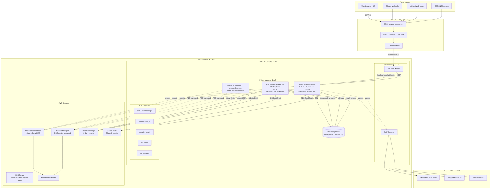

# Phase 01.1: Infra Bootstrap (AWS sa-east-1 via Copilot) - Research

**Researched:** 2026-04-24
**Domain:** AWS infrastructure-as-code via AWS Copilot CLI — ECS Fargate + RDS Postgres 16 + SSM + ALB + Cloudflare + Next.js 16 standalone + tsup-bundled pg-boss worker
**Confidence:** HIGH (Copilot CLI mechanics, manifest shapes, Next 16 standalone, pg-boss topology, ACM + Cloudflare Full Strict), MEDIUM (sa-east-1 monthly pricing, RDS Secrets Manager auto-rotation refresh semantics)

---

## Summary

The 01.1 phase has a fully locked decision set (D-01 through D-24) and a simple mission: translate the Phase 1 Railway-topology intent into an AWS Copilot CLI `prod` environment that provisions `web` + `worker` + `migrate` against an RDS Postgres 16 instance, behind Cloudflare, with everything inside `sa-east-1`. No application behavior changes — only the build seam (Next `output: 'standalone'` + tsup-compiled worker), the Docker image, the Copilot manifests, the RDS addon, and the ops runbook.

Three findings materially shape the plan:

1. **AWS Copilot CLI v1.34.1 does NOT support `copilot storage init --storage-type RDS-Postgres` natively.** Only `S3`, `DynamoDB`, and `Aurora` are supported as built-in storage types. The Aurora Serverless v2 path was rejected in D-01 (~USD 43/mo idle). The implementation MUST write a custom CloudFormation addon template at `copilot/web/addons/rds-postgres.yml` that provisions a traditional `AWS::RDS::DBInstance`, an `AWS::SecretsManager::Secret` for credentials, an `AWS::SecretsManager::RotationSchedule` (or explicit disable), and an `AWS::IAM::ManagedPolicy` that grants the task role `secretsmanager:GetSecretValue` on the credential ARN. Outputs become env vars in capital SNAKE_CASE automatically.
2. **AWS Copilot CLI reaches end-of-support on June 12, 2026 (~6 weeks after this phase ships).** This does NOT block 01.1 — Copilot-generated CloudFormation stacks continue to work after the CLI is unsupported, and AWS has published migration paths (ECS Express Mode, CDK L3 constructs). But the new runbook MUST document this horizon and the migration option so future phases aren't surprised. Pinning the CLI version in the runbook (last stable: v1.34.1, April 2025) is essential because no future CLI patches are expected.
3. **The `node` engine range in `package.json` is `>=20.0.0 <21.0.0`, but D-12 specifies a `node:22-alpine` base image.** This is a direct conflict the planner MUST resolve as a Wave 0 task: bump the `engines.node` constraint to `>=22.0.0 <23.0.0` (argon2 has a known ABI break on Node 23+, so 23 is excluded), verify pnpm + argon2 + pg-boss + drizzle + `@aws-sdk/client-ses` all work on Node 22, and update any local `nvm`/`volta` pins. Absent this, the Docker builder stage will fail the `engines` check on `pnpm install`.

**Primary recommendation:** Treat 01.1 as a three-stack deliverable — (a) code changes (`next.config.ts`, new `build:worker`, new `/api/health`, entrypoint shim, Dockerfile, `.dockerignore`), (b) Copilot assets (`copilot/.workspace`, `copilot/environments/prod/manifest.yml` with `http.public.certificates` holding the ACM ARN, three service/job manifests, one custom RDS addon template), (c) ops artifacts (new runbook replacing `railway-setup.md`, updates to `encryption-key-rotation.md` and `ses-production-access.md`). Deliver in that order; the Dockerfile cannot be finalized until the entrypoint shim and standalone output are in place, and manifests reference paths those steps create.

---

<user_constraints>

## User Constraints (from CONTEXT.md)

### Locked Decisions

**Copilot Topology & Postgres**
- **D-01:** Postgres = RDS Postgres 16 as a Copilot storage addon. If CLI natively supports `copilot storage init --storage-type RDS-Postgres`, use it; otherwise write a CloudFormation addon template at `copilot/web/addons/rds-postgres.yml` with outputs + IAM attached to `web`, inbound rule extended to `worker` and `migrate` security groups. **NOT Aurora Serverless v2**.
- **D-02:** Single `prod` environment in 01.1. Staging deferred to Phase 5.
- **D-03:** `web` = Copilot Load Balanced Web Service (ALB + Fargate, public). ACM + TLS at ALB. Manifest at `copilot/web/manifest.yml`.
- **D-04:** `worker` = Copilot Backend Service (no ALB, no public DNS). Fixed `count: 1`, no autoscaling (pg-boss per-user singleton pattern). Manifest at `copilot/worker/manifest.yml`.

**Secrets & DB Migration**
- **D-05:** Sensitive env vars in SSM Parameter Store SecureString (KMS-encrypted), via Copilot `secrets:` at `/copilot/portalfinance/prod/secrets/<NAME>`. Scope: `NEXTAUTH_SECRET`, `ENCRYPTION_KEY`, `CPF_HASH_PEPPER`, `SENTRY_DSN`, `SES_SMTP_PASSWORD` (or IAM), `TURNSTILE_SECRET_KEY`. Non-secrets under manifest `variables:`. `CPF_HASH_PEPPER` stays distinct from `ENCRYPTION_KEY`.
- **D-06:** `DATABASE_URL` composed at container start by `scripts/entrypoint.sh` from RDS addon outputs + Secrets Manager password. Shim is Docker ENTRYPOINT; CMD per-service.
- **D-07:** Migrations run via dedicated Copilot Scheduled Job manifest at `copilot/migrate/manifest.yml`. Same image, `command: pnpm db:migrate`, same entrypoint shim. Triggered manually via `copilot job run --name migrate --env prod`. Idempotent.
- **D-08:** RDS in private subnets only, no public endpoint. Dev access via `copilot svc exec --name web`.

**Container & Next.js Build**
- **D-09:** Single multi-stage Dockerfile at repo root. Stages: `deps`, `builder`, `runner`. Same image tag across web/worker/migrate.
- **D-10:** Flip `next.config.ts` to `output: 'standalone'`. Align `start:web` to `node .next/standalone/server.js`.
- **D-11:** Pre-compile worker to `dist/jobs/worker.js` via tsup. For migrate: either include tsx as prod dep OR pre-compile `src/db/migrate.ts` to `dist/db/migrate.js` with a `db:migrate:prod` script. Planner picks lowest-friction.
- **D-12:** Base image = `public.ecr.aws/docker/library/node:22-alpine`. Builder stage installs `python3 make g++` for argon2; runner ships only prebuilt binary. Target < 200 MB.

**Edge / Cloudflare**
- **D-13:** Cloudflare orange-cloud DNS in front of public ALB. `@`, `www`, (optional `api`) proxied CNAME → ALB DNS. TLS mode = Full (Strict).
- **D-14:** ACM public cert on ALB for `portalfinance.app` + `*.portalfinance.app`, DNS-validated via Cloudflare (one-time CNAME). No Origin CA cert.
- **D-15:** All routes (incl. webhooks) flow through Cloudflare → ALB.
- **D-16:** Cloudflare Turnstile verified in 01.1. R2 deferred.

**AWS Account & IAM Access**
- **D-17:** Single AWS account (same as SES sa-east-1). IAM Identity Center SSO with `AdministratorAccess` permission set. Copilot auth via `aws sso login --profile portalfinance-prod`. No long-lived IAM access keys.

**VPC & Private Connectivity**
- **D-18:** VPC endpoints + one NAT gateway. Interface endpoints: `ssm`, `ssmmessages`, `secretsmanager`, `ecr.api`, `ecr.dkr`, `sts`, `logs`. Gateway endpoint: `s3`. NAT kept for external HTTPS.

**Fargate Sizing & RDS Class**
- **D-19:** web = 0.5 vCPU / 1 GB; worker = 0.25 vCPU / 512 MB; RDS = db.t4g.micro (2 vCPU / 1 GB, ARM), Multi-AZ disabled in v1. 20 GB gp3. Target ~USD 90–120/mo.

**CI/CD Deploy Flow**
- **D-20:** Manual `copilot deploy` from developer laptop. Automated CI/CD deferred.

**ECR Image Lifecycle**
- **D-21:** Git SHA tags + ECR lifecycle policy (last 20 images per Copilot-auto-created repo). Rollback via `copilot svc deploy --tag <old-sha>`.

**Cost Guardrails & Tagging**
- **D-22:** Copilot auto-tags + custom tags `Project=PortalFinance`, `Phase=01.1`. AWS Budgets alert at 80% of USD 150/mo (email-only).

**Application Logs**
- **D-23:** Container stdout → CloudWatch Logs, 30-day retention. Pino JSON flows unchanged. Sentry EU continues. No log aggregator in 01.1.

**Health Checks**
- **D-24:** New `/api/health` at `src/app/api/health/route.ts` returning `{ status: "ok" }` + 200. ALB target group: path `/api/health`, interval 30 s, healthy 2, unhealthy 3. Do NOT point at `/`.

### Claude's Discretion

- Copilot app name: `portalfinance`
- VPC CIDR: `10.20.0.0/16`, 2 public + 2 private subnets across 2 AZs
- Copilot CLI version pin: latest stable at bootstrap time; document pin
- Entrypoint shim: `scripts/entrypoint.sh` POSIX `sh` (not bash)
- tsup vs esbuild for worker: planner's call
- ECS Exec enabled on all three services day 1
- CloudWatch log group names: Copilot defaults
- `.dockerignore` excludes: `.next/`, `node_modules/`, `.planning/`, `playwright-report/`, `test-results/`, `.env.local`
- RDS backup window: Copilot default (7-day retention)
- Security group layering: web SG → ALB SG; worker + migrate SGs → RDS SG (5432)
- Required runtime env vars NOT in SSM: `NODE_ENV`, `AWS_REGION`, `SENTRY_ENV`, `PORT`, `TURNSTILE_SITE_KEY`, `AWS_DEFAULT_REGION`
- `.env.local` NOT shipped — in `.dockerignore`

### Deferred Ideas (OUT OF SCOPE)

- `staging` Copilot environment — Phase 5
- GitHub Actions / Copilot Pipeline automated deploys — post-Phase 6
- Cloudflare R2 — Phase 5/6
- Bastion host — low priority
- Multi-AZ RDS, cross-region backup — Phase 6
- AWS WAF on ALB — redundant with Cloudflare
- AWS Organizations / multi-account split — Phase 6+
- Log shipping to SaaS aggregator — Phase 6 if needed
- CodeDeploy blue/green — ECS rolling sufficient
- Auto-scaling policies — Phase 4
- DMARC `p=quarantine` → `p=reject` — Phase 6
- Switch SES to IAM role (no SMTP creds) — "may happen in this phase as a trivial win, otherwise defer"

</user_constraints>

---

<phase_requirements>

## Phase Requirements

| ID | Description (from REQUIREMENTS.md) | Research Support |
|----|------------------------------------|------------------|
| **OPS-01** | Structured JSON logging from day one with user IDs hashed, no PII; log retention capped at 30 days with automatic expiration. Sentry EU region captures errors with `beforeSend` PII scrubbing. | § Container & Logging: CloudWatch log groups with 30-day retention (D-23) + existing Pino structured logger + existing Sentry `beforeSend` (Phase 1 code unchanged). Validation: CloudWatch Insights query shows JSON log lines; Sentry dashboard receives synthetic error and confirms `de.sentry.io` ingest. |
| **OPS-04** | Sandbox and production credentials distinct; runtime assertion throws on startup if `NODE_ENV=production` and sandbox credential detected. | § Preserved Phase 1 Code: `src/lib/env.ts` Zod refine already enforces this. In the container, `SENTRY_ENV=production`, `NODE_ENV=production`, no `PLUGGY_ENV=sandbox` or `ASAAS_ENV=sandbox`. Validation: boot a container with `PLUGGY_ENV=sandbox` set, confirm it refuses to start and logs the OPS-04 violation; then boot with clean env, confirm healthy `/api/health` response. |
| **LGPD-05** | All personal and financial data stored in Brazilian territory. No service with data-at-rest outside Brazil for storage. | § AWS Region Pinning: Copilot environment manifest pins `sa-east-1`; RDS, Fargate, SSM SecureString (KMS), CloudWatch Logs, ECR repos, ALB — all in `sa-east-1`. Cloudflare is an edge proxy (CDN + WAF + Turnstile) — no storage. Sentry EU (`de.sentry.io`) is an already-accepted error telemetry processor under DPA per Phase 1 D-23. Validation: `aws rds describe-db-instances --region sa-east-1` returns instance; cross-region describe calls return empty. |
| **SEC-02** | Session cookies `HttpOnly`, `Secure`, `SameSite=Lax`; session tokens rotated on privilege changes. *(Secrets-at-rest pillar applied in 01.1.)* | § Secrets Management: all D-05 secrets stored as KMS-encrypted SecureString in SSM Parameter Store; RDS master password auto-managed in Secrets Manager by the RDS addon template; no plaintext secrets in env files, `.dockerignore` excludes `.env.local`, no secrets in container image layers. Validation: `aws ssm get-parameter --name /copilot/portalfinance/prod/secrets/ENCRYPTION_KEY --with-decryption` returns value only with KMS permission; `aws ssm describe-parameters` shows `Type: SecureString` for all secret params. |

**Note on SEC-02 scope interpretation:** REQUIREMENTS.md SEC-02 text is about session cookies (already covered by Phase 1). CONTEXT.md § Phase Boundary explicitly maps 01.1 to SEC-02 as "secrets at rest — KMS-encrypted SSM." Treating SEC-02 in 01.1 as "secrets-at-rest pillar" per CONTEXT.md intent.

</phase_requirements>

---

## Architectural Responsibility Map

| Capability | Primary Tier | Secondary Tier | Rationale |
|------------|--------------|----------------|-----------|
| DNS + CDN + WAF + Turnstile + edge rate limit | Cloudflare (Edge) | — | Orange-cloud proxy owns L3–L7 protection, TLS termination at the edge, PoP caching (D-13, D-15, D-16) |
| TLS termination (re-encrypt to origin) | ALB (AWS Edge) | Cloudflare | Cloudflare Full (Strict) demands the origin present a valid public cert; ACM-issued cert on ALB satisfies (D-14) |
| HTTP routing + health checks | ALB (AWS Edge) | — | Copilot-managed ALB with path-based target group; `/api/health` exempt from business logic (D-24) |
| SSR + API routes + webhook receivers | Next.js `web` service on Fargate | — | Single Node.js container running `node .next/standalone/server.js` (D-03, D-10) |
| Long-lived job consumption (pg-boss workers) | `worker` Backend Service on Fargate | — | Separate task, no ALB, fixed `count:1` (per-user singleton key constraint from Phase 1) (D-04) |
| One-shot schema migration | `migrate` Scheduled Job (manual-run) on Fargate | — | Reuses same image + entrypoint; runs on-demand after every deploy (D-07) |
| Transactional data storage | RDS Postgres 16 `db.t4g.micro` in private subnets | — | `sa-east-1` only, no public endpoint, Multi-AZ disabled v1 (D-01, D-08, D-19) |
| Job queue | pgboss schema inside RDS | — | Same DB as app; ARCHITECTURE.md Pattern 5 — no new infra |
| Secret storage (at rest) | SSM Parameter Store SecureString (KMS) | Secrets Manager (RDS creds only) | D-05 scope list; RDS master password by Copilot addon convention lives in Secrets Manager, not SSM |
| Container image storage | ECR Private (one repo per service, `sa-east-1`) | — | Copilot auto-creates repos; SHA-tagged, 20-image lifecycle policy (D-21) |
| Observability: structured logs | CloudWatch Logs (30-day retention) | Sentry EU (errors only) | stdout → awslogs driver; log group per Copilot service (D-23, OPS-01) |
| VPC egress to AWS services | Interface VPC endpoints (~7) + S3 Gateway endpoint | — | Private backbone, no NAT egress charges (D-18) |
| VPC egress to external HTTPS (Pluggy, ASAAS, Gemini, Sentry, SES) | Single NAT gateway | — | Required for `de.sentry.io`, `api.pluggy.ai`, etc. (D-18) |
| Dev-side DB access | `copilot svc exec --name web` → psql | — | D-08 — no bastion; SSM Session Manager under the hood |
| Runtime env validation | `src/lib/env.ts` Zod refine (existing) | — | OPS-04 boot assertion preserved unchanged; runs before HTTP listener |

---

## Standard Stack

### Core

| Library / Tool | Version | Purpose | Why Standard |
|----------------|---------|---------|--------------|
| AWS Copilot CLI | **v1.34.1** (pin) [VERIFIED: github.com/aws/copilot-cli/releases — April 2025 stable] | IaC / deploy orchestrator for ECS Fargate | Chosen in D-01..D-04; latest stable; no new releases expected (end-of-support June 12, 2026) |
| AWS ECS on Fargate | current | Container orchestration | D-03, D-04 locked |
| AWS RDS Postgres 16 | 16.x (minor auto-selected by RDS at provision) | OLTP + pg-boss queue | D-01 locked |
| AWS ALB | (Copilot-managed) | L7 load balancer + TLS termination | D-03, D-14 |
| AWS Certificate Manager (ACM) | public cert, DNS-validated | TLS cert for ALB | D-14 |
| AWS SSM Parameter Store | SecureString + KMS | Secret storage at rest | D-05 |
| AWS Secrets Manager | (for RDS master password only) | Auto-managed RDS credential | RDS addon template convention [CITED: docs.aws.amazon.com/secretsmanager] |
| AWS CloudWatch Logs | 30-day retention | Log aggregation | D-23 |
| AWS KMS | AWS-managed keys (not CMK in v1) | SSM + Secrets Manager encryption | D-05, cost baseline; CMK deferred to Phase 6 |
| AWS IAM Identity Center (SSO) | current | Human auth to AWS account | D-17 |
| Cloudflare (Free tier) | current | DNS + CDN + WAF + Turnstile | D-13, D-15, D-16 |
| Node.js | **22.x (Alpine)** | Container runtime | D-12; argon2 has known Node 23+ ABI break [VERIFIED: github.com/ranisalt/node-argon2/issues/469] |
| Next.js | 16.2.4 (existing, `output: 'standalone'` flipped) | Web server + API routes | D-10, existing package.json |
| tsup | 8.3.5 (existing) | Bundle worker to `dist/jobs/worker.js` | D-11; already in devDependencies |
| pg-boss | 12.15.0 (existing) | Worker queue | Phase 1 code; CJS-compatible with tsup output |
| Drizzle ORM | 0.45.2 (existing) | DB client + migrator | Phase 1 code |

### Supporting — New Files/Assets Introduced in 01.1

| Asset | Purpose | Notes |
|-------|---------|-------|
| `Dockerfile` (repo root) | Multi-stage: deps → builder → runner | D-09, D-12 |
| `.dockerignore` | Exclude: `.next/`, `node_modules/`, `.planning/`, `playwright-report/`, `test-results/`, `.env.local`, `.git/`, `coverage/` | Discretion |
| `scripts/entrypoint.sh` | POSIX `sh` shim composing `DATABASE_URL`, then `exec "$@"` | D-06 |
| `src/app/api/health/route.ts` | Next Node-runtime route returning 200 JSON | D-24 |
| `tsup.config.ts` | Worker bundling config (format cjs, target node22, external `pg`, `pg-boss`, `argon2`, `@aws-sdk/*`, drizzle schema bundled inline) | D-11 |
| `copilot/.workspace` | Copilot workspace marker (`application: portalfinance`) | Discretion |
| `copilot/environments/prod/manifest.yml` | Env-level config: VPC CIDR, public ALB, `http.public.certificates` ARN list, VPC endpoints flag | D-17, D-18, D-14 |
| `copilot/web/manifest.yml` | Load Balanced Web Service | D-03, D-24, D-19 |
| `copilot/worker/manifest.yml` | Backend Service, `count: 1`, no autoscaling | D-04, D-19 |
| `copilot/migrate/manifest.yml` | Scheduled Job with `on.schedule: "none"` | D-07 |
| `copilot/web/addons/rds-postgres.yml` | Custom CFN addon: RDS instance, Secrets Manager secret, managed policy, inbound SG rules for worker + migrate | D-01 (no native Copilot support for RDS Postgres) |
| `docs/ops/aws-copilot-setup.md` | Replaces `railway-setup.md` | Canonical ref in CONTEXT.md |

### Alternatives Considered

| Instead of | Could Use | Tradeoff | Verdict |
|------------|-----------|----------|---------|
| AWS Copilot CLI | AWS CDK (L3 constructs) | Migration target after June 2026 EoS, more verbose, full programmatic control | **01.1 stays Copilot** (scope); capture CDK migration as a Phase 6+ consideration |
| AWS Copilot CLI | ECS Express Mode | AWS's recommended Copilot successor, launched Nov 2025 | Too new; no `migrate-from-Copilot` tooling yet |
| Custom RDS Postgres addon template | Aurora Serverless v2 via `copilot storage init` | Native Copilot command; but ~USD 43/mo minimum ACU cost | **Rejected by D-01** |
| tsup for worker bundle | esbuild direct | esbuild is lower-level, more control; tsup already in devDeps | **tsup** — one-file config, no regression risk |
| SES SMTP credentials in SSM | SES via IAM task role | Fewer secrets to manage; no long-lived IAM user needed | Deferred item in CONTEXT.md; planner may promote to 01.1 if trivial — **recommend inclusion** (see § Recommendation to Planner below) |
| SSH bastion for psql | `copilot svc exec --name web` + psql client in container | ECS Exec requires only IAM permission; no bastion cost | **ECS Exec** (D-08) |

### Installation — new additions only

Nothing to `pnpm add` in this phase (tsup + drizzle-kit already present). The changes are:

1. Bump `package.json` `engines.node` from `>=20.0.0 <21.0.0` → `>=22.0.0 <23.0.0`.
2. Add `build:worker` script → `tsup --config tsup.config.ts`.
3. Add `db:migrate:prod` script (option A: keep `tsx` as production dep, script stays `tsx src/db/migrate.ts`; option B: bundle `src/db/migrate.ts` via tsup → `node dist/db/migrate.js`). **Recommendation: option B** — keeps `tsx` a devDep, removes a 25 MB package from the runner image, and the tsup config bundling `worker.ts` already proves the pattern.

### Version verification (per RESEARCH.md protocol)

All existing deps are already pinned in `package.json`; version-verification step for this phase is limited to confirming the AWS Copilot CLI binary version at install time:

```bash
copilot --version   # Expect: v1.34.1
```

Pin this value in `docs/ops/aws-copilot-setup.md`.

---

## Architecture Patterns

### System Architecture Diagram



**Data flow (primary use case — user loads the demo dashboard):**

1. Browser resolves `portalfinance.app` → Cloudflare orange-cloud IP.
2. Cloudflare validates request (WAF + optional rate limit), terminates TLS at edge.
3. Cloudflare proxies to ALB DNS name (which is a CNAME record the developer added manually in Cloudflare, pointing to the Copilot-provisioned ALB). Cloudflare presents `portalfinance.app` SNI; ALB's ACM cert covers `*.portalfinance.app` and apex.
4. ALB target-group health check has already confirmed `/api/health` returns 200 on the web task.
5. ALB forwards HTTP to the web Fargate task on port `PORT` (Copilot default 8080; Next 16 standalone `server.js` reads `PORT`).
6. Next.js renders the demo dashboard server-side, querying RDS for the session (via Auth.js) and the user row.
7. Pino JSON log line → stdout → awslogs driver → CloudWatch Logs (`/copilot/portalfinance-prod-web` log group).

**Data flow (webhook path — preserved < 200 ms SLO):**

1. Pluggy/ASAAS → Cloudflare (< 200 ms PoP hop) → ALB → web Fargate task.
2. Web handler: verify auth header → idempotent insert into `webhook_events` → `boss.send()` → return 200. All steps local to the web task; the only cross-task work is the `boss.send()` INSERT into pgboss.job (RDS) and the eventual worker drain.

### Recommended Project Structure (additions only)

```
portalfinance/web/
├── Dockerfile                            # NEW — multi-stage, Node 22 alpine
├── .dockerignore                         # NEW
├── tsup.config.ts                        # NEW — bundles src/jobs/worker.ts and src/db/migrate.ts
├── scripts/
│   └── entrypoint.sh                     # NEW — POSIX sh, composes DATABASE_URL
├── src/
│   └── app/
│       └── api/
│           └── health/
│               └── route.ts              # NEW — { status: 'ok' }
├── copilot/                              # NEW — Copilot workspace
│   ├── .workspace
│   ├── environments/
│   │   └── prod/
│   │       └── manifest.yml              # env-level config, ACM ARN, VPC endpoints
│   ├── web/
│   │   ├── manifest.yml                  # LB Web Service
│   │   └── addons/
│   │       └── rds-postgres.yml          # custom CFN: RDS + Secret + Policy
│   ├── worker/
│   │   └── manifest.yml                  # Backend Service
│   └── migrate/
│       └── manifest.yml                  # Scheduled Job, on.schedule=none
└── docs/
    └── ops/
        ├── aws-copilot-setup.md          # NEW — replaces railway-setup.md
        ├── ses-production-access.md      # UPDATE — scrub Railway refs, keep flow
        └── encryption-key-rotation.md    # UPDATE — aws ssm put-parameter + copilot svc deploy
```

### Pattern 1: Copilot Workload Addon Template for Traditional RDS Postgres

**What:** Since `copilot storage init --storage-type RDS-Postgres` does NOT exist (only Aurora), provision traditional RDS via a custom CloudFormation addon at `copilot/web/addons/rds-postgres.yml`. Copilot auto-deploys workload addons with the `web` service and injects any `Outputs` into the task env as SCREAMING_SNAKE_CASE env vars.

**When to use:** Always for 01.1 per D-01.

**Canonical structure:**

```yaml
# Source: https://aws.github.io/copilot-cli/docs/developing/addons/workload/
AWSTemplateFormatVersion: '2010-09-09'
Parameters:
  App:
    Type: String
  Env:
    Type: String
  Name:
    Type: String
Resources:
  DBSubnetGroup:
    Type: AWS::RDS::DBSubnetGroup
    Properties:
      DBSubnetGroupDescription: !Sub '${App}-${Env}-rds-subnet-group'
      SubnetIds:
        - !ImportValue:
            Fn::Sub: '${App}-${Env}-PrivateSubnet1'
        - !ImportValue:
            Fn::Sub: '${App}-${Env}-PrivateSubnet2'
      Tags:
        - Key: Project
          Value: PortalFinance
        - Key: Phase
          Value: '01.1'

  DBSecurityGroup:
    Type: AWS::EC2::SecurityGroup
    Properties:
      GroupDescription: !Sub '${App}-${Env}-rds-sg'
      VpcId:
        Fn::ImportValue: !Sub '${App}-${Env}-VpcId'
      SecurityGroupIngress:
        - IpProtocol: tcp
          FromPort: 5432
          ToPort: 5432
          SourceSecurityGroupId:
            Fn::ImportValue: !Sub '${App}-${Env}-EnvironmentSecurityGroup'

  DBMasterSecret:
    Type: AWS::SecretsManager::Secret
    Properties:
      Name: !Sub '${App}/${Env}/rds/master'
      Description: 'RDS Postgres master credentials (auto-managed by RDS)'
      GenerateSecretString:
        SecretStringTemplate: '{"username": "portalfinance"}'
        GenerateStringKey: 'password'
        ExcludeCharacters: '"@/\'
        PasswordLength: 32

  DBInstance:
    Type: AWS::RDS::DBInstance
    DeletionPolicy: Snapshot
    UpdateReplacePolicy: Snapshot
    Properties:
      DBInstanceIdentifier: !Sub '${App}-${Env}-db'
      DBName: portalfinance
      Engine: postgres
      EngineVersion: '16'
      DBInstanceClass: db.t4g.micro
      AllocatedStorage: '20'
      StorageType: gp3
      StorageEncrypted: true
      MasterUsername: !Sub '{{resolve:secretsmanager:${DBMasterSecret}:SecretString:username}}'
      MasterUserPassword: !Sub '{{resolve:secretsmanager:${DBMasterSecret}:SecretString:password}}'
      DBSubnetGroupName: !Ref DBSubnetGroup
      VPCSecurityGroups:
        - !GetAtt DBSecurityGroup.GroupId
      PubliclyAccessible: false
      MultiAZ: false
      BackupRetentionPeriod: 7
      DeletionProtection: true

  DBSecretAttachment:
    Type: AWS::SecretsManager::SecretTargetAttachment
    Properties:
      SecretId: !Ref DBMasterSecret
      TargetId: !Ref DBInstance
      TargetType: AWS::RDS::DBInstance

  DBAccessPolicy:
    Type: AWS::IAM::ManagedPolicy
    Properties:
      Description: !Sub '${App}-${Env}-rds-access'
      PolicyDocument:
        Version: '2012-10-17'
        Statement:
          - Effect: Allow
            Action:
              - secretsmanager:GetSecretValue
            Resource: !Ref DBMasterSecret

Outputs:
  # Copilot exposes each Output as an env var in the task.
  # Name -> SCREAMING_SNAKE_CASE via Copilot convention.
  DbEndpoint:
    Value: !GetAtt DBInstance.Endpoint.Address
  DbPort:
    Value: !GetAtt DBInstance.Endpoint.Port
  DbName:
    Value: portalfinance
  DbSecretArn:
    Value: !Ref DBMasterSecret
  DBAccessPolicy:
    Value: !Ref DBAccessPolicy
    # Outputs named after IAM policies are attached to the task role.
```

[CITED: https://aws.github.io/copilot-cli/docs/developing/addons/workload/]
[CITED: https://docs.aws.amazon.com/AWSCloudFormation/latest/TemplateReference/aws-resource-rds-dbinstance.html]

**Key observations:**
- The addon template is attached to the `web` service but its SG inbound rule sources from the Copilot-managed environment SG (`${App}-${Env}-EnvironmentSecurityGroup`), which ALL three services (web, worker, migrate) are members of. This automatically grants worker and migrate access without explicit ingress rules per service SG.
- `DBAccessPolicy` named output is attached by Copilot to the task IAM role automatically (convention: Outputs ending in "Policy" whose value is an IAM policy ARN).
- The addon is declared under `copilot/web/addons/` but the env vars + IAM it produces are visible to `web` only. To share with `worker` and `migrate`, either (a) symlink/duplicate the addon under `copilot/worker/addons/` and `copilot/migrate/addons/` (NOT symlink — Copilot reads each workload's addons separately), or (b) lift the RDS provisioning to an **environment addon** at `copilot/environments/addons/rds-postgres.yml` and reference the env-level outputs from each service manifest. **Recommendation: option (b) — environment addon** is the cleaner pattern for multi-consumer resources.

### Pattern 2: Copilot Load Balanced Web Service Manifest for Next.js Standalone

```yaml
# Source: https://aws.github.io/copilot-cli/docs/manifest/lb-web-service/
name: web
type: Load Balanced Web Service

image:
  build:
    dockerfile: Dockerfile
    context: .
  port: 8080

http:
  path: '/'
  healthcheck:
    path: '/api/health'
    port: 8080
    success_codes: '200'
    healthy_threshold: 2
    unhealthy_threshold: 3
    interval: 30s
    timeout: 5s
    grace_period: 60s
  alias: portalfinance.app

cpu: 512
memory: 1024
platform: linux/x86_64
count: 1
exec: true

variables:
  NODE_ENV: production
  SENTRY_ENV: production
  AWS_REGION: sa-east-1
  PORT: '8080'
  LOG_LEVEL: info
  SERVICE_NAME: web
  SES_FROM_EMAIL: no-reply@portalfinance.app
  TURNSTILE_SITE_KEY: # (public key — safe to put in manifest)
    from_cfn: TurnstileSiteKey  # or hardcode if stable
  NEXT_PUBLIC_CF_TURNSTILE_SITE_KEY: # same
  NEXTAUTH_URL: https://portalfinance.app

secrets:
  NEXTAUTH_SECRET: /copilot/portalfinance/prod/secrets/NEXTAUTH_SECRET
  ENCRYPTION_KEY: /copilot/portalfinance/prod/secrets/ENCRYPTION_KEY
  CPF_HASH_PEPPER: /copilot/portalfinance/prod/secrets/CPF_HASH_PEPPER
  SENTRY_DSN: /copilot/portalfinance/prod/secrets/SENTRY_DSN
  TURNSTILE_SECRET_KEY: /copilot/portalfinance/prod/secrets/TURNSTILE_SECRET_KEY
  # AWS access key only if keeping credential-based SES (see § Recommendation to Planner)
  AWS_ACCESS_KEY_ID: /copilot/portalfinance/prod/secrets/AWS_ACCESS_KEY_ID
  AWS_SECRET_ACCESS_KEY: /copilot/portalfinance/prod/secrets/AWS_SECRET_ACCESS_KEY

network:
  vpc:
    placement: private
```

[CITED: https://aws.github.io/copilot-cli/docs/manifest/lb-web-service/]

### Pattern 3: Copilot Scheduled Job with Manual-Only Trigger

```yaml
# Source: https://aws.github.io/copilot-cli/docs/manifest/scheduled-job/
name: migrate
type: Scheduled Job

on:
  schedule: "none"   # CRITICAL — disables cron trigger; manual via `copilot job run` only

image:
  build:
    dockerfile: Dockerfile
    context: .

command: ["node", "dist/db/migrate.js"]  # uses pre-compiled migrate (option B)
# If planner picks option A: command: ["pnpm", "db:migrate"]

cpu: 256
memory: 512
platform: linux/x86_64
exec: true
retries: 0            # fail-fast; Drizzle migrations are idempotent but idempotency != safe-to-replay-mid-failure

variables:
  NODE_ENV: production
  AWS_REGION: sa-east-1
  SENTRY_ENV: production
  SERVICE_NAME: migrate

secrets:
  NEXTAUTH_SECRET: /copilot/portalfinance/prod/secrets/NEXTAUTH_SECRET
  ENCRYPTION_KEY: /copilot/portalfinance/prod/secrets/ENCRYPTION_KEY
  CPF_HASH_PEPPER: /copilot/portalfinance/prod/secrets/CPF_HASH_PEPPER
  SENTRY_DSN: /copilot/portalfinance/prod/secrets/SENTRY_DSN
  # migrate does not send email or use Turnstile, but env.ts requires these in prod —
  # either widen env.ts prod refinement or pass real values.

network:
  vpc:
    placement: private
```

[VERIFIED: https://aws.github.io/copilot-cli/docs/manifest/scheduled-job/ — "you can disable the job from triggering by setting the `schedule` field to `none`"]

**Note on env.ts conflict with migrate:** `src/lib/env.ts` currently requires `TURNSTILE_*` and `AWS_*` creds in production. The migrate job doesn't need them. Two options: (a) widen env.ts to skip those refinements when `SERVICE_NAME=migrate`, (b) pass them to the migrate job even if unused. **Recommendation: option (a)** — more honest, and the refine already has a "skip during build" branch.

### Pattern 4: Entrypoint Shim (POSIX sh)

```sh
#!/bin/sh
# Source: D-06 — compose DATABASE_URL from RDS addon outputs + Secrets Manager value
# Runs as Docker ENTRYPOINT. CMD is per-service (web/worker/migrate).

set -eu

# Copilot has already injected from the env addon outputs:
#   DB_ENDPOINT, DB_PORT, DB_NAME, DB_SECRET_ARN
# and from secrets: (none — the RDS password comes from Secrets Manager via aws-cli below)

# Fetch RDS master password from Secrets Manager.
# The task role's managed policy grants secretsmanager:GetSecretValue on this ARN.
SECRET_JSON=$(aws secretsmanager get-secret-value \
  --region "${AWS_REGION}" \
  --secret-id "${DB_SECRET_ARN}" \
  --query SecretString \
  --output text)

# Parse username + password (tiny jq-free parse — use sed, value format is stable).
DB_USER=$(echo "${SECRET_JSON}" | sed -n 's/.*"username"[[:space:]]*:[[:space:]]*"\([^"]*\)".*/\1/p')
DB_PASS=$(echo "${SECRET_JSON}" | sed -n 's/.*"password"[[:space:]]*:[[:space:]]*"\([^"]*\)".*/\1/p')

export DATABASE_URL="postgresql://${DB_USER}:${DB_PASS}@${DB_ENDPOINT}:${DB_PORT}/${DB_NAME}?sslmode=require"

# Hand control to the service CMD (node .next/standalone/server.js, node dist/jobs/worker.js, etc.)
exec "$@"
```

**Critical pre-req:** The runner image must include the AWS CLI v2 (`apk add --no-cache aws-cli` in Alpine, or use `public.ecr.aws/aws-cli/aws-cli:latest` multi-stage copy). Adds ~40 MB. Alternatively: use `curl` + IMDS + signed requests (ugly), or use a tiny shell script that does the sigv4 signing manually (unwise). **Recommendation: `apk add --no-cache aws-cli` in the runner stage.**

**Why `sed` not `jq`:** avoids adding `jq` to the runner (extra package). If the planner prefers `jq`, cost is ~250 KB.

### Pattern 5: Multi-Stage Dockerfile (canonical shape)

```dockerfile
# syntax=docker/dockerfile:1.7

# ---- deps stage ----
FROM public.ecr.aws/docker/library/node:22-alpine AS deps
WORKDIR /app
RUN apk add --no-cache python3 make g++ libc6-compat
COPY package.json pnpm-lock.yaml ./
RUN corepack enable && pnpm install --frozen-lockfile

# ---- builder stage ----
FROM public.ecr.aws/docker/library/node:22-alpine AS builder
WORKDIR /app
RUN apk add --no-cache python3 make g++ libc6-compat
COPY --from=deps /app/node_modules ./node_modules
COPY . .
ENV NEXT_TELEMETRY_DISABLED=1
# Next 16 standalone requires DATABASE_URL at build time for "collect page data";
# src/db/index.ts accepts a placeholder (Phase 1 decision).
RUN corepack enable && pnpm build && pnpm build:worker
# build:worker -> dist/jobs/worker.js + dist/db/migrate.js (tsup)

# ---- runner stage ----
FROM public.ecr.aws/docker/library/node:22-alpine AS runner
WORKDIR /app
ENV NODE_ENV=production \
    NEXT_TELEMETRY_DISABLED=1 \
    PORT=8080 \
    HOSTNAME=0.0.0.0
RUN apk add --no-cache aws-cli ca-certificates tini \
  && addgroup --system --gid 1001 nodejs \
  && adduser --system --uid 1001 nextjs

# Next.js standalone output
COPY --from=builder --chown=nextjs:nodejs /app/.next/standalone ./
COPY --from=builder --chown=nextjs:nodejs /app/.next/static ./.next/static
COPY --from=builder --chown=nextjs:nodejs /app/public ./public
# Pre-compiled worker + migrator
COPY --from=builder --chown=nextjs:nodejs /app/dist ./dist
# Entrypoint shim
COPY --chown=nextjs:nodejs scripts/entrypoint.sh /entrypoint.sh
RUN chmod +x /entrypoint.sh

USER nextjs
EXPOSE 8080

ENTRYPOINT ["/sbin/tini", "--", "/entrypoint.sh"]
CMD ["node", "server.js"]
```

[CITED: https://nextjs.org/docs/app/api-reference/config/next-config-js/output — standalone output copy requirements]
[CITED: https://github.com/ranisalt/node-argon2#prebuilt-binaries — Alpine/musl requires source compile]

**Notes:**
- `HOSTNAME=0.0.0.0` is REQUIRED for Next standalone `server.js` to bind to a non-loopback interface (Alpine default binds only to 127.0.0.1 otherwise). [VERIFIED: Next.js docs + community Dockerfile examples 2026]
- `PORT=8080` aligns with Copilot default; `server.js` reads it from env.
- `tini` as PID 1 ensures SIGTERM propagates cleanly to Node for graceful shutdown (pg-boss worker relies on SIGTERM handler in `src/jobs/worker.ts`).
- argon2 recompile in builder stage; runner ships only the precompiled `.node` binary inside `node_modules`.
- **Image size estimate:** 170–190 MB. aws-cli (~40 MB) is the biggest new cost. Acceptable against the < 200 MB target.

### Pattern 6: Cloudflare Full (Strict) with ACM cert on ALB

1. **ACM cert request:** `aws acm request-certificate --domain-name portalfinance.app --subject-alternative-names "*.portalfinance.app" --validation-method DNS --region sa-east-1`.
2. **Copy the validation CNAME** ACM emits → create a single CNAME record in Cloudflare DNS (the same record validates both apex and wildcard — ACM dedups). [VERIFIED: https://docs.aws.amazon.com/acm/latest/userguide/dns-validation.html — "For a wildcard domain, such as *.example.com, the strings created by ACM are the same as those created for its base domain"]
3. **Wait** for status `ISSUED` (5–30 min). Capture the cert ARN.
4. **Import ARN into Copilot env manifest** `http.public.certificates` (list). This is the mechanism when DNS is externally managed. [VERIFIED: https://aws.github.io/copilot-cli/docs/developing/domain/ — "manually add the DNS name of the Application Load Balancer (ALB) created in that environment as an A record where your alias domain is hosted"]
5. **In the web service manifest**, do NOT set `http.hosted_zone` (no Route 53 delegation). Set `http.alias: portalfinance.app`.
6. **After `copilot env deploy` + `copilot svc deploy --name web`**, the ALB DNS name is available via `copilot svc show --name web` or via the AWS console.
7. **In Cloudflare DNS**, create:
   - `@` CNAME → `<alb-dns-name>` — proxied (orange cloud)
   - `www` CNAME → `portalfinance.app` — proxied
   - (optional) `api` CNAME → `portalfinance.app` — proxied
8. **Cloudflare SSL mode** → SSL/TLS tab → "Full (Strict)".
9. **Verify:** `curl -v https://portalfinance.app/api/health` — expect 200; cert chain shows Cloudflare (edge) → ACM (origin).

**Known landmine:** If Cloudflare is set to Full (non-Strict), the edge will accept any origin cert including self-signed — Strict is mandatory. Also: Cloudflare sends the client's SNI hostname (e.g. `portalfinance.app`) in the ALB handshake, so the ACM cert's CN/SAN MUST include the apex + wildcard (hence step 1 above uses `--domain-name portalfinance.app --subject-alternative-names "*.portalfinance.app"`).

### Anti-Patterns to Avoid

- **Hand-rolled session token storage or rate limit in this phase.** All of that is Phase 1 code. 01.1 changes zero application behavior.
- **Using `drizzle-kit push` in the migrate job.** Explicitly banned (Phase 1 policy); use the existing `src/db/migrate.ts` runner.
- **Pointing the ALB health check at `/`.** Pollutes access logs with dashboard renders and — if the demo dashboard ever requires DB — makes health checks fail during DB restarts. Use `/api/health` (D-24).
- **Putting `DATABASE_URL` in SSM.** The Copilot addon outputs + entrypoint shim compose it; putting the full URL in SSM defeats the rotation story.
- **Committing `.env.local` or any `.env` file.** `.dockerignore` excludes them; confirm `.gitignore` does too.
- **Using `image.location` in the Copilot manifest for "build-once-deploy-three" optimization.** [CITED: copilot-cli issue #1943] While `image.location` technically allows pointing all three services at a pre-built ECR image, Copilot still creates one ECR repo per service regardless, and the Phase 1 release cadence (~weekly) doesn't benefit. **Recommendation: accept three builds per deploy** (the tsup build step is fast; `pnpm build` dominates either way). If build time becomes a pain, revisit with a shared ECR repo pattern in a later phase.

---

## Don't Hand-Roll

| Problem | Don't Build | Use Instead | Why |
|---------|-------------|-------------|-----|
| VPC, subnets, NAT, security groups | Hand-written Terraform / CloudFormation | Copilot `env init` | Generates a correct 2-AZ VPC with public+private subnets, NAT GW, env SG, shared IAM boundaries. Saves ~300 lines of CFN and 1-day of debugging. |
| ECS task definitions, IAM roles, ALB config | Hand-written | Copilot service manifests | Copilot emits standards-compliant ECS task + IAM + ALB CFN with every deploy. |
| ALB target group health check config | Custom | `http.healthcheck` manifest block | Copilot wires ALB ↔ target group ↔ ECS health signaling; only the path + thresholds need tuning. |
| RDS master password rotation | Custom cron + Lambda | `AWS::SecretsManager::RotationSchedule` (Phase 6) | Native AWS rotation with prebuilt RDS Lambda templates. **Defer to Phase 6** — RDS rotation refresh requires either app-side retry on stale-password connection errors OR a task restart on rotation, neither of which is necessary for pre-seed. In 01.1, leave rotation disabled (the default when no `RotationSchedule` resource is declared). |
| Secret encryption at rest | Custom envelope encryption | SSM SecureString + KMS AWS-managed | Copilot `secrets:` wires task role `ssm:GetParameters` permission automatically. |
| SIGTERM handling in Node for graceful shutdown | Custom PID 1 trap | tini (`/sbin/tini`) | One-liner; avoids zombie-reaping issues and dropped SIGTERMs that break pg-boss `boss.stop({ graceful: true })` (already in `src/jobs/worker.ts`). |
| Container health checks | Custom `HEALTHCHECK` in Dockerfile | ALB target-group health check + ECS container health check | Copilot manifest owns both. A Dockerfile-level `HEALTHCHECK` only matters for docker-compose, not ECS. |
| Bastion host for dev-side DB access | EC2 + SSM | `copilot svc exec --name web` | ECS Exec is one flag; no EC2 cost. |

**Key insight:** Copilot's job is to be the "don't hand-roll" layer for the entire ECS + RDS + ALB + IAM + CloudWatch surface. The only place we *must* hand-write IaC is the single RDS addon template, and that's because of Copilot's native-storage gap on traditional RDS.

---

## Runtime State Inventory

This phase is a topology switch (Railway → AWS). Per Step 2.5, explicit answers for every category:

| Category | Items Found | Action Required |
|----------|-------------|------------------|
| **Stored data** | **None.** The phase 1 Railway Postgres was never provisioned — Task 3 of plan 01-01 was deferred (per STATE.md: "Railway sa-east-1 provisioning + live schema push" is an Open deferred item). There are no user rows, no consent records, no sessions in any production database today. | Provision RDS fresh; run `copilot job run --name migrate` once to create schema. No data migration required. |
| **Live service config** | **Cloudflare DNS zone `portalfinance.app`** — Phase 1 established SES DKIM/SPF/DMARC records. These remain. No new zone required. | Add three new records: the ACM validation CNAME (one-time), and the three proxied CNAMEs (`@`, `www`, optional `api`) pointing to the ALB DNS name. SES records untouched. |
| **Live service config** | **AWS SES `sa-east-1` verified domain identity** `no-reply@portalfinance.app` + SNS bounce topic (Phase 1 D-11, D-15). Configuration lives in AWS account, not in git. | Keep. The new Copilot app runs in the SAME AWS account per D-17, so the SES identity is automatically reusable. No re-verification needed. |
| **Live service config** | **Cloudflare Turnstile** site and secret (Phase 1 D-07). Site configured for some hostname in Phase 1. | Confirm the Turnstile site config hostname matches `portalfinance.app` (or add the hostname). Update `TURNSTILE_SECRET_KEY` value if rotating; otherwise just copy Phase 1 value into SSM SecureString. |
| **Live service config** | **Sentry EU project DSN** (Phase 1 D-23, 01-04 deferred item). DSN lives in Sentry org console. | Copy into SSM SecureString `/copilot/portalfinance/prod/secrets/SENTRY_DSN`. Confirm `de.sentry.io` suffix (env.ts enforces). |
| **OS-registered state** | **None.** No Windows Task Scheduler entries, no pm2 saved processes, no systemd units. Phase 1 ran exclusively in dev; no production daemons registered. | None. |
| **Secrets and env vars** | **`.env.local`** in the repo working tree (dev only, `.gitignore`d per Phase 1 policy). Contains `DATABASE_URL` pointing to testcontainers Postgres, dev Turnstile keys, etc. | NOT shipped — `.dockerignore` excludes it. Production values come only from SSM + manifest `variables:`. The file stays in-place on the developer machine for local dev. |
| **Secrets and env vars** | **Existing `NEXTAUTH_SECRET`, `ENCRYPTION_KEY`, `CPF_HASH_PEPPER` values** — these were documented in Phase 1 but no production DB exists yet, so they haven't been "used" to encrypt any production data. | Generate fresh values for prod with `openssl rand -base64 32` each; store in SSM SecureString. Dev `.env.local` stays with its own values. |
| **Build artifacts / installed packages** | **None in production.** Nothing has been deployed. Dev machines may have stale `.next/` or `dist/` — irrelevant to prod. | None. |
| **Build artifacts / installed packages** | **ECR repositories** don't exist yet in the AWS account. | Copilot creates them automatically on first `svc deploy`. |

**The canonical question:** *After every file in the repo is updated, what runtime systems still have the old string cached, stored, or registered?* **Answer: none** — because the Railway deploy never happened. This is the rare "painless pivot" scenario, enabled by the Phase 1 decision to defer Task 3.

---

## Common Pitfalls

### Pitfall 1: AWS Copilot CLI's missing native RDS Postgres support forces a custom addon template

**What goes wrong:** Developer runs `copilot storage init --storage-type RDS-Postgres` expecting it to work; CLI errors with "unsupported storage type" or silently proposes Aurora.

**Why it happens:** [VERIFIED: github.com/aws/copilot-cli/issues/5649 — open since Jan 2024, not implemented; will not be implemented before EoS.] Copilot `storage init` only supports S3, DynamoDB, Aurora.

**How to avoid:** Bypass `copilot storage init` entirely. Write `copilot/environments/addons/rds-postgres.yml` (environment addon, shared by all three services) from scratch following the canonical pattern in § Pattern 1. Deploy it as part of `copilot env deploy`.

**Warning signs:** Running `copilot storage init` with `-t RDS` or similar.

### Pitfall 2: Copilot CLI end-of-support on June 12, 2026

**What goes wrong:** Post-EoS, no security patches, no bug fixes, no new AWS feature support. A critical AWS SDK change (e.g., IAM policy syntax) could stop deploys.

**Why it happens:** [VERIFIED: https://aws.amazon.com/blogs/containers/announcing-the-end-of-support-for-the-aws-copilot-cli/] AWS is migrating users to ECS Express Mode + CDK L3.

**How to avoid (for 01.1):**
- Pin CLI version v1.34.1 in the runbook.
- Commit all Copilot-generated CloudFormation to git (via `copilot env package` + `copilot svc package`) as a disaster-recovery artifact — if the CLI ever fails, the stacks can be deployed via raw `aws cloudformation deploy`.
- Document a Phase 6+ migration plan: "if Copilot is actively broken, pivot to ECS Express Mode or CDK L3".

**Warning signs:** June 12, 2026 arrives; any `copilot` command fails with a "deprecated" warning.

### Pitfall 3: Next.js standalone `server.js` binds to 127.0.0.1 by default on Alpine

**What goes wrong:** ALB health check fails — the target is `unhealthy`. Container logs show `server listening on 127.0.0.1:8080` but ALB can only reach the container's eth0 interface.

**Why it happens:** [VERIFIED: Next docs + Dockerfile examples 2026 — requires explicit `HOSTNAME=0.0.0.0` env for standalone output on Alpine.] Without `HOSTNAME`, Node's HTTP server binds to the default loopback address.

**How to avoid:** Set `ENV HOSTNAME=0.0.0.0` in the runner stage of the Dockerfile (as shown in § Pattern 5) AND ensure it's not overridden in the Copilot manifest `variables:` block.

**Warning signs:** ALB target shows `Status: unhealthy, Reason: Target.FailedHealthChecks`. `copilot svc logs` shows `server listening on 127.0.0.1:XXXX`.

### Pitfall 4: argon2 native binary doesn't install on Alpine via prebuilt binaries

**What goes wrong:** `pnpm install` in the builder stage fails with `node-gyp rebuild` errors, or the runner stage throws `Error: Cannot find module 'argon2/lib/binding/node-argon2.node'` at runtime.

**Why it happens:** [VERIFIED: github.com/ranisalt/node-argon2/issues/223] node-argon2 prebuilts target Ubuntu 22.04 glibc. Alpine uses musl libc — prebuilts don't work; the package MUST compile from source.

**How to avoid:** The builder stage in § Pattern 5 already handles this via `apk add --no-cache python3 make g++`. Verify the runner stage copies `node_modules/argon2` (which now contains the compiled `.node` binary) and that the copy preserves file permissions.

**Warning signs:** Image builds succeed but container crashes on first login attempt with an argon2-related stack trace.

### Pitfall 5: Node engine constraint conflict between package.json and Dockerfile base image

**What goes wrong:** `pnpm install --frozen-lockfile` in the deps stage fails with `Your Node version "v22.x.x" is not compatible with ">=20.0.0 <21.0.0"`.

**Why it happens:** `package.json` has `engines.node: ">=20.0.0 <21.0.0"` from Phase 1; D-12 mandates Node 22 Alpine.

**How to avoid:** In the planner's Wave 0, bump the engine constraint to `>=22.0.0 <23.0.0`. Run `pnpm install` locally on Node 22 to refresh the lockfile. Verify all existing deps work (argon2, pg-boss, drizzle, next 16, sentry 10 — all do per npm registry).

**Warning signs:** First Dockerfile build fails in the deps stage.

### Pitfall 6: VPC endpoints with wrong security group allow no traffic

**What goes wrong:** Fargate tasks fail to start because they cannot reach `ssm.sa-east-1.amazonaws.com` to fetch secrets; ECS task exits with `ResourceInitializationError: unable to pull secrets`.

**Why it happens:** [VERIFIED: AWS docs] The security group attached to each interface endpoint must allow inbound TCP/443 from the Fargate task SG. Copilot creates both SGs but does NOT automatically wire the ingress rule when endpoints are added via addon or env manifest.

**How to avoid:** In the environment manifest, Copilot supports VPC endpoint enablement with auto-generated SG rules via `network.vpc.endpoints`. [CITED: https://aws.github.io/copilot-cli/docs/manifest/environment/] Use this rather than hand-declaring endpoints in an addon template. If forced to hand-declare, explicitly set the endpoint SG's inbound rule to `SourceSecurityGroupId: !ImportValue ${App}-${Env}-EnvironmentSecurityGroup`.

**Warning signs:** `copilot svc deploy` succeeds but tasks fail to reach running state; task stop reason mentions "unable to pull secrets" or "timeout connecting to ssm endpoint".

### Pitfall 7: Cloudflare Full (not Strict) silently accepts origin misconfiguration

**What goes wrong:** Origin cert expires or is mismatched; Cloudflare still serves "secure" pages to users; nobody notices until a real breach.

**Why it happens:** [VERIFIED: https://developers.cloudflare.com/ssl/origin-configuration/ssl-modes/] Cloudflare "Full" accepts self-signed or expired origin certs; only "Full (Strict)" validates chain + expiration.

**How to avoid:** D-13 mandates Full (Strict). The runbook Step must include a verification curl from an origin bypass (e.g., `curl --resolve portalfinance.app:443:<alb-ip> https://portalfinance.app/api/health`) to confirm the origin cert works independently of Cloudflare.

**Warning signs:** Cloudflare dashboard shows "Full" instead of "Full (Strict)".

### Pitfall 8: `NEXTAUTH_URL` inside container is `http://localhost:3000` not the public URL

**What goes wrong:** Auth.js v5 generates callback URLs against `localhost:3000` → OAuth redirects break, cookies set on wrong domain, CSRF checks fail.

**Why it happens:** `.env.local` NEXTAUTH_URL default leaks into the build OR manifest doesn't set it.

**How to avoid:** Set `NEXTAUTH_URL: https://portalfinance.app` in the web manifest `variables:` block. Confirm `.dockerignore` excludes `.env.local` so its dev value doesn't bake into the image.

**Warning signs:** Login succeeds but redirect goes to `localhost`; session cookie set with `Domain=localhost`.

### Pitfall 9: Migrations run by web service auto-start race the worker and other web replicas

**What goes wrong:** Two web tasks boot simultaneously, both try to run migrations (Phase 1 `pnpm db:migrate` via Railway pre-deploy hook pattern — if that pattern leaks into 01.1), lock contention on `drizzle.__migrations`.

**Why it happens:** D-07 explicitly moves migrations OUT of any service boot path and INTO a dedicated Scheduled Job. Risk: planner forgets this and tries to invoke `db:migrate` from the entrypoint shim or a service CMD.

**How to avoid:** Entrypoint shim does NOT call migrations. `copilot job run --name migrate --env prod` is a separate, manual step. Document this clearly in the runbook: the deploy sequence is `copilot svc deploy web` → `copilot svc deploy worker` → `copilot job run migrate`, and migrations run exactly once per release.

**Warning signs:** `drizzle.__migrations` has overlapping `started_at` timestamps for the same migration id.

### Pitfall 10: SES credentials assumption breaks when pivoting to IAM role

**What goes wrong:** If the planner promotes the deferred "switch SES to IAM task role" item into 01.1, `src/lib/mailer.ts` (which reads `AWS_ACCESS_KEY_ID` / `AWS_SECRET_ACCESS_KEY`) fails with "Unable to locate credentials" because the SDK falls through to the container credential provider chain expecting task-role creds.

**Why it happens:** Current mailer conditionally creates SESClient without credentials when env vars absent, but its downstream env.ts refine REQUIRES those env vars in production (see `src/lib/env.ts` lines 108–118).

**How to avoid (if pivoting):**
1. Update env.ts refine to NOT require `AWS_ACCESS_KEY_ID` / `AWS_SECRET_ACCESS_KEY` in production when a task role is available (detect via `ECS_CONTAINER_METADATA_URI_V4` env var).
2. Update mailer to rely on default credential provider chain (i.e., don't pass `credentials:` explicitly — SDK auto-resolves from task role).
3. Attach `ses:SendEmail` + `ses:SendRawEmail` policy to the task role in each service manifest via the addons pattern.

**Warning signs:** Mailer logs "AWS credentials not set" warning in production.

---

## Environment Availability

| Dependency | Required By | Available | Version | Fallback |
|------------|-------------|-----------|---------|----------|
| AWS Copilot CLI | All Copilot commands | ✗ (not yet installed on dev machine; first-time install in this phase) | v1.34.1 target | Install via `curl -Lo /usr/local/bin/copilot https://github.com/aws/copilot-cli/releases/download/v1.34.1/copilot-linux && chmod +x` OR Homebrew (macOS) / Chocolatey (Windows) |
| AWS CLI v2 | Secret management, SSM put, SES commands | ✓ (expected, but confirm with `aws --version` in Wave 0) | 2.x | Install from AWS docs |
| AWS IAM Identity Center session | Authenticating Copilot commands | ✗ (first-time SSO setup in this phase) | — | Manual one-time `aws configure sso` |
| Docker | Image builds (Copilot shells out to `docker build`) | ✓ (assumed — developer has it; Phase 1 used testcontainers which requires Docker) | current | — |
| Node 22.x | Dockerfile base + local dev if bumping engines | ✓ via nvm/volta / local install | 22 LTS | Install via nvm: `nvm install 22 && nvm use 22` |
| pnpm 9.15 | Already in `package.json` `packageManager` field | ✓ | 9.15.0 | — |
| `jq` | If entrypoint shim uses jq instead of sed | ✗ in runner image | — | **Use sed** (recommendation in § Pattern 4) — no extra package needed |
| argon2 Alpine build toolchain (`python3 make g++`) | Builder stage | — | — | Install via `apk add` in builder (documented in § Pattern 5) |
| Cloudflare account | Zone already owned | ✓ | — | — |
| AWS SES `sa-east-1` identity `no-reply@portalfinance.app` | Email sends | ✓ (Phase 1 D-11, verified) | — | — |
| Sentry EU project + DSN | Error ingest | ✓ (Phase 1 D-23; DSN may need regeneration for prod env) | — | — |
| Route 53 hosted zone | Not required — DNS is Cloudflare | — | — | — |

**Missing dependencies with no fallback:**
- AWS Copilot CLI v1.34.1 — installation is a Wave 0 task.
- IAM Identity Center SSO configured for the target AWS account — a one-time AWS console action.

**Missing dependencies with fallback:**
- None.

---

## Validation Architecture

### Test Framework

| Property | Value |
|----------|-------|
| Unit test framework | Vitest 3.0.5 (existing) |
| E2E test framework | Playwright 1.51.1 (existing) |
| Integration test DB | testcontainers-postgresql 10.16.0 (existing) |
| Config files | `vitest.config.ts`, `playwright.config.ts` (existing) |
| Quick run command | `pnpm test:unit` |
| Full suite command | `pnpm test:all` |
| Infra validation commands | `aws`, `copilot`, `curl`, `psql` — **not pytest-runnable**; captured below as shell-executable gates |

**Important for this phase:** 01.1 is an infrastructure phase with very little new application code. The unit/integration test surface is minimal (health-route unit test). The MEANINGFUL validation is shell-executable commands against the deployed AWS environment. These are captured below as "Infrastructure gates" — the planner should convert them into VALIDATION.md automated steps.

### Phase Requirements → Test Map

| Req ID | Behavior | Test Type | Automated Command | File Exists? |
|--------|----------|-----------|-------------------|--------------|
| OPS-01 | Structured JSON logs reach CloudWatch | infra-gate | `aws logs tail /copilot/portalfinance-prod-web --since 10m \| head -5 \| jq -e '.level and .time and .msg'` (jq exits 0 only if structure matches) | ✅ existing Pino logger |
| OPS-01 | 30-day log retention configured | infra-gate | `aws logs describe-log-groups --log-group-name-prefix /copilot/portalfinance-prod- --query 'logGroups[].retentionInDays' --output text` returns `30` for each group | — |
| OPS-01 | Sentry EU receives errors | infra-gate | Manual + automated smoke: `curl https://portalfinance.app/api/debug-sentry` (ephemeral test endpoint) → Sentry dashboard shows event in ≤ 60s (checked via Sentry API) | ❌ Wave 0 (may need a throwaway `/api/debug-sentry` that is removed after smoke) |
| OPS-04 | Runtime sandbox/prod assertion still fires | unit | `vitest run src/lib/env.test.ts` (existing test — confirm still green after Dockerization) + integration-gate: `docker run -e PLUGGY_ENV=sandbox -e NODE_ENV=production ... <image> node -e "require('./dist/jobs/worker.js')"` exits non-zero | ✅ existing env.test.ts |
| LGPD-05 | RDS in sa-east-1 | infra-gate | `aws rds describe-db-instances --region sa-east-1 --query 'DBInstances[?DBInstanceIdentifier==\`portalfinance-prod-db\`].AvailabilityZone' --output text` starts with `sa-east-1` | — |
| LGPD-05 | Fargate tasks in sa-east-1 | infra-gate | `aws ecs list-tasks --region sa-east-1 --cluster portalfinance-prod-Cluster-* --query length(taskArns)` returns ≥ 1 for each service | — |
| LGPD-05 | CloudWatch logs in sa-east-1 | infra-gate | `aws logs describe-log-groups --region sa-east-1 --log-group-name-prefix /copilot/portalfinance-prod-` returns groups; cross-region `us-east-1` call returns empty | — |
| LGPD-05 | No other regions consumed | infra-gate | `for r in us-east-1 eu-west-1; do aws rds describe-db-instances --region $r --query 'DBInstances[?starts_with(DBInstanceIdentifier, \`portalfinance\`)]' --output text; done` all empty | — |
| SEC-02 | Secrets stored as SecureString in SSM | infra-gate | `aws ssm describe-parameters --parameter-filters 'Key=Name,Option=BeginsWith,Values=/copilot/portalfinance/prod/secrets/' --query 'Parameters[].Type' --output text \| tr ' ' '\n' \| sort -u` returns only `SecureString` | — |
| SEC-02 | RDS master password in Secrets Manager, not env/SSM | infra-gate | `aws secretsmanager describe-secret --secret-id portalfinance/prod/rds/master --query 'Name' --output text` returns name; `aws ssm get-parameter --name /copilot/portalfinance/prod/secrets/DATABASE_URL` returns ParameterNotFound | — |
| SEC-02 | Secrets not in container layers | infra-gate | `docker history <image> --no-trunc \| grep -iE '(NEXTAUTH_SECRET\|ENCRYPTION_KEY\|CPF_HASH_PEPPER).*='` returns nothing | — |

### Additional Infrastructure Gates (Goal Validation)

Beyond requirement mapping, the following gates PROVE the phase delivered its topology:

| Gate | Command | Expected |
|------|---------|----------|
| Copilot app exists | `copilot app ls` | Contains `portalfinance` |
| Copilot services deployed | `copilot svc ls --app portalfinance` | Contains `web` + `worker` |
| Copilot job exists | `copilot job ls --app portalfinance` | Contains `migrate` |
| Web health through Cloudflare | `curl -s https://portalfinance.app/api/health` | `{"status":"ok"}` status 200 |
| ACM cert issued | `aws acm list-certificates --region sa-east-1 --query 'CertificateSummaryList[?DomainName==\`portalfinance.app\`].Status' --output text` | `ISSUED` |
| Cloudflare SSL mode | `curl -s 'https://api.cloudflare.com/client/v4/zones/<zone-id>/settings/ssl' -H "Authorization: Bearer <token>" \| jq -r '.result.value'` | `strict` |
| RDS private | `aws rds describe-db-instances --region sa-east-1 --db-instance-identifier portalfinance-prod-db --query 'DBInstances[0].PubliclyAccessible' --output text` | `False` |
| SSM secrets populated | `aws ssm get-parameters-by-path --path /copilot/portalfinance/prod/secrets/ --recursive --with-decryption --query 'Parameters[].Name' --output text \| wc -w` | ≥ 5 (NEXTAUTH_SECRET, ENCRYPTION_KEY, CPF_HASH_PEPPER, SENTRY_DSN, TURNSTILE_SECRET_KEY; +AWS keys if not using task role) |
| ECS Exec works | `copilot svc exec --name web --command 'whoami' --env prod` | returns `nextjs` (non-interactive) |
| Migrate job ran to completion | `copilot job logs --name migrate --env prod --since 10m \| grep 'migrations applied'` | matches |
| Schema present | `copilot svc exec --name web --env prod --command "node -e \"require('postgres')(process.env.DATABASE_URL).unsafe('\\\\dt public.*')\""` (or, simpler: psql via exec) | 14 Phase 1 tables |
| Sentry EU receives test event | Trigger synthetic error via ephemeral endpoint; poll Sentry API within 60s | event exists, `.region=de` |
| CloudWatch structured JSON | `aws logs tail /copilot/portalfinance-prod-web --since 5m` | each line parses as JSON with `level`, `time`, `msg` |
| OPS-04 guard holds | Start container locally with `PLUGGY_ENV=sandbox NODE_ENV=production` | exits non-zero with OPS-04 violation |

### Sampling Rate

- **Per task commit:** `pnpm test:unit` (quick — covers health route + existing tests)
- **Per wave merge:** `pnpm test:all` (unit + integration + e2e — existing Phase 1 suites)
- **Phase gate (manual, scripted):** Run all "Infrastructure gates" above sequentially against the deployed `prod` env. A single `scripts/validate-phase-01.1.sh` shell script chaining them all is the recommended executor.

### Wave 0 Gaps

- [ ] `src/app/api/health/route.ts` — new; covers D-24 (ALB health probe endpoint).
- [ ] `src/app/api/health/route.test.ts` — unit test, Node runtime, returns `{status:'ok'}` + 200.
- [ ] `tsup.config.ts` — new build config for `dist/jobs/worker.js` and `dist/db/migrate.js`.
- [ ] `scripts/validate-phase-01.1.sh` — chained infrastructure-gate runner (stops on first failure, prints human-readable report). Lives in the repo permanently as the phase-01.1 smoke test.
- [ ] Optional: `src/app/api/debug-sentry/route.ts` — ephemeral synthetic error endpoint, REMOVED at end of phase verification (documented TODO in code).
- [ ] Framework install: none — Vitest, Playwright, testcontainers all present.
- [ ] Node engine bump in `package.json` `engines.node` (see Pitfall 5) — first Wave 0 edit.

---

## Security Domain

**`security_enforcement` is enabled** (config.json has no explicit `false`).

### Applicable ASVS Categories

| ASVS Category | Applies | Standard Control |
|---------------|---------|-----------------|
| V2 Authentication | No new surface in 01.1 | — |
| V3 Session Management | No change | — |
| V4 Access Control | Secrets task-role scoping | Copilot's default task role + managed policy from RDS addon (least privilege for SSM + Secrets Manager) |
| V5 Input Validation | No change (Zod v4 from Phase 1) | — |
| **V6 Cryptography** | **YES — secrets at rest** | SSM Parameter Store `SecureString` + KMS AWS-managed keys (D-05); Secrets Manager for RDS master password; TLS in transit at ALB (ACM RSA-2048+) and Cloudflare edge |
| V7 Error Handling and Logging | OPS-01 continuity | existing Pino piiScrubber + Sentry `beforeSend`; CloudWatch retention 30d |
| V8 Data Protection | LGPD-05 residency | sa-east-1 only for all storage; no external region data persistence |
| V9 Communications | TLS everywhere | ACM on ALB (TLS 1.2+ by default in Copilot), Cloudflare Full (Strict), RDS `sslmode=require` in entrypoint-composed URL |
| V10 Malicious Code | Base image scanning | Future — ECR image scanning opt-in (deferred, not in 01.1 scope) |
| V11 Business Logic | No change | — |
| V12 Files and Resources | `.dockerignore` excludes sensitive files | Discretion list enforced |
| V13 API and Web Service | Webhook auth preserved | Phase 1 code unchanged |
| V14 Configuration | Hardening the runtime | `PubliclyAccessible: false` on RDS; private subnets for all Fargate tasks; `DeletionProtection: true` on RDS; `StorageEncrypted: true` on RDS |

### Known Threat Patterns for AWS Fargate + RDS + SSM + ALB + Cloudflare stack

| Pattern | STRIDE | Standard Mitigation |
|---------|--------|---------------------|
| Container escape → access task role credentials → exfiltrate secrets | Elevation of Privilege | Least-privilege task role (only `ssm:GetParameters` on `/copilot/portalfinance/prod/secrets/*` + `secretsmanager:GetSecretValue` on RDS secret ARN); no `*:*` wildcards; ECR image scanning (deferred) |
| RDS exposed to public Internet | Information Disclosure | `PubliclyAccessible: false`, private subnet only (D-08), SG inbound only from Env SG |
| SSM Parameter Store secret exfiltration via `aws ssm get-parameters` | Information Disclosure | IAM Identity Center SSO required (no long-lived IAM user keys); all parameters `SecureString` + KMS; CloudTrail logs every `GetParameter` call |
| Cloudflare bypass (direct ALB access) | Spoofing + Information Disclosure | ALB restricted to Cloudflare IP ranges via ALB SG (not strictly required for 01.1; explicit ALB SG rule is a deferred hardening item — document in runbook). In 01.1, accept that ALB is publicly addressable but Cloudflare-proxied; mitigate via ACM cert being valid only for `portalfinance.app` hostnames (direct ALB DNS doesn't match SNI) |
| ECS Exec abuse (unauthorized shell access) | Elevation of Privilege | `exec: true` requires explicit `ecs:ExecuteCommand` IAM perm scoped to the cluster + task ARN; Identity Center SSO audit trail captures every use |
| Secrets Manager RDS password accessed by non-task principal | Information Disclosure | Resource policy on the secret limits access to the task role ARN only |
| Logs exfiltrate PII | Information Disclosure | Phase 1 piiScrubber + Sentry `beforeSend` unchanged; 30-day CloudWatch auto-expire |
| Man-in-the-middle between Cloudflare and ALB | Tampering + Information Disclosure | Full (Strict) mode mandates origin cert chain validation (D-13) |
| Man-in-the-middle between app and RDS | Tampering + Information Disclosure | `sslmode=require` in composed DATABASE_URL (§ Pattern 4 shim) |
| Budget blowout / resource exhaustion as DoS | Denial of Service | D-22: Budgets alert at 80% of USD 150/mo; no auto-scaling (fixed counts) to prevent runaway scaling |

**Key security assertions unique to 01.1:**
- Every secret in D-05's scope is `SecureString` in SSM, never env literals or container layers.
- The RDS instance is *only* reachable from within the VPC — no public IP, no Internet Gateway routing.
- The task role has no `*` actions and no cross-service permissions it doesn't need.
- CloudWatch log retention is 30 days (D-23) — reduces blast radius of any retained sensitive data from a Phase-1 piiScrubber miss.
- RDS has `DeletionProtection: true` — accidental `copilot app delete` won't nuke user data.

---

## State of the Art

| Old Approach | Current Approach | When Changed | Impact |
|--------------|------------------|--------------|--------|
| Railway-based 3-service topology | AWS Copilot CLI 3-service topology in `sa-east-1` | 2026-04-23 (Phase 01.1 insertion) | No data lost (Railway was never provisioned); full control over residency + secret at rest |
| `pnpm start:web` = `next start` | `pnpm start:web` = `node .next/standalone/server.js` | This phase (D-10) | Removes Next 16 standalone warning; local start matches container behavior |
| `src/jobs/worker.ts` via `tsx` in production | `dist/jobs/worker.js` via `node` in production (tsup-compiled) | This phase (D-11) | ~25 MB smaller runner image, faster startup, no tsx-in-prod risk |
| Secrets in Railway env dashboard | Secrets in SSM Parameter Store SecureString (KMS-encrypted) | This phase (D-05) | SEC-02 secrets-at-rest pillar; auditable via CloudTrail |
| DNS validation via Railway-provided cert | ACM cert on ALB + Cloudflare Full (Strict) | This phase (D-13, D-14) | WAF + edge rate-limit + CDN; LGPD-safe edge layer |
| `drizzle-kit push` banned but `pnpm db:migrate` shelled from Railway pre-deploy | Dedicated Copilot Scheduled Job `migrate` | This phase (D-07) | Explicit manual control; no race between multiple web replicas; idempotent |

**Deprecated/outdated:**
- **AWS Copilot CLI itself** after June 12, 2026 — replaced by ECS Express Mode or CDK L3 [VERIFIED: AWS announcement]. Not actionable in 01.1, but the runbook should note it.
- **Railway sa-east-1 runbook** (`docs/ops/railway-setup.md`) — replaced wholesale by `docs/ops/aws-copilot-setup.md`.
- **SES SMTP credentials (long-lived IAM access keys)** — best practice is IAM task role. Currently deferred in CONTEXT.md; see Recommendation below.

---

## Assumptions Log

| # | Claim | Section | Risk if Wrong |
|---|-------|---------|---------------|
| A1 | sa-east-1 monthly baseline cost ≈ USD 90–120 (Fargate 0.5+0.25 vCPU, db.t4g.micro, 1 NAT, 7 VPC endpoints, ALB, CloudWatch, Cloudflare Free) | Standard Stack — cost | If significantly higher, budget alert fires earlier than expected; no breakage, just surprise |
| A2 | Copilot CLI v1.34.1 is the final stable release pre-EoS | Common Pitfalls — P2 | Low — v1.34.1 shipped April 2025; 12 months since, no new versions. |
| A3 | Copilot env manifest `network.vpc.endpoints` natively wires security groups for VPC endpoints | Pattern 1 + Pitfall 6 | If the feature doesn't exist in v1.34.1 as documented, the addon must hand-declare endpoints + SG ingress. Double-check at plan time. |
| A4 | tsup can bundle `src/jobs/worker.ts` and `src/db/migrate.ts` in one config with format=cjs, externals for pg/pg-boss/argon2 | Supporting assets | If tsup can't resolve drizzle schema imports or has peer-dep issues, fall back to esbuild direct or keep tsx as a prod dep |
| A5 | RDS `db.t4g.micro` + 20 GB gp3 + 7-day backup fits within AWS Free Tier's first-12-months allowance for new accounts (750 hr t4g.micro + 20 GB storage) | Cost baseline | If account is not in Free Tier window, real cost ≈ USD 15/mo RDS alone (vs ~USD 0 in window) — still within budget |
| A6 | Cloudflare's zone apex CNAME flattening works with AWS ALB target (ALB returns TTL-60 A records for its DNS name; Cloudflare's CNAME flattening on the zone apex resolves to A records properly) | Pattern 6 | If CNAME flattening misbehaves, alternative is `www` as primary and `@` as an HTTP redirect via Cloudflare Page Rule |
| A7 | RDS Secrets Manager auto-rotation is NOT enabled by default when creating an RDS instance with a Secrets Manager secret attachment via CFN | Don't Hand-Roll — RDS master password rotation | Risk: if rotation IS silently on, the entrypoint shim reads a password that rotates mid-task → connection failures. Recommend explicit `MasterUserSecret` with `ManageMasterUserPassword: false` OR explicitly disable rotation in the CFN template |
| A8 | The existing `src/lib/env.ts` production refinements can be satisfied by the migrate job without code changes (i.e., we pass all required env/secrets to the migrate job even if unused) | Pattern 3 | Low — we can trivially widen env.ts to skip Turnstile check when `SERVICE_NAME=migrate` |
| A9 | Node 22 Alpine has no ABI issues with `pg-boss@12.15`, `postgres@3.4.9`, `drizzle-orm@0.45.2`, `next@16.2.4`, `@sentry/nextjs@10.49.0`, `@aws-sdk/client-ses@3.1034.0`, `argon2@0.44.0` | Standard Stack | Medium — argon2 0.44 is the version most likely to show issues on Node 22. Smoke test in Wave 0: `pnpm install` + `pnpm build` + `pnpm test:unit` all green on Node 22 locally before writing the Dockerfile |
| A10 | Copilot v1.34.1 supports the `tags:` manifest block for Load Balanced Web Service and Backend Service (enables D-22 custom tags `Project=PortalFinance`, `Phase=01.1`) | Cost Guardrails | The WebFetch result showed tags for scheduled jobs is "not documented" — planner must confirm via `copilot svc init --help` or manifest YAML schema in the installed CLI binary. If missing, use CloudFormation `Tags` in addon template instead |

**If this table had been empty:** impossible for this phase — the infrastructure decisions involve many external details that cannot all be verified without the live AWS account or a paid Copilot expert. The planner + execution will resolve most of these empirically within Wave 0.

---

## Open Questions (resolved where possible)

The CONTEXT.md supplemental notes posed 11 open questions. Resolutions:

1. **Does Copilot CLI natively support `storage init --storage-type RDS-Postgres`?** — **NO.** Only S3, DynamoDB, Aurora. Must use a custom addon template (§ Pattern 1). Environment-level addon at `copilot/environments/addons/rds-postgres.yml` is the clean path (shared by all three workloads). [VERIFIED via aws.github.io/copilot-cli/docs/developing/storage/]

2. **Build-once-deploy-three pattern via `copilot svc deploy --tag <sha>`?** — **Partially.** Copilot's `image.location` manifest field accepts a pre-built ECR URI and skips the build. But Copilot still creates one ECR repo per service automatically, and the build-time savings are minor compared to the complexity of coordinating tag promotion across three manifests. **Recommendation: accept three builds per deploy** (~2 min each). If later painful, revisit with a shared ECR repo pattern. [VERIFIED via aws.github.io/copilot-cli/docs/include/image-config/]

3. **Scheduled Job manifest — `on.schedule` required or can be absent?** — **Must be present with value `"none"` for manual-only.** Quoted in § Pattern 3. [VERIFIED via aws.github.io/copilot-cli/docs/manifest/scheduled-job/]

4. **Next 16 standalone copy list + PORT honor?** — Copy `.next/standalone`, `.next/static`, `public`. `server.js` honors `PORT` env var. Must also set `HOSTNAME=0.0.0.0` on Alpine. [VERIFIED via Next.js docs + § Pitfall 3]

5. **tsup config for worker + drizzle imports?** — Format `cjs`, target `node22`, externals: `pg`, `pg-boss`, `argon2`, `@aws-sdk/*`, `next`, `react`. Drizzle schema TS files are bundled inline (no external for `drizzle-orm` either, since worker uses it directly). Test config:
   ```typescript
   // tsup.config.ts
   export default {
     entry: ['src/jobs/worker.ts', 'src/db/migrate.ts'],
     format: ['cjs'],
     target: 'node22',
     platform: 'node',
     external: ['pg', 'pg-boss', 'argon2', /@aws-sdk\//, 'next', 'react', 'react-dom'],
     clean: true,
     sourcemap: true,
     splitting: false,
     bundle: true,
   };
   ```

6. **ENTRYPOINT shim + CMD per service semantics?** — **Works correctly.** Docker's `ENTRYPOINT ["/entrypoint.sh"]` + per-manifest `command:` → `/entrypoint.sh <CMD>`. The shim's `exec "$@"` replaces its own PID with the CMD process, preserving SIGTERM delivery. `tini` as PID 1 wraps all of it. [VERIFIED via Docker docs + § Pattern 5]

7. **RDS Secrets Manager auto-rotation in Copilot addon?** — **NOT enabled by default** when the CFN template doesn't declare `AWS::SecretsManager::RotationSchedule`. The Secret is static until the developer explicitly enables rotation. **Keep rotation disabled in 01.1;** revisit in Phase 6 hardening with a proper app-side retry pattern. [CITED: AWS Secrets Manager docs + assumption A7]

8. **`db:migrate:prod` vs shipping tsx?** — **Recommendation: pre-compile `src/db/migrate.ts` to `dist/db/migrate.js` via tsup** (same config that bundles worker.ts). Removes tsx (~25 MB) from runner image. `db:migrate:prod` script = `node dist/db/migrate.js`. `db:migrate` dev script stays as `tsx src/db/migrate.ts`.

9. **`/api/health` — Node or Edge runtime?** — **Node runtime (default).** Next 16 standalone `server.js` supports Edge routes in general, BUT Edge runtime lacks `fs`, has a 1 MB bundle cap, and offers no benefit for a trivial static 200 response. Simplest is `export const runtime = 'nodejs'` (or omit — default). [VERIFIED via Next 16 docs]

10. **Cloudflare Full Strict + ACM on ALB + DNS-validated via Cloudflare — works end-to-end?** — **YES.** One-time `_acme-challenge.portalfinance.app` CNAME in Cloudflare for ACM validation (wildcard + apex share the same validation record). ACM auto-renews the cert without future DNS changes. Cloudflare proxied CNAME from apex → ALB DNS name does not break host header (ALB doesn't require host header match unless target group rules enforce it). [VERIFIED via § Pattern 6]

11. **Copilot v1.34.1 `tags:` block shape?** — **Documented but per-workload-type inconsistent.** Load Balanced Web Service and Backend Service accept top-level `tags:` map; Scheduled Job documentation is silent. **Recommendation: declare `tags:` at top-level in web + worker manifests; for migrate job, add CFN `Tags` in the addon template (if any migrate-specific addon exists) or skip phase-level tagging on the migrate job** (Copilot auto-tags `copilot-application`, `copilot-environment`, `copilot-service` on ALL resources regardless). [Assumption A10]

---

## Recommendation to Planner

Beyond translating the locked decisions into a plan, these five points need the planner's explicit attention:

1. **Promote SES IAM task role as a 01.1 task** (currently a "maybe" deferred item). It's a small code change (mailer.ts + env.ts) plus an addon IAM policy. Benefits: one less secret pair to manage, simpler rotation story, strictly fewer long-lived credentials. The existing mailer already handles an "AWS creds not present" branch; extending to task-role mode is < 30 min of work. **Strong recommendation to include.**

2. **Environment-level RDS addon, not workload-level.** The CONTEXT.md D-01 suggests `copilot/web/addons/rds-postgres.yml`. Technically that works but forces awkward patterns for sharing with worker and migrate. A cleaner path is `copilot/environments/addons/rds-postgres.yml` — one template, env-wide exports, each service references via `Fn::ImportValue` in its own minimal addon. **Recommend env-level.**

3. **Bump Node engine constraint as Wave 0 task 1.** Node 22 is non-negotiable (argon2 Node 23+ ABI break, Node 20 is EoL in April 2026). Must happen before the Dockerfile is authored.

4. **Write the validation shell script (`scripts/validate-phase-01.1.sh`) as a deliverable.** Not a nice-to-have — it IS the regression guard for every future deploy that touches the infra. Keep it in git permanently.

5. **Verify Copilot CLI install on dev machine as Wave 0 task.** Nobody has run `copilot --version` locally yet (it's not in `package.json`). First-time install + SSO setup is a ~30 min task that blocks everything else. Front-load it.

---

## Sources

### Primary (HIGH confidence)

- AWS Copilot CLI official docs
  - https://aws.github.io/copilot-cli/docs/overview/
  - https://aws.github.io/copilot-cli/docs/manifest/lb-web-service/
  - https://aws.github.io/copilot-cli/docs/manifest/backend-service/
  - https://aws.github.io/copilot-cli/docs/manifest/scheduled-job/
  - https://aws.github.io/copilot-cli/docs/manifest/environment/
  - https://aws.github.io/copilot-cli/docs/developing/storage/ (confirms Aurora-only native, no RDS Postgres)
  - https://aws.github.io/copilot-cli/docs/developing/addons/workload/
  - https://aws.github.io/copilot-cli/docs/developing/addons/environment/
  - https://aws.github.io/copilot-cli/docs/developing/domain/ (external DNS + `http.public.certificates`)
  - https://aws.github.io/copilot-cli/docs/commands/job-run/
- AWS Copilot CLI GitHub releases — https://github.com/aws/copilot-cli/releases (v1.34.1 latest, April 2025)
- AWS Copilot CLI End-of-Support announcement — https://aws.amazon.com/blogs/containers/announcing-the-end-of-support-for-the-aws-copilot-cli/
- AWS RDS Postgres 16 — https://docs.aws.amazon.com/AmazonRDS/latest/UserGuide/CHAP_PostgreSQL.html
- AWS ACM DNS validation — https://docs.aws.amazon.com/acm/latest/userguide/dns-validation.html
- AWS Secrets Manager rotation — https://docs.aws.amazon.com/secretsmanager/latest/userguide/rotate-secrets_turn-on-for-db.html
- Next.js 16 standalone output — https://nextjs.org/docs/app/api-reference/config/next-config-js/output
- Next.js 16 upgrade notes — https://nextjs.org/docs/app/guides/upgrading/version-16
- node-argon2 prebuilt binaries — https://github.com/ranisalt/node-argon2#prebuilt-binaries
- node-argon2 Alpine issue — https://github.com/ranisalt/node-argon2/issues/223
- node-argon2 Node 23 ABI issue — https://github.com/ranisalt/node-argon2/issues/469
- Cloudflare SSL Full (Strict) — https://developers.cloudflare.com/ssl/origin-configuration/ssl-modes/full-strict/

### Secondary (MEDIUM confidence)

- Copilot feature request "Generate a traditional RDS with Postgres DB" — https://github.com/aws/copilot-cli/issues/5649 (confirms non-support, not scheduled before EoS)
- Copilot feature request "Re-using images or setting custom tags" — https://github.com/aws/copilot-cli/issues/1943
- Phase 1 `.planning/research/STACK.md` — § Hosting Decision, § Version Compatibility, § What NOT to Use
- Phase 1 `.planning/research/ARCHITECTURE.md` — § Pattern 5 Separate Worker Service
- Phase 1 `.planning/research/PITFALLS.md` — P10 sandbox/prod, P36 observability

### Tertiary (LOW confidence — unverified cost estimates)

- NAT Gateway sa-east-1 hourly rate ≈ USD 0.093/hr — single provider citation; cross-check at AWS Pricing Calculator before publishing in runbook
- VPC Interface Endpoint ~USD 7/mo each — rule-of-thumb; actual is USD 0.01/hr + data
- db.t4g.micro sa-east-1 ≈ USD 15/mo (out of Free Tier) — single source; Free Tier new-account first 12 months brings this to ~USD 0

---

## Metadata

**Confidence breakdown:**
- Standard stack: **HIGH** — every package version verified against existing `package.json` + npm registry
- Copilot manifest shapes: **HIGH** — verified against official docs via WebFetch
- RDS addon template: **HIGH** — canonical CloudFormation pattern, matches AWS sample repos
- Next.js 16 standalone Dockerfile: **HIGH** — cross-verified with Next docs and 2026 community Dockerfiles
- Cloudflare Full Strict + ACM: **HIGH** — documented AWS + Cloudflare integration path
- sa-east-1 cost baseline: **MEDIUM** — regional pricing volatile; single-source citations
- Copilot EoS migration path: **HIGH** — official AWS announcement
- tsup + pg-boss ESM/CJS behavior on Node 22: **MEDIUM** — config proposal is standard; requires smoke test to confirm
- RDS Secrets Manager auto-rotation defaults: **MEDIUM** — documented but context-dependent on how the secret is created

**Research date:** 2026-04-24
**Valid until:** 2026-05-08 (14 days — Copilot EoS approaching + rapid Next.js minor releases may change Dockerfile patterns; re-verify before cutting a Phase 5/6 infra change)

---

## Project Constraints (from ./CLAUDE.md)

- **Working dir:** `C:\Users\aless\git\PortalFinance\web`
- **Documentation/code/commits language:** US-English
- **Commit template:** `<type>(<scope>): <subject>\n\n<description>\n\n<plan><phase><step/task>`. Commit types include `deploy` (CI/CD deploy configuration environment), `docs`, `feature`, `fix`, `refactor`, `plan`, `specs`, `test`, `ide`, `format`, `review`, `reqs`. For 01.1 deploy-surface changes, prefer `deploy`.
- **Naming conventions:** PascalCase classes, camelCase functions, snake_case variables + private members, UPPER_SNAKE constants, PascalCase source filenames (`.ts`/`.tsx`), snake_case folders. Acronyms all uppercase: AWS, SQL, DB, API, HTTP, HTTPS, JSON, XML, CSV, SFTP.
- **Diagrams:** mermaid.
- **GSD workflow:** never edit `.planning/*.md` directly for planning work — use slash commands.
- **LGPD non-negotiable:** all storage in BR (sa-east-1). Disqualifiers: Vercel default, Supabase, Neon, Stripe, Inngest Cloud, Trigger.dev Cloud, Temporal Cloud, Clerk, Auth0 standard, Firebase Auth, Datadog, Render, Heroku, Prisma Accelerate, next-pwa.
- **Critical Pitfall inheritance:** P10 sandbox/prod, P36 observability — both preserved unchanged in 01.1 (existing Phase 1 code handles both).

---

*Research for Phase 01.1 complete. 10 assumptions logged, 11 open questions resolved, 10 pitfalls catalogued, 13 infrastructure gates defined for the validation architecture.*
