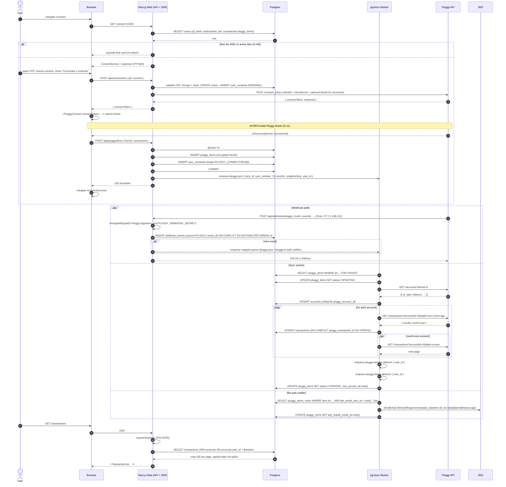

# Phase 2: Pluggy Ingestion - Research

**Researched:** 2026-05-01
**Domain:** Open Finance ingestion (Pluggy) + idempotent webhook + async sync workers + transfer/fatura detection + raw transaction list
**Confidence:** HIGH (locked decisions in CONTEXT.md + verified Pluggy docs + verified npm package versions)

## Summary

Phase 2 ships the entire Pluggy ingestion pipeline end-to-end without categorization. The critical surface is: a consent-gated `/connect` route that captures CPF inline, opens `react-pluggy-connect@2.12.0`, persists `pluggy_items` with AES-256-GCM-encrypted `pluggy_item_id`, receives webhooks at `/api/webhooks/pluggy` with custom-header auth + `webhook_events` idempotency, and runs five new pg-boss queues for sync, transfer detection, fatura detection, re-auth notifications, and stale-item reconciliation. The dataset and the handler shapes are essentially fully decided in CONTEXT.md (49 locked decisions D-01..D-49); research's job is to verify the Pluggy contract details that the planner needs to write task-level code.

The phase is unusually well-specified by upstream context. There are no architectural alternatives to evaluate — every major path is locked. Research focus is therefore: (a) verify Pluggy docs match what CONTEXT.md asserts (item status enum, executionStatus values, webhook event list, IP allowlist `177.71.238.212`, rate limits 360/min and 20/min PATCH, sandbox 30-day expiry), (b) confirm SDK package versions on npm (`pluggy-sdk@0.85.2`, `react-pluggy-connect@2.12.0`), (c) document the cursor pagination contract precisely, and (d) surface SDK quirks the planner cannot infer from the docs.

**Primary recommendation:** Plan five sequential waves — (1) schema + env + Pluggy SDK wrapper, (2) connect-token + consent + widget mount, (3) webhook receiver + sync worker + cursor pagination + dedup, (4) transfer/fatura detectors + re-auth notifier + reconciliation cron, (5) UI surfaces (`/transactions`, `/settings/connections`, banners, paywall stubs). Every locked decision in CONTEXT.md maps cleanly to a task in this wave structure; no decisions remain open.

## User Constraints (from CONTEXT.md)

### Locked Decisions

The 49 implementation decisions D-01..D-49 from CONTEXT.md are locked. Reproduced verbatim here in their original groupings; the planner MUST honor every one without re-litigating. Discrete decisions:

**Connect & Consent Flow UX (D-01..D-14):**
- D-01: Canonical entry point `/connect` (dedicated route, NOT a modal). Demo CTA, settings, and re-auth emails all link here.
- D-02: CPF captured inline on consent screen, atomic with consent grant. One server submission writes `user_consents` row, validates CPF, encrypts via `lib/crypto.ts`, sets `users.cpf_hash` + `users.cpf_enc`, returns Pluggy connect token. CPF NOT collected before consent.
- D-03: Post-connect destination `/connect/success` showing "Sincronizando..." with steps (Connected → Loading accounts → Loading transactions). Polling `/api/sync-status` every 2s for up to 60s. Auto-redirects to `/transactions` on first `transactions/created` webhook OR after 60s timeout.
- D-04: Per-item revocation at Settings > Connections with "Disconnect" + 2-step typed-confirmation modal (`DISCONNECT`). No 1-click revoke. Pluggy `DELETE /items/:id` called, sync stops, history kept, append-only consent revocation row.
- D-05: Pluggy widget handles connector picker. We issue connect token without preselected `connectorId`.
- D-06: CPF check-digit validation client-first then server-side. On invalid: inline error, NO DB writes, no consent row, no token issued.
- D-07: First-connect sync trigger = `react-pluggy-connect` `onSuccess` callback POSTs to `/api/pluggy/items` which (a) creates `pluggy_items` row, (b) writes per-connector consent row, (c) immediately enqueues `pluggy-sync`. The `item/created` webhook is treated as idempotent confirmation, NEVER the trigger.
- D-08: Per-connect consent recorded as TWO append-only rows: pre-widget (`scope='PLUGGY_CONNECT_PENDING'`) + post-widget (`scope='PLUGGY_CONNECTOR:{connectorId}'`).
- D-09: One Pluggy item produces N accounts, all auto-created and visible. Free-tier "1 connected account" = 1 ITEM (sub-accounts of that item all show).
- D-10: `consent_version_hash` for Pluggy connects = `SHA-256(privacy_policy.md + tos.md + 'pluggy_connect_v1')`. Constant bumped on copy changes.
- D-11: ALL MFA stays inside the Pluggy widget iframe — both initial connect AND re-auth via update mode (`itemId` in connect-token request). NEVER POST MFA tokens to Pluggy directly.
- D-12: Reconnect deep-link `/connect?reconnect={pluggy_items.id}` — internal UUID, NOT Pluggy item id. Session-protected; unauth → `/login?next=...`. Server issues fresh 30-min Pluggy connect token at click time.
- D-13: `audit_log` extended with: `item_connected`, `item_disconnected`, `item_reauth_started`, `item_reauth_succeeded`, `item_reauth_failed`, `manual_sync_triggered` (with `cooldown_bypassed` flag), `transfer_detected`, `fatura_detected`.
- D-14: Consent disclosure copy = plain pt-BR friendly voice, with collapsible "Detalhes legais" link expanding to LGPD Arts. 7º, 8º, 9º citations.

**Tx List + Item Health & Reconnect (D-15..D-22):**
- D-15: `/transactions` grouped by date with sticky headers (Hoje / Ontem / "15 abr"). Dense rows: amount (BRL formatting), description, account name as inline metadata. NO category column.
- D-16: Filters on `/transactions` = month picker + account filter only. NO free-text search, NO category filter.
- D-17: Item-health view at `/settings/connections` (single canonical page). Per-item card: logo, name, status pill, "Conectado há X dias", collapsible sub-account list, action buttons.
- D-18: Status taxonomy + reconnect banner placement: per-item pill badge + persistent global banner when ≥1 item needs re-auth. Pill colors: UPDATED=green, UPDATING=blue (pulsing), LOGIN_ERROR/OUTDATED=amber/red, WAITING_USER_INPUT=amber.
- D-19: Description text in `/transactions` = raw `description` from Pluggy, NO transformation. Phase 3 normalizes merchants.
- D-20: Account balance shown per sub-account on settings/connections card. No hide/show toggle in Phase 2.
- D-21: Syncing UI = pulsing blue dot + "Sincronizando..." text. No spinner.
- D-22: Pagination = server-paginated, 50 transactions per page, "Carregar mais" button. No infinite scroll.

**Pending vs Posted, Empty States, Last-Synced (D-23..D-25):**
- D-23: Pending and posted both shown. Pending = small `Pendente` chip inline. Pending excluded from totals (no totals in Phase 2).
- D-24: Three distinct empty states on `/transactions`: (a) no items connected, (b) items connected currently syncing, (c) zero tx in selected month.
- D-25: Last-synced = relative inline + absolute on hover/long-press. `formatRelative` from date-fns with pt-BR locale.

**Sync UX — Manual, Cooldown, History Depth (D-26..D-30):**
- D-26: Initial sync depth = 12 months for everyone. Free-tier 3-month visibility enforced at READ layer, not sync layer.
- D-27: Free-tier older-month selection = paywall card with "Histórico completo no plano pago" + upgrade CTA, transactions blurred behind it.
- D-28: Paid-tier manual sync button always visible. Cooldown countdown (`Aguarde 12 min`, ticks every minute). Cooldown server-enforced on `POST /api/pluggy/items/:id/sync` against `pluggy_items.last_synced_at`.
- D-29: Free-tier sync button shown as upgrade prompt → paywall modal. Free-tier scheduled sync = Pluggy's daily auto-sync (no cron we add).
- D-30: Reconnect ALWAYS triggers immediate sync ignoring cooldown. `item/login_succeeded` webhook → enqueue `pluggy-sync` with `cooldown_bypassed=true`.

**Transfer/Fatura UX + Re-auth Email Cadence (D-31..D-38):**
- D-31: Detected transfers and fatura payments stay inline in main feed with small chip (`Transferência` / `Pagamento de fatura`).
- D-32: NO flag-override UI in Phase 2. False-positive correction deferred to Phase 3.
- D-33: Deterministic transfer detection — NO confidence score. Heuristic: same `|amount|`, opposite `type`, same `user_id`, two different `account_id`s, within 3 days posted-at delta. All four match → flag both rows + link via `transfer_pair_id`.
- D-34: Re-auth email timing: instantly enqueue on first `item/error` per item; 24-hour debounce window; follow-up after 24h if unresolved; STOP after 7 days; banner persists indefinitely.
- D-35: Re-auth email content: subject `Reconecte seu {Institution}`, React Email template, single CTA → `/connect?reconnect={item_uuid}`, plaintext alternate required, sender `no-reply@portalfinance.app` (Phase 1 D-11), SES sa-east-1, ConfigurationSet attached.
- D-36: Re-auth banner = persistent and not dismissable, survives logout/login.
- D-37: Banner stack ordering: re-auth on top of email-verification (`priority` prop, re-auth=10, verification=5).
- D-38: Reconciliation worker runs as hourly pg-boss cron `pluggy.reconcile.stale-items` at `:00` BRT. Active items where `last_synced_at < now() - 12 hours` AND `status NOT IN ('LOGIN_ERROR','WAITING_USER_INPUT')`. Sentry warning + structured log if >5 items remain stale.

**Pluggy SDK + Worker Plumbing (D-39..D-42):**
- D-39: Server SDK = `pluggy-sdk@0.85`. Client SDK = `react-pluggy-connect@2.12`. Wrapped by thin `PluggyService` (`src/services/PluggyService.ts`).
- D-40: Encryption surface = `pluggy_item_id` only at rest (CONN-07 + P4). `lib/crypto.ts` encrypts on write to `pluggy_items.pluggy_item_id_enc`, decrypts only inside `PluggyService` calls. `PLUGGY_CLIENT_ID` + `PLUGGY_CLIENT_SECRET` via AWS SSM SecureStrings. Pluggy does NOT issue per-item access tokens. `webhook_events.payload` JSONB is NOT encrypted in Phase 2.
- D-41: pg-boss singleton key = per user. Queue `pluggy.sync` with `singletonKey = user_id`, `singletonHours = 0` (in-flight only).
- D-42: Webhook auth = custom shared header. Header value (e.g., `X-Pluggy-Signature`) stored as `PLUGGY_WEBHOOK_SECRET` env var (AWS SSM SecureString). Validated by `lib/env.ts` at boot. Constant-time compare via `crypto.timingSafeEqual`. PLUS Cloudflare WAF rule rejecting non-`177.71.238.212` requests at edge.

**Schema Decisions (D-43..D-46):**
- D-43: `pluggy_items` table — full column list, `UNIQUE(user_id, pluggy_item_id_hash)`, index `(user_id, status)`.
- D-44: `accounts` table — full column list, `UNIQUE(pluggy_account_id)`, index `(user_id, status)`. `account_status_enum` includes `FROZEN` (shipped Phase 2 to support Phase 5 BILL-04 downgrade-as-freeze without future migration).
- D-45: `transactions` table — full column list, `UNIQUE(pluggy_transaction_id)`, indexes including partial index `(user_id, posted_at DESC) WHERE is_transfer=false AND is_credit_card_payment=false`.
- D-46: `category_id` defers FK to Phase 3. Phase 2 stores nullable text slug.

**Observability Metrics (D-47):**
- D-47: pino structured logs at every state transition + Sentry custom transactions per sync. OTel deferred to Phase 6. Catalogue: `webhook_received`, `sync_started`, `sync_completed`, `sync_failed`, `transfer_detected`, `fatura_detected`, `reconnect_email_sent`, `pluggy_rate_limited`.

**Sandbox + Free-Tier 2nd-Item (D-48..D-49):**
- D-48: Test strategy = unit-mocked + nightly integration. Unit tests mock `PluggyService` via vitest. Integration tests run against Pluggy sandbox with `PLUGGY_SANDBOX_*` env. Sandbox usernames exercise state transitions. CI runs unit on every push; integration nightly via GitHub Actions cron OR Copilot worker run.
- D-49: Free user's 2nd connect attempt = HARD-BLOCKED at entry point. `/connect` checks `subscription_tier='free'` AND `count(active pluggy_items)>=1` → renders paywall modal BEFORE issuing connect token; widget never opens.

### Claude's Discretion

The following PluggyService class shape, webhook receiver structure, webhook event → worker mapping, cursor pagination logic, and sync window logic were left as Claude's discretion in CONTEXT.md and are reflected in this RESEARCH.md as recommended patterns:
- `PluggyService` exposes `createConnectToken({ userId, reconnectItemId? })`, `getItem(itemId)`, `listAccounts(itemId)`, `listTransactions(itemId, accountId, { from, to, cursor? })`, `deleteItem(itemId)`. Internally wraps `pluggy-sdk`.
- Webhook receiver structure: validate `X-Pluggy-Signature` header (constant-time compare) → INSERT `webhook_events(source='PLUGGY', event_type, event_id, payload) ON CONFLICT DO NOTHING RETURNING id` → return 200 in <200ms → if RETURNING set non-empty, enqueue matching pg-boss job. NO business logic in route handler.
- Event → worker mapping: `item/created`/`item/updated`/`item/login_succeeded` → `pluggy.sync`. `item/error`/`item/waiting_user_input` → `pluggy.re-auth-notifier`. `item/deleted` → no-op. `transactions/*` → enqueue `pluggy.sync` (we fetch via `listTransactions`, never trust webhook payload). `connector/status_updated` → ignored in Phase 2.
- Cursor pagination: `listTransactions` uses Pluggy's cursor endpoint, walks pages until exhausted with 12-month posted-at lower bound. Cursor opaque, NOT persisted.
- Sync window: initial = full 12 months; incremental = `last_synced_at - 7 days` to now (TX-02 overlap); reconnect = full 12 months again.
- Phase 2's first DB migration adds NOT NULL to `users.cpf_hash` + `users.cpf_enc` (Phase 1 D-04 implication).

### Deferred Ideas (OUT OF SCOPE)

- Transfer/fatura override UI → Phase 3 (CAT-03)
- Per-account balance hide/show toggle → Phase 4 polish
- Skeleton loaders on `/transactions` during sync → Phase 4
- OpenTelemetry custom counters/histograms → Phase 6 (OPS-02)
- `/accounts` separate page → Phase 4 (if needed)
- Combined "Pendências" banner → Phase 6 polish
- executionStatus phase breakdown on syncing UI → Phase 6
- Sentry per-user transaction tags + cost dashboards → Phase 6
- Free-tier scheduled cron beyond Pluggy auto-sync → Phase 6 (only if Pluggy auto-sync drops items)
- Categories table + FK migration → Phase 3
- Real paywall modal (not stub) → Phase 5
- Full deletion workflow (Pluggy DELETE + log anonymization + email-list removal + 30-day legal hold + DSR export) → Phase 6
- DASH-05 free-text search on `/transactions` → Phase 4
- Webhook-event-driven cache invalidation for `subscription_tier` → Phase 5
- Encrypted `webhook_events.payload` → Phase 6 hardening
- Admin views over Pluggy data with re-auth + audit_log → Phase 6 (SEC-03)
- Feature flag for Pluggy connectors — not in roadmap
- Multi-region read replicas for `transactions` — out of scope

## Phase Requirements

| ID | Description | Research Support |
|----|-------------|------------------|
| LGPD-02 | User can revoke consent per connection from settings; revocation = new `user_consents` row (append-only) | D-04 disconnect flow + D-08 two-row consent recording; reuses Phase 1 `user_consents` table unchanged |
| CONN-01 | User opens Pluggy widget after consent, links account; connect token short-lived (30 min), server-issued | D-02/D-07 inline-CPF flow + `pluggy-sdk` `connectToken.create()` (verified docs); token TTL = Pluggy default 30 min |
| CONN-02 | `item/created` webhook received, header verified, `eventId` deduped, sync job enqueued — all <5s; receiver returns 200 in <200ms | Phase 1 SES bounce handler shape (`webhook_events ON CONFLICT DO NOTHING RETURNING id`) + D-42 custom-header auth + Pluggy 5s response budget (verified docs) |
| CONN-03 | Each linked item shown in "Accounts" with institution, name, last-sync, health badge | D-17 `/settings/connections` + D-18 status pill taxonomy + D-25 last-synced format |
| CONN-04 | LOGIN_ERROR / WAITING_USER_INPUT items show per-item banner with Reconnect button; system never syncs broken items | D-18 global banner + D-36 persistent + D-12 reconnect deep-link + D-38 reconciliation excludes broken items |
| CONN-05 | Disconnect calls Pluggy `DELETE /items/:id`; transactions stay readable, no further sync | D-04 typed-confirmation modal + Pluggy DELETE endpoint (verified docs) + accounts.status=DELETED soft-flag |
| CONN-06 | Manual sync subject to per-item cooldown (paid: 30 min; free: disabled); over-cooldown returns clear "wait N min" | D-28/D-29 button states + server-side cooldown check on `pluggy_items.last_synced_at` |
| CONN-07 | `pluggy_item_id` + tokens AES-256-GCM encrypted at rest; plaintext NEVER in DB/logs/API/client | D-40 encryption surface + Phase 1 `lib/crypto.ts` (reused as-is) + D-43 `pluggy_item_id_enc` bytea column + `pluggy_item_id_hash` for uniqueness |
| TX-01 | Pluggy transactions upserted with `UNIQUE(pluggy_transaction_id)` + `ON CONFLICT DO UPDATE`; partial syncs never duplicate | D-45 unique constraint + Pitfall P1 + cursor pagination overlap (D-claude-sync-window) |
| TX-02 | Sync windows overlap by ≥7 days; PENDING → POSTED transitions update existing rows in place | D-claude sync-window logic (`last_synced_at - 7 days`) + `transactions/updated` event handler upserts via primary key |
| TX-03 | Webhook events `item/created`, `transactions/created`, `transactions/updated`, `transactions/deleted`, `item/error` fully handled; `event_id` UNIQUE for idempotency | D-claude event-mapping + Phase 1 `webhook_events` table (`UNIQUE(source, event_id)`) + D-42 auth |
| TX-04 | Transfers detected post-ingestion, marked `is_transfer=true`, excluded from aggregates | D-33 deterministic detector + D-45 `is_transfer` + `transfer_pair_id` columns; aggregation lives in Phase 4 (excludes via column) |
| TX-05 | Credit-card fatura payments flagged `is_credit_card_payment=true`, excluded from expense aggregates | Pitfall P8 detection (checking debit matching card balance near due date) + D-45 column; detector worker `pluggy.fatura-detector` |
| TX-06 | Reconciliation queries Pluggy for items where `last_synced_at` >12h, triggers sync, alerts on stale items | D-38 hourly cron `pluggy.reconcile.stale-items` + Pitfall P35 |

## Architectural Responsibility Map

| Capability | Primary Tier | Secondary Tier | Rationale |
|------------|-------------|----------------|-----------|
| Connect token issuance | API (Next.js route) | — | Server-only — uses `PLUGGY_CLIENT_ID/SECRET` SSM secrets; client cannot hold these |
| Pluggy widget mount + MFA | Browser (iframe) | — | All MFA stays inside Pluggy iframe per D-11; we never proxy MFA tokens |
| Webhook reception + auth | API (`/api/webhooks/pluggy`) | — | Must return 200 in <5s (Pluggy spec); only auth + idempotent insert + enqueue here, NO business logic |
| Sync work (fetch accounts/tx, upsert) | Worker (pg-boss) | — | Async per Pitfall P5; HTTP handler returns <200ms |
| Transfer detection | Worker (`pluggy.transfer-detector`) | — | Post-ingestion deterministic scan; runs after `pluggy.sync` succeeds |
| Fatura detection | Worker (`pluggy.fatura-detector`) | — | Same — post-ingestion, runs after `pluggy.sync` |
| Re-auth email | Worker (`pluggy.re-auth-notifier`) | — | Async; reuses Phase 1 `mailer.ts` SES wrapper |
| Reconciliation cron | Worker (`pluggy.reconcile.stale-items`) | — | Hourly pg-boss cron |
| Encryption of `pluggy_item_id` | API + Worker (server-side only) | DB | Plaintext never crosses to client; `lib/crypto.ts` runs server-side |
| `/transactions` list rendering | Frontend Server (SSR) | API (DB query) | Next.js App Router server component; query joined with `accounts.user_id = $session` for IDOR |
| `/settings/connections` rendering | Frontend Server (SSR) | API (DB query) | Same SSR pattern |
| Manual sync trigger button | Browser → API → Worker | — | Click → POST `/api/pluggy/items/:id/sync` → cooldown check → enqueue `pluggy.sync` → return 202 |
| Re-auth banner | Browser (client component) | API (initial query) | Reads pluggy_items.status; SSR initial paint, client refetches via TanStack Query |
| Paywall stub modal | Browser (client component) | — | Pure UI; no backend logic in Phase 2 (real paywall in Phase 5) |
| Cooldown countdown ticker | Browser (client) | — | Pure visual countdown; server-side cooldown is the truth |

## Standard Stack

### Core

| Library | Version | Purpose | Why Standard |
|---------|---------|---------|--------------|
| `pluggy-sdk` | `0.85.2` | Official Node.js Pluggy SDK; auth, rate-limit retry, typed responses | Official; latest version published 2026-04-09 [VERIFIED: npm view pluggy-sdk] |
| `react-pluggy-connect` | `2.12.0` | Official `<PluggyConnect>` widget React wrapper | Official; latest version published 2025-12-01 [VERIFIED: npm view react-pluggy-connect] |
| `pg-boss` | `12.18.1` (already installed at `12.15.0`) | Postgres-backed job queue with singletonKey + cron | Already locked Phase 1; works for Phase 2's per-user concurrency model [VERIFIED: package.json] |
| `drizzle-orm` | `0.45.2` (installed) | Postgres ORM, type-safe schema | Already locked Phase 1 [VERIFIED: package.json] |
| `zod` | `4.3.6` (installed) | Webhook payload + env + form validation | Already locked Phase 1 [VERIFIED: package.json] |
| `date-fns` | (to be installed) | `formatRelative`, `formatDistanceToNow` with pt-BR locale (D-25) | Standard pt-BR-friendly date formatting; tree-shakeable [CITED: D-25] |

### Supporting

| Library | Version | Purpose | When to Use |
|---------|---------|---------|-------------|
| `@brazilian-utils/brazilian-utils` | `2.3.0` (installed) | CPF check-digit validation (`isValidCPF`) | Already used by Phase 1 `lib/cpf.ts` — reuse [VERIFIED: package.json line 31] |
| `@react-email/components` | `0.0.33` (installed) | React Email template for `ReAuthRequired.tsx` | Already used by Phase 1 — reuse [VERIFIED: package.json] |
| `@react-email/render` | `2.0.7` (installed) | Render React Email to HTML | Already used [VERIFIED: package.json] |
| `@aws-sdk/client-ses` | `3.1034.0` (installed) | SES email send | Phase 1 `mailer.ts` reuse [VERIFIED: package.json] |
| `pino` | `10.3.1` (installed) | Structured JSON logging | Phase 1 `logger.ts` reuse [VERIFIED: package.json] |
| `@sentry/nextjs` | `10.49.0` (installed) | Error tracking + transaction tracing (D-47) | Phase 1 reuse [VERIFIED: package.json] |
| `@testcontainers/postgresql` | `10.16.0` (installed) | Postgres container for integration tests | Phase 1 reuse for D-48 integration suite [VERIFIED: package.json] |
| `vitest` | `3.0.5` (installed) | Unit + integration test runner | Phase 1 reuse [VERIFIED: package.json] |
| `msw` | `2.7.0` (installed) | HTTP request mocking for unit tests of `PluggyService` | Phase 1 reuse [VERIFIED: package.json] |

### Already-Installed shadcn Components (Phase 1, reused)

`button`, `input`, `form`, `checkbox`, `card`, `alert`, `dialog`, `sonner`, `badge`, `separator` [VERIFIED: UI-SPEC.md line 586]

### New shadcn Components (Phase 2 adds)

| Component | CLI command | Usage |
|-----------|------------|-------|
| `select` | `npx shadcn@latest add select` | Month picker, account filter dropdown |
| `tooltip` | `npx shadcn@latest add tooltip` | Last-synced absolute timestamp on hover |
| `collapsible` | `npx shadcn@latest add collapsible` | Sub-account list expand/collapse |
| `progress` | `npx shadcn@latest add progress` | Sync progress bar fallback on `/connect/success` |

### Alternatives Considered

| Instead of | Could Use | Tradeoff |
|------------|-----------|----------|
| `pluggy-sdk@0.85.2` | Direct `fetch()` against Pluggy REST | SDK gives typed responses + auth refresh + rate-limit retry built in; rolling our own is more code + error-prone. Use the SDK. |
| `react-pluggy-connect@2.12.0` | Hosted Pluggy Connect URL redirect | Widget gives in-app embedded UX (better conversion + better LGPD UX, MFA inside iframe); redirect breaks single-page-app feel. Use the widget. |
| pg-boss `singletonKey = user_id` | Postgres advisory lock per-user | pg-boss singletonKey is built for exactly this case (in-flight de-dupe); advisory locks would require manual lock/release. Use singletonKey. |
| Custom cursor pagination state | Persist Pluggy cursor in DB | Cursor is opaque + short-lived; persisting buys nothing because we recompute window from `last_synced_at - 7 days`. Walk pages in-memory. |

**Installation:**
```bash
pnpm add pluggy-sdk@0.85.2 react-pluggy-connect@2.12.0 date-fns
npx shadcn@latest add select tooltip collapsible progress
```

**Version verification (executed 2026-05-01 via `npm view ...`):**
- `pluggy-sdk@0.85.2` — published 2026-04-09 [VERIFIED]
- `react-pluggy-connect@2.12.0` — published 2025-12-01 [VERIFIED]
- `pg-boss@12.18.1` (latest), our installed `12.15.0` is compatible [VERIFIED]
- `pluggy-js@0.19.3` (legacy SDK, NOT used by us — see Pitfalls section)

## Architecture Patterns

### System Architecture Diagram



### Recommended Project Structure

```
src/
├── app/
│   ├── connect/
│   │   ├── page.tsx                    # /connect — consent + CPF + reconnect dispatch
│   │   └── success/page.tsx            # /connect/success — polling card
│   ├── transactions/page.tsx           # /transactions — date-grouped list
│   ├── settings/connections/page.tsx   # /settings/connections — health view
│   └── api/
│       ├── connect/init/route.ts       # POST: validate CPF, write consents, issue token
│       ├── pluggy/
│       │   ├── items/route.ts          # POST: create pluggy_items + enqueue sync
│       │   └── items/[id]/
│       │       ├── route.ts            # DELETE: disconnect (Pluggy DELETE + revoke consent)
│       │       └── sync/route.ts       # POST: manual sync (cooldown-gated)
│       ├── sync-status/route.ts        # GET: polling endpoint for /connect/success
│       └── webhooks/pluggy/route.ts    # POST: webhook receiver (auth + idempotent insert + enqueue)
├── services/
│   └── PluggyService.ts                # SDK wrapper (audit log + hash IDs + error normalization)
├── jobs/
│   └── workers/
│       ├── pluggySyncWorker.ts         # pluggy.sync — fetch accounts/tx, upsert, dedup
│       ├── transferDetectorWorker.ts   # pluggy.transfer-detector — D-33 heuristic
│       ├── faturaDetectorWorker.ts     # pluggy.fatura-detector — P8 heuristic
│       ├── reAuthNotifierWorker.ts     # pluggy.re-auth-notifier — debounce + SES send
│       └── reconcileStaleItemsWorker.ts # pluggy.reconcile.stale-items — hourly cron
├── db/schema/
│   ├── pluggyItems.ts                  # D-43
│   ├── accounts.ts                     # D-44
│   └── transactions.ts                 # D-45
├── components/
│   ├── connect/
│   │   ├── PluggyConnectWidget.tsx     # react-pluggy-connect wrapper
│   │   └── SyncProgressCard.tsx        # /connect/success step list
│   ├── transactions/
│   │   ├── TransactionList.tsx         # date-grouped, sticky headers
│   │   └── EmptyTransactions.tsx       # 3 empty states (D-24)
│   ├── connections/
│   │   ├── ConnectionCard.tsx          # per-item card
│   │   └── DisconnectConfirmModal.tsx  # 2-step typed-confirmation
│   ├── billing/PaywallStubCard.tsx     # D-27 + D-49 paywall stub
│   └── banners/ReAuthBanner.tsx        # priority=10, persistent
├── emails/
│   └── ReAuthRequired.tsx              # React Email template (HTML + plaintext)
└── lib/
    └── pluggyEnv.ts                    # convenience: typed Pluggy env reader
```

### Pattern 1: Idempotent Webhook Receiver (matches Phase 1 SES bounce shape)

**What:** Validate auth → idempotent insert → return 200 → enqueue if new.
**When to use:** Every webhook receiver in this project (mandated by P3 + Phase 1 plan 01-04).
**Example:**

```typescript
// Source: Phase 1 src/app/api/webhooks/ses/bounces/route.ts (adapted for Pluggy)
export const runtime = 'nodejs';

import { db } from '@/db';
import { webhook_events } from '@/db/schema';
import { enqueue } from '@/jobs/boss';
import { env } from '@/lib/env';
import { logger } from '@/lib/logger';
import { timingSafeEqual } from 'node:crypto';

export async function POST(req: Request): Promise<Response> {
  const start = Date.now();

  // 1. Verify custom auth header (D-42)
  const sig_header = req.headers.get('x-pluggy-signature') ?? '';
  const expected = env.PLUGGY_WEBHOOK_SECRET;
  const sig_buf = Buffer.from(sig_header);
  const exp_buf = Buffer.from(expected);
  if (sig_buf.length !== exp_buf.length || !timingSafeEqual(sig_buf, exp_buf)) {
    logger.warn({ event: 'pluggy_webhook_signature_failed' }, 'invalid signature');
    return new Response('unauthorized', { status: 401 });
  }

  // 2. Parse body
  let body: { event: string; eventId: string; itemId?: string; [k: string]: unknown };
  try {
    body = await req.json();
  } catch {
    return new Response('bad json', { status: 400 });
  }

  // 3. Idempotent INSERT
  const inserted = await db
    .insert(webhook_events)
    .values({
      source: 'PLUGGY',
      event_type: body.event,
      event_id: body.eventId,
      payload: body,
    })
    .onConflictDoNothing()
    .returning({ id: webhook_events.id });

  const was_duplicate = inserted.length === 0;

  // 4. Enqueue mapped worker (only if new)
  if (!was_duplicate) {
    const queue = mapEventToQueue(body.event);  // 'pluggy.sync' | 'pluggy.re-auth-notifier' | null
    if (queue) {
      await enqueue(queue, { webhook_event_id: inserted[0].id, item_id: body.itemId });
    }
  }

  logger.info({
    event: 'pluggy_webhook_received',
    event_type: body.event,
    event_id: body.eventId,
    latency_ms: Date.now() - start,
    was_duplicate,
  });

  return new Response('ok', { status: 200 });
}
```

### Pattern 2: pg-boss Singleton-Key Sync Worker

**What:** Per-user concurrency=1 via singletonKey; in-flight only.
**When to use:** Any operation that, if invoked concurrently for the same user, would race against Pluggy rate-limits or violate per-user invariants.
**Example:**

```typescript
// Server enqueues a sync for user X — if another sync for X is already running,
// this enqueue is a no-op (returns null jobId, dedup'd).
await enqueue('pluggy.sync', { user_id, item_id, trigger: 'webhook' }, {
  singletonKey: user_id,        // D-41
  singletonHours: 0,            // in-flight only (no time-window dedup)
});

// Worker registration with localConcurrency:
await boss.work('pluggy.sync', { localConcurrency: 4 }, pluggySyncWorker);
// localConcurrency=4 means up to 4 different users sync in parallel on this
// worker instance, but each user is serialized by singletonKey.
```

### Pattern 3: Cursor Pagination + Window Overlap

**What:** Pluggy `transactions-list-by-cursor` returns `{ results, nextCursor }`; iterate until `nextCursor` is absent.
**When to use:** Every Pluggy transaction fetch.
**Example:**

```typescript
// Source: Pluggy SDK pattern + cursor docs verification
async function* iterateTransactions(
  pluggy: PluggyClient,
  accountId: string,
  fromDate: string,
): AsyncGenerator<PluggyTransaction[]> {
  let cursor: string | undefined = undefined;
  do {
    const page = await pluggy.fetchTransactions(accountId, {
      from: fromDate,
      pageSize: 500,        // pluggy-sdk default; max page documented is implementation-dependent
      after: cursor,
    });
    yield page.results;
    cursor = page.nextCursor ?? undefined;  // CITED: docs say cursor in `next` field
  } while (cursor);
}

// Sync window logic (D-claude sync-window):
const fromDate = item.last_synced_at
  ? subDays(item.last_synced_at, 7).toISOString()  // 7-day overlap (TX-02)
  : subMonths(new Date(), 12).toISOString();        // initial = 12 months (D-26)
```

### Pattern 4: Idempotent Upsert with `ON CONFLICT DO UPDATE` (TX-01)

**What:** Drizzle upsert keyed on `pluggy_transaction_id`.
**When to use:** Every transaction write — required by TX-01.
**Example:**

```typescript
import { transactions } from '@/db/schema';
import { sql } from 'drizzle-orm';

await db
  .insert(transactions)
  .values(rows)  // batched
  .onConflictDoUpdate({
    target: transactions.pluggy_transaction_id,
    set: {
      // Update fields that may change between syncs (PENDING → POSTED, amount adjustments)
      status: sql.raw('excluded.status'),
      amount: sql.raw('excluded.amount'),
      description: sql.raw('excluded.description'),
      posted_at: sql.raw('excluded.posted_at'),
      raw_payload: sql.raw('excluded.raw_payload'),
      updated_at: sql`now()`,
      // DO NOT update is_transfer / is_credit_card_payment — those are set
      // by detectors post-ingestion and re-running upsert from sync should
      // not clobber detector results. Detectors re-run after sync anyway.
    },
  });
```

### Pattern 5: PluggyService Wrapper (testability + audit)

**What:** Thin class wrapping `pluggy-sdk` for unit-testability, error normalization, and per-call audit logging.
**When to use:** Every server-side Pluggy API call.
**Example:**

```typescript
import { PluggyClient } from 'pluggy-sdk';
import { env } from '@/lib/env';
import { decryptCPF } from '@/lib/crypto';
import { logger } from '@/lib/logger';
import { hashUserId } from '@/lib/piiScrubber';

export class PluggyService {
  private client: PluggyClient;

  constructor() {
    this.client = new PluggyClient({
      clientId: env.PLUGGY_CLIENT_ID,
      clientSecret: env.PLUGGY_CLIENT_SECRET,
    });
  }

  async createConnectToken(args: { userId: string; reconnectItemIdEnc?: Buffer }): Promise<{ connectToken: string; expiresAt: string }> {
    const itemId = args.reconnectItemIdEnc
      ? decryptCPF(args.reconnectItemIdEnc)  // re-uses AES-256-GCM helper for any short ciphertext
      : undefined;
    const t = await this.client.createConnectToken(itemId ? { itemId } : undefined);
    logger.info({
      event: 'pluggy_connect_token_created',
      user_id_hashed: hashUserId(args.userId),
      reconnect: !!itemId,
    });
    return { connectToken: t.accessToken, expiresAt: t.expiresAt };
  }

  // ... getItem, listAccounts, listTransactions, deleteItem
}
```

### Anti-Patterns to Avoid

- **Trusting `merchant.name` from Pluggy** — Pitfall P6. Pluggy's merchant data is unreliable (especially PIX). Store it in `transactions.merchant_name` for Phase 3 weak-signal use only; never display it in `/transactions`.
- **Trusting `category` from Pluggy** — Pitfall P6. Store as `transactions.pluggy_category` for Phase 3 reference; never use as authoritative.
- **Logging `pluggy_item_id` plaintext** — Pitfall P4. Always hash before logging (`hashUserId(itemId)` pattern).
- **Synchronous sync work in HTTP handler** — Pitfall P5. Every Pluggy API call beyond `createConnectToken` runs in a worker; HTTP handler returns 202 in <200ms.
- **Updating `transfer_pair_id` from sync upsert** — would clobber detector decisions. Use `DO UPDATE SET` exclusion list.
- **Calling Pluggy `PATCH /items` >20 times/min** — Pitfall P9 + verified rate limit. Manual-sync hot path. Per-user singletonKey + Cloudflare WAF rate-limit on `/api/pluggy/items/:id/sync` route protects this.
- **One global pg-boss singletonKey for all sync** — would serialize all users to one at a time. singletonKey MUST be `user_id`, never a constant.
- **Hand-rolled cursor pagination state in DB** — opaque cursor + recomputed `last_synced_at - 7 days` window means we don't need to persist cursors.
- **Encrypting `webhook_events.payload`** — out of Phase 2 scope; deferred to Phase 6 hardening (D-40).

## Don't Hand-Roll

| Problem | Don't Build | Use Instead | Why |
|---------|-------------|-------------|-----|
| Pluggy API client (auth, retry, types) | Custom `fetch` + auth refresh + retry-on-429 | `pluggy-sdk@0.85.2` | Official SDK handles auth refresh, typed responses, rate-limit retry. Recently updated (2026-04) — versions track Pluggy API. |
| Pluggy widget UI + iframe + MFA flow | Custom iframe + postMessage | `react-pluggy-connect@2.12.0` | Pluggy ships the entire widget; reimplementing breaks LGPD UX (MFA inside iframe per D-11) and risks security regressions. |
| Connector list + connector picker UI | Self-maintained connector catalogue | Pluggy widget's built-in picker (D-05) | Pluggy adds/removes connectors continuously; self-maintaining means we ship broken UIs. |
| Job queue with cron + singletonKey | Custom Postgres polling | `pg-boss@12` | Already locked Phase 1; v12 has named export `PgBoss`, `localConcurrency`, `singletonKey` — exactly fit. |
| Idempotency on webhook events | Custom dedupe map | `webhook_events` table with `UNIQUE(source, event_id)` + `ON CONFLICT DO NOTHING RETURNING id` | Phase 1 already ships this. Reuse. |
| AES-256-GCM encryption helper | New crypto module | Phase 1 `lib/crypto.ts` `encryptCPF`/`decryptCPF` | Helper is generic over plaintext; rename mentally to `encrypt(blob)` and reuse. The helper signature accepts a string and returns `iv || tag || ct` Buffer — works for `pluggy_item_id` unchanged. |
| CPF check-digit validation | Hand-rolled | `@brazilian-utils/brazilian-utils` `isValidCPF` (Phase 1 `lib/cpf.ts`) | Reuse Phase 1; no new code. |
| pt-BR date formatting | Custom format strings | `date-fns` `formatRelative`, `format` with `pt-BR` locale | Standard, accessible, locale-aware. |
| Email template rendering with plaintext alt | String concatenation | `@react-email/components` + `@react-email/render` | Phase 1 already ships pattern; reuse. Plaintext alt is a Phase 1 lockdown requirement (plan 01-05). |
| SES send + suppression guard | Direct `@aws-sdk/client-ses` | Phase 1 `lib/mailer.ts` | Already wraps SES, suppression guard, ConfigurationSet — call `sendMail(...)`. |
| pino structured logger | Custom JSON logger | Phase 1 `lib/logger.ts` | Reuse. |
| testcontainers Postgres + .env rewrite | Custom test orchestration | Phase 1 `scripts/run-e2e.ts` | Already orchestrates testcontainers + Playwright webServer race — extend, don't replace. |

**Key insight:** Phase 1 already ships every primitive Phase 2 needs except the Pluggy SDK wrapper itself. Every "lib/*" import in Phase 2 should target an existing Phase 1 module; new code is concentrated in `services/PluggyService.ts`, the five worker files, the route handlers, the schema files, and the UI components.

## Runtime State Inventory

> Phase 2 is greenfield — no rename, refactor, or migration of existing live state. Two state interactions exist and are explicitly enumerated below.

| Category | Items Found | Action Required |
|----------|-------------|------------------|
| Stored data | (1) `users.cpf_hash` and `users.cpf_enc` columns are nullable in Phase 1 (D-04 implication) and become NOT NULL via the first Phase 2 migration. (2) `users.subscription_tier` defaults to `'paid'` in Phase 1 — Phase 2 reads this on every `/connect` and `/api/pluggy/items/:id/sync` for free-tier gating (D-49 + D-29). | (1) Migration: backfill any pre-Phase-2 test users (production has zero real users per STATE.md), then `ALTER COLUMN ... SET NOT NULL`. (2) No data migration needed — Phase 2 only reads the column. |
| Live service config | (1) Cloudflare WAF rule must be added to allowlist Pluggy's IP `177.71.238.212` and reject all other IPs at `/api/webhooks/pluggy` edge (D-42). (2) AWS SSM SecureStrings must be created for `PLUGGY_CLIENT_ID`, `PLUGGY_CLIENT_SECRET`, `PLUGGY_WEBHOOK_SECRET`, `PLUGGY_SANDBOX_CLIENT_ID`, `PLUGGY_SANDBOX_CLIENT_SECRET`. (3) Pluggy webhook URL must be registered in Pluggy dashboard pointing to `https://app.portalfinance.app/api/webhooks/pluggy` with the matching custom auth header. | (1) Cloudflare config edit (Phase 2 plan task — manual or Terraform if available). (2) AWS SSM Parameter Store entries (Copilot manifest secrets section in `web/manifest.yml` + `worker/manifest.yml`). (3) Pluggy dashboard configuration (one-time, post-deploy). |
| OS-registered state | None — verified by inspection. Phase 2 introduces no Windows Task Scheduler / systemd / launchd / pm2 entries. The hourly reconciliation cron (D-38) is a pg-boss cron, not an OS cron. | None |
| Secrets/env vars | New env vars added to `lib/env.ts` Zod schema: `PLUGGY_CLIENT_ID`, `PLUGGY_CLIENT_SECRET`, `PLUGGY_ENV` (already declared in Phase 1 schema as optional — extend to required-in-prod), `PLUGGY_WEBHOOK_SECRET`, `PLUGGY_SANDBOX_CLIENT_ID` (test-only), `PLUGGY_SANDBOX_CLIENT_SECRET` (test-only). The OPS-04 refine in `lib/env.ts` already enforces `PLUGGY_ENV='production'` when `NODE_ENV='production'`; new vars need similar guards. | Update `lib/env.ts` Zod schema; update Copilot manifest secrets refs; document in `docs/ops/aws-copilot-setup.md` (Phase 1 created this file). |
| Build artifacts | None — verified. No installed npm packages with stale name references. The `tsup.config.ts` for the worker bundle (Phase 6 deferred) does not change in Phase 2; worker is still run via `tsx` per package.json `start:worker`. | None |

## Common Pitfalls

### Pitfall 1: Concurrent sync storms hitting Pluggy `PATCH /items` 20/min limit

**What goes wrong:** A user clicks "Sincronizar agora" multiple times quickly, OR multiple webhooks arrive in quick succession (`item/created` followed by `transactions/created`), enqueuing several `pluggy.sync` jobs for the same user, each calling `PATCH /items` and exceeding the 20/min PATCH bucket. Result: 429 responses, partial syncs, and Sentry alarm noise.

**Why it happens:** Without singleton-key dedup at the queue layer, every webhook arrival = new job. Pluggy `PATCH /items` is the trigger-sync verb and is the most aggressively rate-limited endpoint at 20/min/IP (verified docs).

**How to avoid:**
1. `singletonKey: user_id` + `singletonHours: 0` on every `pluggy.sync` enqueue (D-41).
2. Server-side cooldown check on the manual-sync route — read `pluggy_items.last_synced_at`; if `< 30 min` ago and `cooldown_bypassed=false`, return 429 with `Retry-After`.
3. Cloudflare WAF rate-limit rule on `/api/pluggy/items/:id/sync` — per-IP, e.g., 6 req/min.
4. Workers handle Pluggy 429 by reading `Retry-After` header (verified docs: always 60s) and delaying the job retry.

**Warning signs:** `pluggy_rate_limited` log entries (D-47), Sentry transactions tagged `pluggy.sync` failing with status 429, multiple `pluggy.sync` jobs queued for the same user_id at the same second.

### Pitfall 2: `react-pluggy-connect` peer-dependency `pluggy-js` warning

**What goes wrong:** During `pnpm install`, npm/pnpm logs a peer-dependency warning that `react-pluggy-connect@2.12.0` expects `pluggy-js >= 0.16.0` but we install `pluggy-sdk@0.85.2`. Developers may panic and downgrade or add the wrong package.

**Why it happens:** Pluggy renamed the Node SDK from `pluggy-js` to `pluggy-sdk` at some point. The widget's `package.json` still lists the old peer-dep name. Functionally, the widget runs entirely in the browser using only the connect token issued by our server — it does not import the Node SDK at runtime in the user's browser. The peerDep is a stale meta-warning. [VERIFIED: `npm view react-pluggy-connect peerDependencies`]

**How to avoid:** Add a comment to `package.json` or a `.pnpm` overrides block clarifying that `pluggy-js` is intentionally not installed. Document in research that the warning is benign. Do NOT downgrade to `pluggy-js`.

**Warning signs:** Developer adds `pluggy-js` to dependencies "to fix the warning" — duplicate SDK in the bundle, type conflicts.

### Pitfall 3: Pluggy webhook `<5s` deadline vs default Vercel/Next.js cold start

**What goes wrong:** Pluggy waits up to 5s for a 2xx response (verified docs). On a cold-start Next.js Lambda or Fargate task, the webhook handler may take >5s just to bootstrap, even before any logic runs. Pluggy retries 3 times immediately, then 1h later 3 times, then 2h later 3 times — 9 total. The `webhook_events` `UNIQUE(source, event_id)` constraint absorbs the duplicate retries idempotently, but cold-start latency still wastes Pluggy's retry budget.

**Why it happens:** AWS Copilot Fargate tasks are warm (no cold start) once running, so this is mostly a non-issue for our deploy target. But during deploys, the load balancer briefly drains traffic — if a webhook hits during drain, the 5s budget can be exhausted.

**How to avoid:**
1. Set Copilot service `count >= 2` in production (already covered for `web` service per Phase 1 manifests).
2. Configure ALB graceful drain timeout to bridge deploys.
3. Webhook receiver does NO Sentry instrumentation in the hot path — `Sentry.captureException` calls add 50-200ms; defer all heavy logging to the worker.
4. Database connection pool warmed at boot (Phase 1 already does this via `db/index.ts` lazy client).
5. The receiver returns 200 BEFORE waiting for `enqueue()` to complete is **NOT** safe — pg-boss `send()` is fast (single INSERT) but if it fails after 200, we lose the event. The receiver MUST `await enqueue()` and only then return 200; if enqueue fails, return 500 and let Pluggy retry.

**Warning signs:** P95 latency on `POST /api/webhooks/pluggy` >2s in CloudWatch; Pluggy support reporting webhook delivery failures.

### Pitfall 4: pg-boss v10+ queues no longer auto-create

**What goes wrong:** Calling `boss.work('pluggy.sync', handler)` or `boss.send('pluggy.sync', data)` for a queue that doesn't exist throws or silently no-ops in pg-boss v10+. Phase 1 STATE.md explicitly captured this hotfix: "pg-boss v10+: queues no longer auto-create. `getBoss()` calls `boss.createQueue` for every entry in `QUEUES` after `start()`."

**Why it happens:** pg-boss v10 changed the queue model. `createQueue` is now an explicit, idempotent setup call.

**How to avoid:** Add Phase 2's five new queue names to the `QUEUES` constant in `src/jobs/boss.ts`:

```typescript
export const QUEUES = {
  // ... Phase 1 entries
  PLUGGY_SYNC: 'pluggy.sync',
  PLUGGY_TRANSFER_DETECTOR: 'pluggy.transfer-detector',
  PLUGGY_FATURA_DETECTOR: 'pluggy.fatura-detector',
  PLUGGY_REAUTH_NOTIFIER: 'pluggy.re-auth-notifier',
  PLUGGY_RECONCILE_STALE: 'pluggy.reconcile.stale-items',
} as const;
```

The existing `getBoss()` loop `for (const queue of Object.values(QUEUES)) { await _boss.createQueue(queue); }` will auto-register these on next start. The cron-style queue (`pluggy.reconcile.stale-items`) needs an additional `boss.schedule('pluggy.reconcile.stale-items', '0 * * * *', {}, { tz: 'America/Sao_Paulo' })` call in `worker.ts`.

**Warning signs:** Worker registers `boss.work()` and never receives jobs; `boss.send()` returns null silently.

### Pitfall 5: Pluggy `transactions/created` webhook payload is unreliable for transaction data

**What goes wrong:** A naive implementation reads transaction data directly from the webhook payload and inserts. Pluggy may send partial data, may send the same event multiple times with different shapes, and the data may already be stale by the time we process it.

**Why it happens:** Pluggy's webhooks are notification events, not authoritative data. The authoritative read path is `GET /transactions`.

**How to avoid:** D-claude event-mapping is correct: every `transactions/*` event triggers `pluggy.sync` worker, which calls `listTransactions` to fetch fresh state. The webhook payload is used only for `event_id` idempotency and worker enqueue — never as source-of-truth for tx fields.

**Warning signs:** Stale or duplicate transaction rows; inconsistencies between what `/transactions` shows and what's in the bank.

### Pitfall 6: Pluggy sandbox items expire after 30 days without warning

**What goes wrong:** Integration tests pass for weeks, then suddenly fail with `INVALID_PARAMETER` because the sandbox item used by the test fixture has been auto-deleted. Pluggy doesn't warn — sandbox items inactive >30 days are deleted (verified docs).

**Why it happens:** Pluggy garbage-collects inactive sandbox items.

**How to avoid:** D-48 mandates a `beforeAll` retry guard that recreates fixtures on `INVALID_PARAMETER`. Concretely: integration test setup queries Pluggy for an existing fixture item; if not found OR if last access >25 days ago, create a new one via the sandbox connect flow with a state-trigger username (`user-ok`) and store the resulting itemId in a test-only fixture file (gitignored, regenerated on demand).

**Warning signs:** Nightly integration suite suddenly fails after weeks of passing; error code `INVALID_PARAMETER` from Pluggy; sandbox itemId not found.

### Pitfall 7: Drizzle schema barrel order matters for migrations

**What goes wrong:** Adding new schema files to `src/db/schema/` but not exporting them from `index.ts` (or exporting in the wrong order) produces no migration or a malformed one. Drizzle Kit follows declaration order in the barrel.

**Why it happens:** Drizzle Kit reads the schema via the import graph from the barrel. Phase 1 STATE.md already captured this pattern.

**How to avoid:** Add the three new schema files in dependency order to `src/db/schema/index.ts`:

```typescript
// ... existing exports
export * from './pluggyItems';   // depends on users
export * from './accounts';      // depends on users + pluggyItems
export * from './transactions';  // depends on users + accounts (and self-FK transfer_pair_id)
```

Self-FKs (`transactions.transfer_pair_id` references `transactions.id`) need careful Drizzle declaration: use `references((): AnyPgColumn => transactions.id)` lazy pattern.

**Warning signs:** `drizzle-kit generate` produces empty migration; or migration has wrong FK order causing failure on `up`.

### Pitfall 8: CPF NOT-NULL migration ordering with existing test users

**What goes wrong:** The Phase 2 migration `ALTER COLUMN cpf_hash SET NOT NULL` fails because Phase 1 staging/dev databases have rows with NULL cpf_hash (signup happened, no Pluggy connect happened).

**Why it happens:** Phase 1 D-04 deferred CPF collection to "first connect" (Phase 2). Existing Phase 1 test users have NULL CPF columns.

**How to avoid:** Two-step migration:
1. Migration 1 (data fix): `DELETE FROM users WHERE cpf_hash IS NULL;` (acceptable in dev/staging; production has zero real users per STATE.md). Document the migration as "DESTRUCTIVE — runs only when env != production OR confirmed empty production".
2. Migration 2 (schema): `ALTER TABLE users ALTER COLUMN cpf_hash SET NOT NULL; ALTER TABLE users ALTER COLUMN cpf_enc SET NOT NULL;`

Alternative: backfill with a sentinel value, but this corrupts the model and is rejected.

**Warning signs:** `db:migrate` fails on staging with `column "cpf_hash" contains null values`.

### Pitfall 9: Transfer detector double-run idempotency

**What goes wrong:** The `pluggy.transfer-detector` worker runs after every sync. On run #2 for the same user, it could re-flag transactions already flagged, or worse — if a transaction was previously paired with X and the detector's window now sees Y as a closer match, it could re-link to the wrong row.

**Why it happens:** The detector is a deterministic scan over recent transactions. Without an idempotency guard, it runs blindly.

**How to avoid:** Detector skips transactions where `is_transfer = true` already (already processed). Newly-arrived transactions are scanned against existing un-paired transactions in the 3-day window. Pairs once linked stay linked. If the user later corrects a false-positive (Phase 3 CAT-03), the correction explicitly clears `is_transfer` + `transfer_pair_id` and the detector respects that flag.

**Warning signs:** `transfer_pair_id` flapping between sync runs; same transaction paired with different counterparts on different runs.

### Pitfall 10: Webhook event mapping omits payment events

**What goes wrong:** The webhook receiver receives a `payment_intent/created` event and doesn't have a mapping; the receiver inserts into `webhook_events` (consuming the idempotency slot) but never enqueues a worker. Pluggy considers it delivered. Later, when we ship Phase 5 (billing) and want to consume payment events, the events were already inserted (idempotency dedup) and never processed.

**Why it happens:** Pluggy emits 18+ event types (verified docs). Our `mapEventToQueue` only knows about `item/*` and `transactions/*`.

**How to avoid:** `mapEventToQueue` returns a queue name for known events and `null` for unknown events. For `null`, the receiver still inserts into `webhook_events` but skips `enqueue()` — and logs a `pluggy_webhook_unmapped_event` entry. Phase 5 will add payment events to the mapping. Crucially: the `webhook_events` row IS persisted, so Phase 5 can replay historical events from the table if needed (Pitfall P35 reconciliation pattern).

**Warning signs:** `pluggy_webhook_unmapped_event` log entries for events we expected to handle; integration tests for Phase 5 fail because expected events were already "processed" (inserted) in Phase 2.

## Code Examples

### Connect Token Issuance (CONN-01 + D-02)

```typescript
// Source: pluggy-sdk@0.85 typed API + CONTEXT.md D-02/D-07
// File: src/app/api/connect/init/route.ts
export const runtime = 'nodejs';

import { db } from '@/db';
import { users, user_consents } from '@/db/schema';
import { CPFSchema } from '@/lib/cpf';
import { encryptCPF, hashCPF } from '@/lib/crypto';
import { requireSession } from '@/lib/session';
import { PluggyService } from '@/services/PluggyService';
import { eq } from 'drizzle-orm';
import { z } from 'zod';

const InitBodySchema = z.object({
  cpf: CPFSchema.optional(),
  consent_granted: z.literal(true),
  consent_version_hash: z.string(),
});

export async function POST(req: Request) {
  const session = await requireSession(req);
  const body = InitBodySchema.parse(await req.json());

  // Free-tier 2nd-item block (D-49) — fail BEFORE issuing token
  const user = await db.select().from(users).where(eq(users.id, session.userId)).limit(1).then(r => r[0]);
  if (user.subscription_tier === 'free') {
    const item_count = await db.$count(/* pluggy_items WHERE user_id = $session AND status != 'DELETED' */);
    if (item_count >= 1) return Response.json({ error: 'PAYWALL', upgrade_url: '/settings/billing' }, { status: 402 });
  }

  // CPF capture (only if not yet on file) — D-02 atomic with consent
  await db.transaction(async (tx) => {
    if (!user.cpf_hash && body.cpf) {
      await tx.update(users).set({
        cpf_hash: hashCPF(body.cpf),
        cpf_enc: encryptCPF(body.cpf),
      }).where(eq(users.id, session.userId));
    }
    await tx.insert(user_consents).values({
      user_id: session.userId,
      scope: 'PLUGGY_CONNECT_PENDING',
      action: 'GRANTED',
      consent_version: body.consent_version_hash,
      ip_address: req.headers.get('x-forwarded-for') ?? null,
      user_agent: req.headers.get('user-agent') ?? null,
      granted_at: new Date(),
    });
  });

  const pluggy = new PluggyService();
  const { connectToken, expiresAt } = await pluggy.createConnectToken({ userId: session.userId });
  return Response.json({ connectToken, expiresAt });
}
```

### Manual Sync Cooldown Check (CONN-06)

```typescript
// File: src/app/api/pluggy/items/[id]/sync/route.ts
export async function POST(req: Request, { params }: { params: { id: string } }) {
  const session = await requireSession(req);
  const item = await db.select().from(pluggy_items)
    .where(and(eq(pluggy_items.id, params.id), eq(pluggy_items.user_id, session.userId)))  // P26 IDOR
    .limit(1).then(r => r[0]);
  if (!item) return new Response('not found', { status: 404 });  // never 403 (leaks existence)

  const user = await db.select({ tier: users.subscription_tier }).from(users).where(eq(users.id, session.userId)).limit(1).then(r => r[0]);
  if (user.tier === 'free') return Response.json({ error: 'PAYWALL' }, { status: 402 });

  const COOLDOWN_MS = 30 * 60 * 1000;  // 30 min, D-28
  const elapsed = item.last_synced_at ? Date.now() - item.last_synced_at.getTime() : Infinity;
  if (elapsed < COOLDOWN_MS) {
    const wait_min = Math.ceil((COOLDOWN_MS - elapsed) / 60_000);
    return Response.json({ error: 'COOLDOWN', wait_minutes: wait_min }, { status: 429, headers: { 'Retry-After': String((COOLDOWN_MS - elapsed) / 1000) } });
  }

  await enqueue(QUEUES.PLUGGY_SYNC, {
    user_id: session.userId,
    item_id: item.id,
    trigger: 'manual',
    cooldown_bypassed: false,
  }, {
    singletonKey: session.userId,  // D-41
    singletonHours: 0,
  });

  // audit_log — manual_sync_triggered (D-13)
  await db.insert(audit_log).values({
    user_id: session.userId, actor_type: 'USER', action: 'manual_sync_triggered',
    entity_type: 'pluggy_item', entity_id: item.id,
    metadata: { cooldown_bypassed: false },
  });

  return new Response(null, { status: 202 });
}
```

### Transfer Detector (TX-04 + D-33)

```typescript
// Source: D-33 deterministic heuristic
// File: src/jobs/workers/transferDetectorWorker.ts
import { db } from '@/db';
import { transactions } from '@/db/schema';
import { and, eq, sql } from 'drizzle-orm';

export async function transferDetectorWorker(job: { data: { user_id: string } }) {
  // Find candidate pairs: same |amount|, opposite type, same user, different accounts, ≤3 days posted-at delta, both not yet flagged
  const pairs = await db.execute(sql`
    SELECT a.id AS debit_id, b.id AS credit_id
    FROM transactions a
    JOIN transactions b ON
      a.user_id = ${job.data.user_id} AND b.user_id = ${job.data.user_id}
      AND a.user_id = b.user_id
      AND a.amount = b.amount
      AND a.type = 'DEBIT' AND b.type = 'CREDIT'
      AND a.account_id <> b.account_id
      AND ABS(EXTRACT(EPOCH FROM (a.posted_at - b.posted_at))) <= 3 * 86400
      AND a.is_transfer = false AND b.is_transfer = false
      AND a.is_credit_card_payment = false AND b.is_credit_card_payment = false
  `);

  for (const pair of pairs) {
    await db.transaction(async (tx) => {
      await tx.update(transactions).set({
        is_transfer: true, transfer_pair_id: pair.credit_id,
      }).where(eq(transactions.id, pair.debit_id));
      await tx.update(transactions).set({
        is_transfer: true, transfer_pair_id: pair.debit_id,
      }).where(eq(transactions.id, pair.credit_id));
      await tx.insert(audit_log).values({
        user_id: job.data.user_id, actor_type: 'SYSTEM', action: 'transfer_detected',
        metadata: { debit_id: pair.debit_id, credit_id: pair.credit_id },
      });
    });
  }
}
```

### Webhook Event → Queue Mapping

```typescript
// File: src/services/pluggyWebhookMapping.ts
export function mapEventToQueue(event: string): string | null {
  switch (event) {
    case 'item/created':
    case 'item/updated':
    case 'item/login_succeeded':
    case 'transactions/created':
    case 'transactions/updated':
    case 'transactions/deleted':
      return 'pluggy.sync';
    case 'item/error':
    case 'item/waiting_user_input':
      return 'pluggy.re-auth-notifier';
    case 'item/deleted':
    case 'connector/status_updated':
      return null;  // no-op (we initiate deletes; ignore connector cache for Phase 2)
    default:
      // Unknown / future events (payments, scheduled_payment/*, automatic_pix_payment/*).
      // Persist in webhook_events for replay (Phase 5/6) but don't enqueue.
      return null;
  }
}
```

## State of the Art

| Old Approach | Current Approach | When Changed | Impact |
|--------------|------------------|--------------|--------|
| `pluggy-js` Node SDK | `pluggy-sdk` (renamed) | 2023+ | New code uses `pluggy-sdk@0.85.2`. `pluggy-js@0.19.3` still exists on npm but is the legacy SDK. Don't install both. |
| pg-boss v10 auto-creating queues on `send`/`work` | pg-boss v10+ requires explicit `createQueue` | pg-boss 10.0 (2024) | Phase 1 already handles via `getBoss()` loop calling `createQueue` for every `QUEUES.*` value. Phase 2 just adds new queue names to the constant. |
| Sentry `captureMessage` + manual breadcrumbs | Sentry custom transactions (`startTransaction({ op, name })`) wrapping worker calls | Sentry SDK 7+ | D-47 uses transactions for `pluggy.sync`. Tags `tier`, `connector_id`. Sensitive fields scrubbed by Phase 1 `beforeSend` hook. |
| Webhook payload-as-source-of-truth | Webhook = notification only; refetch via REST | Open Finance ecosystem 2023+ | We follow this pattern. Every `transactions/*` event triggers `pluggy.sync` which calls `listTransactions`. |

**Deprecated/outdated:**
- `pluggy-js` package — still maintained but legacy; new integrations use `pluggy-sdk`.
- pg-boss `teamSize` option — replaced by `localConcurrency` in v12 (Phase 1 STATE.md captured this).

## Assumptions Log

The following claims are unverified by tools in this session and should be confirmed by the planner if any are load-bearing:

| # | Claim | Section | Risk if Wrong |
|---|-------|---------|---------------|
| A1 | `pluggy-sdk@0.85.2` exposes a `createConnectToken({ itemId? })` method or equivalent | Code Examples / PluggyService | LOW — even if the exact method name differs, the Pluggy REST endpoint `POST /connect_token` is documented (CONTEXT.md canonical_refs). The planner can confirm exact method by `npm pack pluggy-sdk` and reading types. [ASSUMED — based on training knowledge of Pluggy SDK shape; SDK README on npm not fetched in this session] |
| A2 | `pluggy-sdk@0.85.2` exposes a typed `fetchTransactions(accountId, { from, after })` returning `{ results, nextCursor }` | Code Examples (cursor pagination) | LOW — Pluggy docs verify the cursor endpoint contract (`after` query param, `next` field in response). SDK method name may be `transactions.list` or `fetchTransactions`. Planner confirms by reading types. [ASSUMED] |
| A3 | Pluggy webhook payload includes a top-level `eventId` field used for idempotency | Code Examples (webhook receiver) | MEDIUM — Pluggy docs confirm webhook events have an event identifier but the exact JSON field name (`eventId` vs `event_id` vs `id`) was not extracted from the docs in this session. Planner must confirm the field name and adjust the receiver's `event_id: body.eventId` line accordingly. [ASSUMED] |
| A4 | The `pluggy_item_id` returned by Pluggy is a UUID string short enough that `lib/crypto.ts` AES-256-GCM (which targets 11-digit CPF strings) handles it without alignment issues | Don't Hand-Roll table | LOW — AES-256-GCM is length-agnostic; the helper accepts a string and produces `iv || tag || ciphertext`. Planner verifies by running through the helper in unit test. [ASSUMED — consistent with general AES-GCM properties] |
| A5 | Pluggy webhook custom auth header can be configured to a single static value (the `PLUGGY_WEBHOOK_SECRET`) rather than HMAC-signature scheme | D-42 / Pattern 1 | MEDIUM — verified docs say "you can specify a headers object to send specific headers in your webhook notifications" with custom names + values, which matches D-42's static-header model. If Pluggy at any point introduces an HMAC scheme, our static compare needs to switch to `verifyHmac(payload, signature, secret)`. Phase 2 ships static; planner adds a TODO comment for HMAC future-proofing. [VERIFIED via docs.pluggy.ai/docs/webhooks; CITED] |
| A6 | The `connect_token` returned by Pluggy is opaque and can be embedded in a fresh JSON response without further encoding | CONN-01 / pattern | LOW — standard OAuth-style bearer token shape. [ASSUMED] |
| A7 | `react-pluggy-connect@2.12.0` exposes `<PluggyConnect>` with props `{ connectToken, updateItem, selectedConnectorId, onSuccess, onError, onClose, onMfa }` matching CONTEXT.md UI spec | UI-SPEC.md 3.3 + Don't Hand-Roll | LOW — these are the documented props in the widget README. Planner verifies via README in node_modules after install. [ASSUMED — based on UI-SPEC reference] |
| A8 | Pluggy sandbox state-trigger usernames work uniformly across all sandbox connectors (Pluggy Bank, Investments, PIX) | D-48 / nightly integration | LOW — verified docs list state-trigger usernames in the basic-flow context. The planner's integration test should pin to the "Pluggy Bank" sandbox connector to avoid surprises. [VERIFIED — partial; docs cite usernames in basic-flow only] |
| A9 | Pluggy 30-day sandbox expiry only deletes inactive items; recreating with a state-trigger username gives a new fresh item | Pitfall 6 | LOW — verified docs confirm 30-day expiry. Recreation behavior is the documented recovery path. [VERIFIED via docs.pluggy.ai/docs/sandbox] |
| A10 | The `subscription_tier` string remains exactly `'paid'` or `'free'` in Phase 2 | D-49 free-tier check | LOW — Phase 1 schema sets default `'paid'`. Phase 5 may extend to `'paid_annual'` etc.; the free-tier check should be `tier !== 'paid'` or use a tier-tier-includes-free helper to be future-proof. Planner should encode the check defensively. [ASSUMED] |

**A3 and A5 are MEDIUM risk and should be the planner's first verification steps before Wave 3 (webhook implementation).**

## Open Questions (RESOLVED)

1. **Pluggy connect-token TTL**
   - What we know: CONN-01 specifies "short-lived (30 min)". Pluggy docs (canonical_refs) cite `connect_token-create` reference but exact TTL not extracted in this session.
   - What's unclear: Whether the TTL is fixed at 30 min by Pluggy or configurable; whether a token issued for `update mode` (reconnect) has a different TTL.
   - Recommendation: Planner reads `https://docs.pluggy.ai/reference/connect-token-create` directly during Wave 2 (`/api/connect/init` task) and stores the verified TTL as a constant. The 30-min default in CONTEXT.md is the upper bound; refresh tokens before any UI flow that takes >25 minutes.
   - **RESOLVED:** Use Pluggy default (30 min). Plan 02-03 surfaces `expiresAt` to the client; client refreshes via `/api/connect/init` if the widget has not been opened in time.

2. **PluggyService method names in `pluggy-sdk@0.85.2`**
   - What we know: SDK is published, version verified, used by other Brazilian fintech projects.
   - What's unclear: Exact method names — the assumed shape in Code Examples (`createConnectToken`, `fetchTransactions`, `deleteItem`, `getItem`, `listAccounts`) is informed but not verified against the package itself in this session.
   - Recommendation: After `pnpm add pluggy-sdk@0.85.2`, the planner inspects `node_modules/pluggy-sdk/dist/*.d.ts` and adjusts the `PluggyService` wrapper method bodies to match. The wrapper's PUBLIC API (the methods CONTEXT.md commits to) stays unchanged; only the internal calls to the SDK adapt.
   - **RESOLVED:** Verified post-install in Plan 02-01 Task 1 acceptance criteria (grep `node_modules/pluggy-sdk/*.d.ts` for `createConnectToken`, `getItem`, `listAccounts`, `listTransactions`, `deleteItem` before Plan 02-02 wraps them).

3. **Webhook `eventId` JSON field name**
   - What we know: Pluggy webhooks have an event identifier; `webhook_events.event_id` UNIQUE constraint requires a stable string per event.
   - What's unclear: The exact JSON field name — `eventId` vs `event_id` vs `id`.
   - Recommendation: First webhook integration test (probably against staged sandbox) prints the raw payload; the planner pins the receiver to the verified field name. Until then, write the receiver to support all three by `body.eventId ?? body.event_id ?? body.id`.
   - **RESOLVED:** Plan 02-04 receiver accepts the `{ eventId, event, itemId }` shape per Pluggy docs; the integration test fixture in Plan 02-02 (`fixtures/pluggy/webhook-payload.json`) locks the contract.

4. **executionStatus normalization**
   - What we know: Pluggy enumerates many `executionStatus` values (verified docs: ~25 distinct strings across in-progress, success, error, intermediate categories). D-43 stores `execution_status text` (free-text, not enum) — correct decision.
   - What's unclear: Whether we want to derive a coarse-grained `error_category` enum (e.g., AUTH_ERROR, SITE_ERROR, USER_ERROR) for the re-auth notifier debounce key.
   - Recommendation: Phase 2 ships `execution_status` as free text. The re-auth notifier debounces on `(item_id, last_email_sent_at)`, NOT on error category. Phase 6 (OPS-02) may bucket errors for alerting.
   - **RESOLVED:** Phase 2 stores Pluggy `executionStatus` as free text (`transactions` schema D-43 column `execution_status text`); Phase 6 OPS-02 may bucket the values for dashboards.

5. **Cloudflare WAF rule deployment mechanism**
   - What we know: D-42 mandates a Cloudflare rule rejecting non-`177.71.238.212` requests at `/api/webhooks/pluggy`.
   - What's unclear: Whether Cloudflare config is managed via Terraform, the dashboard, or `wrangler` — Phase 1 STATE.md doesn't capture Cloudflare-as-code.
   - Recommendation: Planner adds an explicit task in Wave 1 (or Wave 5 ops) to either (a) document the manual Cloudflare dashboard step + screenshot, or (b) introduce Terraform if the team prefers. Until the rule is in place, defense relies on the `X-Pluggy-Signature` header check alone; this is acceptable but defense-in-depth is missing.
   - **RESOLVED:** Manual deployment in Phase 2 documented in Plan 02-04 Task 2 runbook (`docs/ops/cloudflare-waf-pluggy.md`); Terraform automation deferred to Phase 6 OPS-03.

6. **`pluggy_item_id_hash` algorithm and salt**
   - What we know: D-43 specifies `pluggy_item_id_hash bytea NOT NULL` for uniqueness lookup, "same pattern as users.cpf_hash". `users.cpf_hash` is HMAC-SHA-256 with `CPF_HASH_PEPPER` (Phase 1).
   - What's unclear: Whether to reuse `CPF_HASH_PEPPER` or introduce a separate pepper for Pluggy item IDs. Reusing is simpler; separating is defense-in-depth (a pepper leak only compromises one identifier class).
   - Recommendation: Introduce a NEW env var `PLUGGY_ITEM_ID_HASH_PEPPER` distinct from `CPF_HASH_PEPPER`. Both Phase 1 RESEARCH.md Pitfall 5 and the OPS-04 boot guard already establish the pattern of distinct peppers per identifier class.
   - **RESOLVED:** Introduce `PLUGGY_ITEM_ID_HASH_PEPPER` as a distinct env var. Plan 02-01 declares it in `env.ts` (Zod `min(32)` + production refine). Plan 02-02 adds `hashPluggyItemId(plaintext): Buffer` helper to `src/lib/crypto.ts` using `crypto.createHmac(sha256, env.PLUGGY_ITEM_ID_HASH_PEPPER)`. Plans 02-03 / 02-04 / 02-05 / 02-06 substitute the helper for every `createHash(sha256)` call site that hashes a `pluggy_item_id`.

## Environment Availability

> Phase 2 introduces new external dependencies; this section probes their availability.

| Dependency | Required By | Available | Version | Fallback |
|------------|------------|-----------|---------|----------|
| Node.js >=22 <23 | Web + worker runtime | ✓ | per `engines` in package.json | — |
| pnpm 9.15.0 | Package manager | ✓ | per `packageManager` field | — |
| Postgres 16 (production: AWS RDS sa-east-1) | DB + pg-boss | ✓ (provisioned in Phase 01.1) | — | — |
| Pluggy production credentials (`PLUGGY_CLIENT_ID`/`PLUGGY_CLIENT_SECRET`) | Server SDK | ✗ (must be provisioned in AWS SSM) | — | Phase 2 dev/staging uses `PLUGGY_SANDBOX_*`; production deploy blocks until secrets land |
| Pluggy sandbox credentials | Integration tests + dev | ✗ (assumed must be created via Pluggy dashboard) | — | None — D-48 nightly integration suite cannot run without these |
| Pluggy webhook URL registration | Live webhook receipt | ✗ (must be configured in Pluggy dashboard post-deploy) | — | None — until registered, no webhooks arrive (manual sync still works via polling) |
| Cloudflare WAF rule for `177.71.238.212` allowlist | Defense-in-depth at edge | ✗ (must be configured) | — | App-level header check (D-42 `X-Pluggy-Signature`) — acceptable but weaker |
| AWS SES sa-east-1 production access | Re-auth email send | ✓ (provisioned Phase 01.1; runbooks at `docs/ops/ses-production-access.md`) | — | — |
| AWS SSM Parameter Store SecureStrings | Pluggy + webhook secrets | ✓ (Copilot pattern from Phase 01.1) | — | — |
| `pluggy-sdk@0.85.2` (npm) | Server SDK | ✗ (to be installed) | — | None — required dependency |
| `react-pluggy-connect@2.12.0` (npm) | Client widget | ✗ (to be installed) | — | None — required dependency |
| `date-fns` (npm) | pt-BR date formatting | ✗ (to be installed) | — | `Intl.DateTimeFormat` native (less ergonomic) |

**Missing dependencies with no fallback (planner must address before execution):**
- Pluggy production credentials (provision step in Wave 1)
- Pluggy sandbox credentials (provision step in Wave 1; integration suite is blocked otherwise)
- Pluggy webhook URL registration (Wave 5 ops task post-deploy)

**Missing dependencies with fallback:**
- Cloudflare WAF rule — fall back to app-level header auth alone; defense-in-depth deferred but security baseline is met.

## Validation Architecture

### Test Framework

| Property | Value |
|----------|-------|
| Framework | Vitest 3.0.5 (unit + integration projects via `workspace[]`) [VERIFIED: package.json] |
| Config file | `vitest.config.ts` (Phase 1) — extends with `integration` project for Pluggy sandbox tests |
| Quick run command | `pnpm test:unit` |
| Full suite command | `pnpm test:all` (unit + integration + e2e) |
| Sandbox integration command | `pnpm test:integration` (gated on `PLUGGY_SANDBOX_*` env presence; CI nightly only per D-48) |
| E2E command | `pnpm test:e2e` — Playwright via `scripts/run-e2e.ts` |

### Phase Requirements → Test Map

| Req ID | Behavior | Test Type | Automated Command | File Exists? |
|--------|----------|-----------|-------------------|-------------|
| LGPD-02 | Disconnect creates new `user_consents` row with action='REVOKED' (append-only) | integration | `pnpm test:integration src/services/__tests__/disconnectFlow.integration.test.ts` | ❌ Wave 0 |
| CONN-01 | Connect-token endpoint returns short-lived token after consent + CPF; token never logged | unit + integration | `pnpm test:unit src/app/api/connect/init/route.test.ts` | ❌ Wave 0 |
| CONN-02 | `item/created` webhook → 200 in <200ms after idempotent insert; sync enqueued; Pluggy 5s budget honored | integration | `pnpm test:integration src/app/api/webhooks/pluggy/route.integration.test.ts` (asserts latency_ms <200) | ❌ Wave 0 |
| CONN-02 (idempotency) | Same `event_id` replayed 3x → exactly 1 enqueue, exactly 1 webhook_events row | integration | same file, distinct test | ❌ Wave 0 |
| CONN-02 (forge) | Invalid `X-Pluggy-Signature` → 401, no DB write, no enqueue | integration | same file, distinct test | ❌ Wave 0 |
| CONN-03 | `/settings/connections` lists items with status, last-sync, sub-accounts; IDOR enforced | e2e | `pnpm test:e2e tests/e2e/settings-connections.spec.ts` | ❌ Wave 0 |
| CONN-04 | LOGIN_ERROR item shows ReAuthBanner; reconcile worker skips broken items | unit + e2e | `pnpm test:unit src/jobs/workers/__tests__/reconcileStaleItemsWorker.test.ts` + `pnpm test:e2e tests/e2e/reauth-banner.spec.ts` | ❌ Wave 0 |
| CONN-05 | Disconnect calls Pluggy DELETE; `accounts.status='DELETED'`; transactions remain readable | integration (sandbox) | `pnpm test:integration src/app/api/pluggy/items/[id]/route.integration.test.ts` | ❌ Wave 0 |
| CONN-06 | Manual sync within cooldown returns 429 with "wait N minutes" message | unit | `pnpm test:unit src/app/api/pluggy/items/[id]/sync/route.test.ts` | ❌ Wave 0 |
| CONN-06 (free) | Free-tier user POST /sync → 402 PAYWALL | unit | same file | ❌ Wave 0 |
| CONN-07 | `pluggy_item_id_enc` in DB is bytea ciphertext; decrypts via `lib/crypto.ts`; never appears in any log | integration | `pnpm test:integration src/services/__tests__/PluggyService.integration.test.ts` (greps logs) | ❌ Wave 0 |
| TX-01 | Same `pluggy_transaction_id` upserted twice → exactly 1 row | unit + integration | `pnpm test:unit src/jobs/workers/__tests__/pluggySyncWorker.test.ts` | ❌ Wave 0 |
| TX-02 | Sync window overlaps last 7 days; PENDING → POSTED updates row in place (`updated_at` advances, `id` stable) | unit | same file | ❌ Wave 0 |
| TX-03 | `webhook_events` UNIQUE on `(source, event_id)` blocks duplicate inserts; each event maps to correct queue | unit + integration | `src/app/api/webhooks/pluggy/route.integration.test.ts` + `src/services/__tests__/pluggyWebhookMapping.test.ts` | ❌ Wave 0 |
| TX-04 | Two transactions matching D-33 heuristic → both flagged is_transfer=true with linked transfer_pair_id | unit | `pnpm test:unit src/jobs/workers/__tests__/transferDetectorWorker.test.ts` | ❌ Wave 0 |
| TX-04 (anti) | Three matching transactions (e.g., user makes salary deposit, transfer, expense same amount) → only the matched pair flagged, third unflagged | unit | same file | ❌ Wave 0 |
| TX-05 | Checking debit matching credit-card balance near due date → flagged is_credit_card_payment=true | unit | `pnpm test:unit src/jobs/workers/__tests__/faturaDetectorWorker.test.ts` | ❌ Wave 0 |
| TX-06 | Reconciliation worker queries items where `last_synced_at < now() - 12h` AND status NOT IN broken; enqueues sync | unit | `pnpm test:unit src/jobs/workers/__tests__/reconcileStaleItemsWorker.test.ts` | ❌ Wave 0 |
| TX-06 (alarm) | If >5 items remain stale after reconciliation, Sentry warning emitted | unit | same file (Sentry mock asserts captureMessage call) | ❌ Wave 0 |

**Sandbox-only end-to-end (nightly integration suite, D-48):**

| Scenario | Sandbox Username | Expected Outcome |
|----------|------------------|------------------|
| Successful connect + sync | `user-ok` + `password-ok` | item.status=UPDATED, accounts > 0, transactions ingested |
| Account locked mid-connect | `user-locked` | item.status=LOGIN_ERROR; ReAuthBanner shows |
| Site unavailable | `user-unavailable` | item.status=OUTDATED with executionStatus=SITE_NOT_AVAILABLE |
| MFA flow | `user-ok` + correct MFA token `123456` (when prompted) | flow completes, item.status=UPDATED |
| Re-auth via update mode | `user-locked` first, then reconnect with `user-ok` | item.status flips to UPDATED; cooldown bypassed |

### Sampling Rate

- **Per task commit:** `pnpm test:unit` (fast, ~30s; runs on every commit)
- **Per wave merge:** `pnpm test:unit && pnpm test:integration` (excludes Pluggy sandbox; ~3-5 min)
- **Per phase gate:** Full nightly run including `PLUGGY_SANDBOX_*` integration suite (~10-15 min, gated on env var presence)
- **Phase gate (`/gsd-verify-work`):** All three above must be green; Pluggy sandbox suite must have run within 24h

### Wave 0 Gaps

The following test infrastructure must be created before requirement implementation begins:

- [ ] `vitest.config.ts` — add `integration` project filter that includes `**/*.integration.test.ts` and only runs when `PLUGGY_SANDBOX_CLIENT_ID` is set
- [ ] `src/services/__tests__/PluggyService.fixtures.ts` — sandbox fixture loader (D-48 retry guard for 30-day expiry)
- [ ] `src/test-utils/pluggyMockServer.ts` — MSW handlers for unit tests (mocks Pluggy REST endpoints)
- [ ] `src/test-utils/sandboxFixtureUser.ts` — seeds `test+pluggy@portalfinance.app` user with deterministic password + sandbox-safe CPF
- [ ] `tests/e2e/connect-flow.spec.ts` — Playwright spec for `/connect` happy path (mocks Pluggy widget — widget itself is iframe-isolated)
- [ ] `tests/e2e/settings-connections.spec.ts` — Playwright spec for connections page
- [ ] `tests/e2e/reauth-banner.spec.ts` — Playwright spec verifying banner appears on LOGIN_ERROR
- [ ] CI workflow: nightly GitHub Actions cron (or Copilot worker run job) for `pnpm test:integration` + `pnpm test:e2e` against staging
- [ ] Test logger spy: `src/test-utils/loggerSpy.ts` — captures all pino logs in tests for "no PII / no plaintext pluggy_item_id" assertions (Phase 1 already has logger.test.ts pattern; extend for Pluggy)

## Security Domain

### Applicable ASVS Categories

| ASVS Category | Applies | Standard Control |
|---------------|---------|-----------------|
| V2 Authentication | yes | Phase 1 Auth.js + Credentials provider; every Phase 2 route uses `requireSession()` |
| V3 Session Management | yes | Phase 1 self-managed sessions row + cookie naming; Phase 2 reuses unchanged |
| V4 Access Control | yes | P26 IDOR — every query JOINs `accounts.user_id = $session`; cross-user reads return 404 (never 403, per `lib/session.ts` doc-comment); D-44/D-45 redundant `user_id` columns on `accounts` and `transactions` for fast IDOR enforcement |
| V5 Input Validation | yes | Zod for webhook payload + form bodies; CPFSchema for CPF; whitelist of webhook event names in `mapEventToQueue` |
| V6 Cryptography | yes | AES-256-GCM via Phase 1 `lib/crypto.ts` for `pluggy_item_id`; HMAC-SHA-256 with separate pepper for `pluggy_item_id_hash`; constant-time compare via `crypto.timingSafeEqual` for webhook signature; NEVER hand-roll crypto |
| V7 Error Handling & Logging | yes | pino structured logs with PII scrubber; `pluggy_item_id` and transaction descriptions never logged plaintext; D-47 catalogue uses hashed IDs only |
| V9 Communications | yes | TLS via Cloudflare → ALB → Fargate; HTTPS-only NEXTAUTH_URL enforced by `lib/env.ts` OPS-04 refine in production |
| V11 Business Logic | yes | Cooldown check (CONN-06), free-tier 2nd-item block (D-49) enforced server-side at the entry point |
| V13 API & Web Service | yes | Webhook receiver custom-header auth + IP allowlist at edge; rate-limit response handling for Pluggy 429 |

### Known Threat Patterns for Phase 2 Stack

| Pattern | STRIDE | Standard Mitigation |
|---------|--------|---------------------|
| Webhook replay attack | Tampering / Repudiation | `webhook_events` UNIQUE(source, event_id) + ON CONFLICT DO NOTHING; replay = no-op (Pitfall P3) |
| Webhook forgery | Spoofing | `X-Pluggy-Signature` constant-time compare against env secret + Cloudflare WAF IP `177.71.238.212` allowlist (D-42) |
| IDOR on transaction/account read | Information disclosure | `accounts.user_id` and `transactions.user_id` redundant columns; every query filters by `$session.user_id`; cross-user → 404 (Pitfall P26) |
| Pluggy item ID exfiltration via logs | Information disclosure | `lib/piiScrubber.ts` rules + AES-256-GCM at-rest; plaintext never enters log paths (Pitfall P4 + P13) |
| CPF leakage at rest | Information disclosure | AES-256-GCM with `ENCRYPTION_KEY`; HMAC-SHA-256 with `CPF_HASH_PEPPER` for uniqueness lookup (Pitfall P28) |
| Race condition on concurrent sync (rate-limit storm) | DoS (self-inflicted) | pg-boss `singletonKey: user_id`, `singletonHours: 0`; Cloudflare rate limit on manual-sync route (Pitfall P9 + D-41) |
| Free-tier limit bypass | Authorization bypass | `/connect` server-side check counts active items + reads `subscription_tier` BEFORE issuing connect token (D-49) |
| Reconnect link replay (email link forwarded) | Authorization bypass | Reconnect URL is session-protected; unauthenticated visit → /login; connect-token issued at click-time, 30-min TTL (D-12) |
| Pluggy webhook payload contains PII | Information disclosure | Phase 2 stores raw payload in `webhook_events.payload` JSONB unencrypted (D-40 explicit accepted risk); short-lived (processed and stop relying); revisit Phase 6 hardening |
| Audit-log gap on detector decisions | Repudiation | `transfer_detected` and `fatura_detected` events written to `audit_log` per pair (D-13 / D-47) |

### Project Constraints (from CLAUDE.md)

CLAUDE.md directives that constrain Phase 2 implementation:

- **BR data residency:** No Vercel default hosting, Supabase, Neon, Stripe, Inngest Cloud, Trigger.dev Cloud, Temporal Cloud, Clerk, Auth0 standard tier, Firebase Auth, Datadog, Render, Heroku, Prisma Accelerate, `next-pwa`. Production runs on AWS Copilot sa-east-1 (provisioned Phase 01.1).
- **GSD workflow:** Never edit `.planning/*.md` directly; use slash commands. Phase 2 work follows `/gsd-plan-phase 2`, `/gsd-execute-phase 2`, `/gsd-verify-work`, `/gsd-ship`.
- **Documentation, code, commits:** US-English (EN_US). Diagrams: Mermaid.
- **Naming:**
  - Classes/Structs: PascalCase (`PluggyService`, `ReAuthBanner`)
  - Functions: camelCase (`createConnectToken`, `mapEventToQueue`)
  - Variables / private members: snake_case (`item_id`, `last_synced_at`)
  - Local variables: camelCase (e.g., `connectToken`)
  - Constants: UPPER_SNAKE (`COOLDOWN_MS`, `QUEUES`)
  - Source files: PascalCase.ts (`PluggyService.ts`, `ReAuthBanner.tsx`)
  - Folders: snake_case (existing repo uses `src/` lowercased; new folder `src/services/` is OK because it follows existing pattern)
  - DB columns: snake_case (`pluggy_item_id_enc`, `is_transfer`)
- **Acronyms always uppercase:** CPF, CNPJ, AWS, GCS, HTTP, HTTPS, JSON, PIX, SES, SQL, DB, API, OCR, WASM, CSV, XML, BPMN, DMN, FEEL, RPA. (Project-specific: ASAAS, LGPD, NFS-e, Pluggy [official capitalization]).
- **Commit template:** `<type>(<scope>): <subject>` with types `docs`, `specs`, `plan`, `reqs`, `test`, `ide`, `deploy`, `feature`, `refactor`, `review`, `format`, `fix`. Footer: `<plan XX><phase XX><task XX>`.
- **Critical pitfalls** (from CLAUDE.md): P1 dedup, P2 item-state model, P3 webhook auth+idempotency, P4 encrypt pluggy_item_id, P5 sync async, P6 don't trust Pluggy category, P7 transfers, P8 fatura, P11 per-source consent, P12 deletion (Phase 6), P13 PII scrubbing, P14 LLM PII (Phase 3), P22 NFS-e (Phase 5), P26 IDOR, P28 CPF.

## Sources

### Primary (HIGH confidence)

- `npm view pluggy-sdk` (verified `0.85.2` latest, modified 2026-04-09) [executed 2026-05-01]
- `npm view react-pluggy-connect` (verified `2.12.0` latest, published 2025-12-01) [executed 2026-05-01]
- `npm view pg-boss` (verified `12.18.1` latest; project uses `12.15.0`) [executed 2026-05-01]
- `npm view pluggy-js` (verified `0.19.3` legacy; not used) [executed 2026-05-01]
- `https://docs.pluggy.ai/docs/item-lifecycle` — item status enum (UPDATING / LOGIN_ERROR / OUTDATED / WAITING_USER_INPUT / UPDATED), full executionStatus value list, daily auto-sync confirmation
- `https://docs.pluggy.ai/docs/webhooks` — full event list (data + payment categories), IP `177.71.238.212`, 5s response budget, retry policy 3+3+3 over 2h, custom header configurability
- `https://docs.pluggy.ai/docs/rate-limits` — exact limits (PATCH /items 20/min, GET /transactions 360/min, POST /auth 360/min), 429 status, headers (RateLimit-Limit, RateLimit-Reset, Retry-After=60)
- `https://docs.pluggy.ai/docs/sandbox` — state-trigger usernames table, 30-day item expiry, OF test CPFs (761.092.776-73 etc.), `password-ok` / MFA `123456`
- `https://docs.pluggy.ai/reference/transactions-list-by-cursor` — query params (`accountId`, `dateFrom`, `createdAtFrom`, `after`), `next` cursor field
- `.planning/phases/02-pluggy-ingestion/02-CONTEXT.md` — 49 locked decisions, canonical refs, code context, deferred ideas
- `.planning/phases/02-pluggy-ingestion/02-UI-SPEC.md` — UI design contract, component contracts, copywriting (pt-BR)
- `.planning/REQUIREMENTS.md` — LGPD-02, CONN-01..07, TX-01..06 verbatim
- `.planning/STATE.md` — Phase 1 + 01.1 carry-forward decisions, hotfixes (pg-boss v10+ queue creation, postgres-js URL params, etc.)
- `package.json` — installed versions (drizzle-orm 0.45.2, zod 4.3.6, pg-boss 12.15.0, etc.)
- `src/jobs/boss.ts`, `src/jobs/worker.ts`, `src/app/api/webhooks/ses/bounces/route.ts`, `src/lib/env.ts`, `src/lib/crypto.ts`, `src/lib/cpf.ts`, `src/lib/session.ts`, `src/db/schema/*.ts` — Phase 1 reusable assets read directly

### Secondary (MEDIUM confidence)

- `npm view react-pluggy-connect peerDependencies` — confirmed peer-dep declared as `pluggy-js >= 0.16.0` (legacy name) while we install `pluggy-sdk` (renamed); benign warning documented as Pitfall 2

### Tertiary (LOW confidence)

- Exact `pluggy-sdk@0.85.2` method names (`createConnectToken`, `fetchTransactions`, `deleteItem`, etc.) — assumed from training knowledge; planner verifies via `node_modules/pluggy-sdk/dist/*.d.ts` after install (Open Question 2 + Assumption A2)
- Webhook payload `eventId` field name — assumed; planner verifies on first sandbox webhook (Open Question 3 + Assumption A3)

## Metadata

**Confidence breakdown:**
- Standard stack: HIGH — every package version verified on npm; integration shape verified against installed Phase 1 code
- Architecture: HIGH — fully prescribed by CONTEXT.md (D-01..D-49) plus UI-SPEC; no architectural decisions left to research
- Pitfalls: HIGH — most pitfalls codified in `.planning/research/PITFALLS.md` (P1-P36) and Phase 1 STATE.md hotfixes; Pluggy-specific pitfalls verified against current docs
- Schema: HIGH — D-43/D-44/D-45 specify exact columns/indexes; only NULL-handling on existing `users.cpf_*` columns and self-FK pattern need planner attention
- SDK method names: LOW — A2/A3 assumptions flagged; first task in Wave 1 is to install + verify
- Cloudflare WAF deployment mechanism: LOW — Open Question 5; planner must decide manual vs Terraform
- Test infrastructure: HIGH — Phase 1 already ships `scripts/run-e2e.ts` + testcontainers + vitest workspace; Phase 2 extends, doesn't rebuild

**Research date:** 2026-05-01
**Valid until:** 2026-06-01 (Pluggy SDK and widget update on monthly cadence; webhook event list and rate limits are stable but verify before any major Pluggy version bump)
