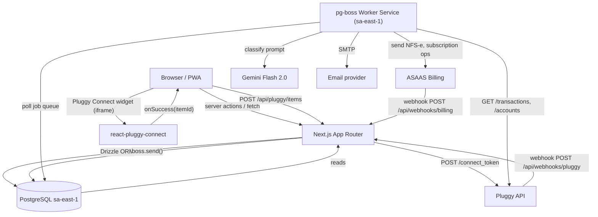

# Architecture Research

**Domain:** Brazilian personal finance PWA — Open Finance ingestion via Pluggy, Next.js + PostgreSQL
**Researched:** 2026-04-22
**Confidence:** HIGH (Pluggy, Next.js, Drizzle, queue patterns all verified against official documentation)

> **Reconciliation note.** This document originally described queueing on Inngest Cloud. To stay consistent with STACK.md's BR-residency constraint, references to the queue runner below are rewritten to **pg-boss** (running in the project's own PostgreSQL inside `sa-east-1`). The *patterns* (webhook → queue → worker, per-user concurrency, step-by-step idempotent workers) are identical; only the runner changes.

---

## Standard Architecture

### System Overview

```
┌─────────────────────────────────────────────────────────────────────┐
│  CLIENT LAYER (Browser / PWA)                                        │
│                                                                      │
│  ┌─────────────────┐  ┌────────────────────────────────────────┐    │
│  │  Next.js Pages  │  │  react-pluggy-connect widget (iframe)  │    │
│  │  (App Router)   │  │  — renders inside Connect flow only    │    │
│  └────────┬────────┘  └─────────────────┬──────────────────────┘    │
│           │ server actions / fetch       │ onSuccess(itemId) cb      │
└───────────┼──────────────────────────────┼──────────────────────────┘
            │                              │
┌───────────▼──────────────────────────────▼──────────────────────────┐
│  NEXT.JS APP (monolith — App Router)                                 │
│                                                                      │
│  ┌──────────────┐  ┌─────────────────┐  ┌──────────────────────┐   │
│  │  Server      │  │  API Routes     │  │  Webhook Receivers   │   │
│  │  Components  │  │  /api/pluggy/*  │  │  /api/webhooks/      │   │
│  │  (SSR dash)  │  │  /api/auth/*    │  │    pluggy            │   │
│  │              │  │  /api/billing/* │  │    billing (asaas)   │   │
│  └──────┬───────┘  └────────┬────────┘  └──────────┬───────────┘   │
│         │                   │                       │               │
│         └─────────┬─────────┘                       │               │
│                   │ DB queries (Drizzle)            │ enqueue job   │
│                   ▼                                  ▼               │
│  ┌────────────────────────────┐   ┌──────────────────────────────┐  │
│  │  Service Layer             │   │  pg-boss client              │  │
│  │  (domain logic, pure fns)  │   │  boss.send('pluggy.sync', …) │  │
│  └────────────────────────────┘   └──────────────────────────────┘  │
└──────────────────────────────────────────────────────────────────────┘
            │                                  │
            ▼                                  ▼
┌───────────────────────┐       ┌──────────────────────────────────────┐
│  POSTGRESQL (sa-east-1)│      │  pg-boss WORKER SERVICE (sa-east-1)  │
│                       │       │  (separate Railway service, same DB) │
│  app schema:          │       │                                      │
│  • users              │       │  ┌────────────────────────────────┐  │
│  • sessions           │       │  │  pluggy-sync-worker            │  │
│  • pluggy_items       │◄──────┤  │  categorization-worker         │  │
│  • accounts           │       │  │  billing-webhook-worker        │  │
│  • transactions       │       │  │  re-auth-notifier              │  │
│  • categories         │       │  │  aggregation-worker            │  │
│  • category_rules     │       │  │  retention-worker              │  │
│  • monthly_summaries  │       │  └────────────────────────────────┘  │
│  • subscriptions      │       └──────────────────────────────────────┘
│  • webhook_events     │                       │
│  • audit_log          │       ┌───────────────▼──────────────────────┐
│  • user_consents      │       │  EXTERNAL SERVICES                   │
│                       │       │                                      │
│  pgboss schema:       │       │  ┌──────────┐  ┌──────────────────┐  │
│  • job, archive, …    │       │  │  Pluggy  │  │  Gemini / LLM    │  │
└───────────────────────┘       │  │  API     │  │  (categ fallback)│  │
                                │  └──────────┘  └──────────────────┘  │
                                │  ┌──────────┐  ┌──────────────────┐  │
                                │  │  ASAAS   │  │  SMTP / email    │  │
                                │  │  Billing │  │  (re-auth, dsr)  │  │
                                │  └──────────┘  └──────────────────┘  │
                                └──────────────────────────────────────┘
```

### Component Responsibilities

| Component | Responsibility | Key Constraint |
|-----------|---------------|----------------|
| Next.js Server Components | SSR of dashboard, transactions list, settings — read from DB directly | Must not call Pluggy API in render path |
| Next.js API Routes `/api/pluggy/*` | Create connect tokens, expose item status to client, trigger manual sync | Pluggy CLIENT_ID/SECRET never exposed to browser |
| Webhook receiver `/api/webhooks/pluggy` | Verify auth header, return 2XX within 5s, enqueue pg-boss job | Must be idempotent on `eventId`; raw body preserved in `webhook_events` |
| Webhook receiver `/api/webhooks/billing` | Verify ASAAS signature, enqueue billing event | Same 5s rule |
| Service layer | Domain logic: item management, transaction transformation, category resolution, transfer detection | Pure TypeScript, no HTTP calls, testable in isolation |
| pg-boss worker: `pluggy-sync` | Fetch transactions from Pluggy, upsert to DB, trigger categorization fan-out | Per-user concurrency = 1 to avoid Pluggy rate limits |
| pg-boss worker: `categorization` | Rules engine first, LLM fallback per unmatched transaction, write result | LLM budget gated; never called for already-categorized |
| pg-boss worker: `aggregation` | Recompute `monthly_summaries` and `category_monthly_totals` after sync/correction | Debounced per `userId`; batched across months changed |
| pg-boss worker: `re-auth-notifier` | React to item/error events; send email + set UI banner | Single run per itemId per error window |
| pg-boss worker: `retention` | Scheduled: soft/hard-delete data past retention window | Cron trigger; idempotent |
| PostgreSQL | Single source of truth for all user, financial, billing, and job data | Data residency: BR region only (Railway Postgres sa-east-1) |
| Encrypted secret store | Pluggy item IDs + access tokens encrypted at application layer (AES-256-GCM) | Never logged, never returned to client in clear |

---

## Component Topology — What Talks to What



---

## Data Flow: Open Finance Ingestion (End-to-End)

### Flow 1 — Initial Bank Connection

```
1. User clicks "Connect bank"
   └─ Client calls POST /api/pluggy/connect-token
      └─ Server calls POST https://api.pluggy.ai/connect_token
         (passes clientUserId = user.id, webhookUrl = /api/webhooks/pluggy)
      └─ Returns { connectToken } to browser (30-min validity)

2. Browser opens react-pluggy-connect widget with token
   └─ User selects institution + enters credentials (inside Pluggy iframe)
   └─ Pluggy creates Item on their side

3. Pluggy fires webhook → POST /api/webhooks/pluggy
   Payload: { event: "item/created", eventId, itemId, clientUserId }
   └─ Webhook handler:
      a. Verify auth header (custom secret header, configured at webhook creation)
      b. INSERT INTO webhook_events (event_id, …) ON CONFLICT DO NOTHING
         (if conflict → duplicate, return 200 immediately)
      c. Return 200
      d. boss.send("pluggy.item.created", { itemId, userId })

4. pg-boss worker: pluggy-sync-worker
   Step 1: GET /items/{itemId} → verify UPDATED status
   Step 2: GET /accounts?itemId → upsert accounts to DB
   Step 3: For each account, GET /transactions?accountId (page 500) → upsert
           with ON CONFLICT (pluggy_transaction_id) DO UPDATE
   Step 4: boss.send("finance.transactions.ingested", { accountId, txIds[] })

5. pg-boss worker: categorization-worker (fan-out)
   Step 1: Load uncategorized transactions for account
   Step 2: Apply rules engine (merchant CNPJ, description regex, amount range)
   Step 3: For unmatched → LLM batch call (bounded by per-user daily budget)
   Step 4: Write category assignments to transactions table
   Step 5: boss.send("finance.aggregation.invalidate", { userId, monthsAffected })

6. Client dashboard polls /api/sync-status (or SSE) for UI updates
```

### Flow 2 — Incremental Sync (Webhook-Driven)

```
Pluggy fires: transactions/created
Payload: { event, itemId, accountId, createdTransactionsLink }

Webhook handler:
  a. Dedup on eventId
  b. boss.send("pluggy.transactions.created", { accountId, link })

pluggy-sync-worker (incremental):
  Step 1: Fetch page from createdTransactionsLink (500/page)
  Step 2: Upsert transactions — ON CONFLICT (pluggy_transaction_id) DO UPDATE
  Step 3: Trigger categorization fan-out for new transactions only

---
Pluggy fires: transactions/updated | transactions/deleted — analogous workers.
```

### Flow 3 — Re-Authentication (STALE / LOGIN_ERROR)

```
Pluggy fires: item/error
Payload: { event, itemId, error: { code: "INVALID_CREDENTIALS" | "USER_INPUT_TIMEOUT" } }

Item statuses: UPDATING → UPDATED (success) | LOGIN_ERROR | WAITING_USER_INPUT | OUTDATED

re-auth-notifier worker:
  Step 1: UPDATE pluggy_items SET status='LOGIN_ERROR', needs_reauth=true
  Step 2: Send re-auth email/notification with deep link
  Step 3: UI surfaces per-item banner

User re-authenticates via Pluggy Connect widget (existing itemId)
  → item/updated webhook fires → full sync triggered
```

### Flow 4 — Categorization Pipeline

```
Input: transaction (description, merchant, amount, type, descriptionRaw)

Step 1 — Merchant Normalization
  Strip punctuation, collapse spaces, uppercase, strip suffixes (LTDA, SA, *PEDIDO, …)
  Look up merchant_aliases → canonical_merchant_id (if known)

Step 2 — User Rules (highest priority)
  Match against category_rules WHERE user_id = $user AND is_active
  First hit → assign category_id, source='USER_RULE'

Step 3 — Shared Rules
  Match against category_rules WHERE user_id IS NULL (curated global rules)
  First hit → assign category_id, source='SHARED_RULE'

Step 4 — Pluggy Category (weak signal — DO NOT trust as-is)
  If no rule matched AND Pluggy returned a non-generic category → assign, source='PLUGGY_HINT'

Step 5 — LLM Fallback (gated)
  Only if:
    a. No rule match AND Pluggy category absent/generic
    b. User has daily LLM budget remaining
    c. PII stripped from description (CPF regex, names in PIX patterns)
  LLM returns a category_id from a CLOSED ENUM (validate before write).
  Invalid → UNCATEGORIZED + log hallucination.

Step 6 — User Correction → Learning
  User changes category in UI → POST /api/transactions/{id}/category
  Write override + fire "categ.learn" job:
    Extract merchant fingerprint → upsert category_rules (per-user, priority=HIGH)
  Next sync from same merchant → instant match, no LLM.
```

---

## Schema Sketch

### OLTP Hot Tables

```sql
-- Identity
users (
  id uuid PK,
  email text UNIQUE NOT NULL,
  cpf_hash bytea NOT NULL,             -- SHA-256 of CPF, for uniqueness lookups
  cpf_enc bytea NOT NULL,              -- AES-256-GCM encrypted CPF for display
  password_hash text NOT NULL,         -- argon2
  subscription_tier text NOT NULL,     -- 'free' | 'paid'
  created_at timestamptz,
  deleted_at timestamptz
)

sessions (
  id uuid PK,
  user_id uuid FK users,
  token_hash text UNIQUE,
  expires_at timestamptz,
  created_at timestamptz
)

user_consents (                        -- LGPD audit trail (append-only)
  id uuid PK,
  user_id uuid FK users,
  data_source_type text,               -- 'PLUGGY_CONNECTOR:123' etc.
  consent_scope jsonb,
  action text,                         -- 'GRANTED' | 'REVOKED'
  ip_address inet,
  user_agent text,
  created_at timestamptz
)

-- Pluggy integration
pluggy_items (
  id uuid PK,
  user_id uuid FK users,
  encrypted_item_id bytea NOT NULL,    -- AES-256-GCM; plaintext NEVER stored
  connector_id int NOT NULL,
  institution_name text,
  status text,                         -- 'UPDATED' | 'UPDATING' | 'LOGIN_ERROR' | 'WAITING_USER_INPUT' | 'OUTDATED'
  needs_reauth boolean DEFAULT false,
  last_sync_requested_at timestamptz,  -- for cooldown enforcement
  last_synced_at timestamptz,
  created_at timestamptz,
  deleted_at timestamptz
)

accounts (
  id uuid PK,
  user_id uuid FK users,
  item_id uuid FK pluggy_items,
  pluggy_account_id text UNIQUE NOT NULL,
  type text,                           -- 'BANK' | 'CREDIT' | 'INVESTMENT'
  subtype text,                        -- 'CHECKING' | 'SAVINGS' | 'CREDIT_CARD'
  name text,
  institution_name text,
  balance numeric(15,2),
  currency_code char(3) DEFAULT 'BRL',
  credit_limit numeric(15,2),
  credit_due_date date,
  credit_close_date date,
  status text DEFAULT 'ACTIVE',        -- 'ACTIVE' | 'FROZEN' (downgrade) | 'ARCHIVED'
  updated_at timestamptz
)

transactions (
  id uuid PK,
  user_id uuid FK users,
  account_id uuid FK accounts,
  pluggy_transaction_id text UNIQUE NOT NULL,  -- dedup key
  description text NOT NULL,
  description_raw text,
  amount numeric(15,2) NOT NULL,
  type text NOT NULL,                  -- 'CREDIT' | 'DEBIT'
  status text NOT NULL,                -- 'POSTED' | 'PENDING'
  date date NOT NULL,
  category_id uuid FK categories,
  category_source text,                -- 'USER_RULE' | 'SHARED_RULE' | 'PLUGGY_HINT' | 'LLM' | 'USER'
  matched_rule_id uuid,                -- FK category_rules
  llm_confidence numeric(4,3),
  llm_used boolean DEFAULT false,      -- cost tracking
  merchant_raw text,
  merchant_canonical_id uuid,          -- FK merchant_aliases
  is_transfer boolean DEFAULT false,
  transfer_peer_id uuid,               -- FK transactions (self)
  is_credit_card_payment boolean DEFAULT false,
  categorized_at timestamptz,
  deleted_at timestamptz,
  created_at timestamptz,
  updated_at timestamptz
)

CREATE INDEX ix_tx_user_date ON transactions (user_id, date DESC);
CREATE INDEX ix_tx_user_cat_date ON transactions (user_id, category_id, date DESC);
CREATE INDEX ix_tx_account_date ON transactions (account_id, date DESC);
```

### Category Taxonomy

```sql
categories (
  id uuid PK,
  parent_id uuid,
  name text NOT NULL,                  -- display name (pt-BR)
  slug text UNIQUE NOT NULL,
  icon text,
  is_system boolean DEFAULT true,
  user_id uuid,                        -- null = system
  created_at timestamptz
)

category_rules (
  id uuid PK,
  user_id uuid,                        -- null = shared/curated
  category_id uuid FK categories,
  priority int NOT NULL,
  condition_type text NOT NULL,        -- 'MERCHANT_CANONICAL' | 'MERCHANT_CNPJ' | 'DESCRIPTION_REGEX' | 'AMOUNT_RANGE' | 'MCC'
  condition_value text NOT NULL,
  is_active boolean DEFAULT true,
  source text,                         -- 'USER_CORRECTION' | 'SEED' | 'ADMIN'
  created_at timestamptz,
  updated_at timestamptz
)

merchant_aliases (
  id uuid PK,
  raw_pattern text UNIQUE NOT NULL,    -- e.g., 'APLIC IFOOD'
  canonical_merchant_id uuid NOT NULL,
  canonical_name text NOT NULL,
  source text                          -- 'SEED' | 'LEARNED'
)
```

### Read-Model / Aggregation

```sql
monthly_summaries (
  id uuid PK,
  user_id uuid FK users,
  account_id uuid FK accounts,         -- null = rolled up across accounts
  year int, month int,
  total_income numeric(15,2),
  total_expenses numeric(15,2),
  net numeric(15,2),
  updated_at timestamptz,
  UNIQUE (user_id, account_id, year, month)
)

category_monthly_totals (
  id uuid PK,
  user_id uuid FK users,
  category_id uuid FK categories,
  year int, month int,
  total numeric(15,2),
  tx_count int,
  UNIQUE (user_id, category_id, year, month)
)
```

### Operational

```sql
webhook_events (
  id uuid PK,
  source text NOT NULL,                -- 'PLUGGY' | 'ASAAS'
  event_type text NOT NULL,
  event_id text UNIQUE NOT NULL,       -- idempotency key
  payload jsonb NOT NULL,
  processed_at timestamptz,
  created_at timestamptz
)

subscriptions (
  id uuid PK,
  user_id uuid FK users UNIQUE,
  provider text NOT NULL,              -- 'ASAAS'
  provider_subscription_id text UNIQUE,
  plan_id text NOT NULL,
  status text NOT NULL,                -- 'ACTIVE' | 'PAST_DUE' | 'CANCELED'
  current_period_end timestamptz,
  cancel_at_period_end boolean,
  created_at timestamptz,
  updated_at timestamptz
)

billing_events (                       -- NFS-e numbers, payment failures, refunds
  id uuid PK,
  subscription_id uuid FK subscriptions,
  event_type text NOT NULL,
  nfse_number text,
  nfse_pdf_url text,
  payload jsonb,
  created_at timestamptz
)

audit_log (
  id uuid PK,
  user_id uuid,
  actor_type text,                     -- 'USER' | 'ADMIN' | 'SYSTEM'
  actor_id uuid,
  action text NOT NULL,
  entity_type text, entity_id uuid,
  ip_address inet,
  created_at timestamptz
)

admin_access_log (                     -- support/admin reads
  id uuid PK,
  admin_user_id uuid,
  target_user_id uuid,
  resource_type text,
  resource_id uuid,
  action text,
  ip_address inet,
  created_at timestamptz
)

dsr_requests (                         -- LGPD data subject requests
  id uuid PK,
  user_id uuid,
  request_type text,                   -- 'EXPORT' | 'DELETE' | 'CORRECTION'
  status text,
  requested_at timestamptz,
  resolved_at timestamptz
)

llm_usage (                            -- per-user LLM budget enforcement
  id uuid PK,
  user_id uuid FK users,
  day date,
  calls int DEFAULT 0,
  tokens_in int DEFAULT 0,
  tokens_out int DEFAULT 0,
  UNIQUE (user_id, day)
)
```

---

## OLTP vs Read-Model Boundary

| Query | Where it runs | Rationale |
|-------|---------------|-----------|
| "What is this transaction's category?" | `transactions.category_id` | Set on every sync |
| "What did I spend in March?" | `monthly_summaries` | Pre-aggregated; dashboard reads one row, no GROUP BY |
| "What did I spend on Food in March?" | `category_monthly_totals` | Same |
| Transaction list with filters | `transactions` direct query + indexes | Paginated; no aggregation |
| "Is this item healthy?" | `pluggy_items.status` | Updated by sync worker |

**Rule:** Dashboard screens NEVER run GROUP BY / SUM across `transactions` at request time. Workers maintain the read-model; requests read pre-aggregated rows. Transfers and credit-card-payment rows are excluded from aggregates.

---

## Special Modeling Patterns

### Transfers Between Own Accounts

- Matcher (post-ingestion worker): same `|amount|`, opposite `type`, same `user_id`, different accounts, same `date ± 3 days`, both `POSTED`.
- Match → `is_transfer=true`, `transfer_peer_id=other.id` on both rows.
- Aggregates exclude `is_transfer=true`.
- User can manually flag/unflag; unflagging creates a `category_rule` for that merchant.

### Credit Card Fatura

- Credit card accounts (`type=CREDIT`): ingest individual transactions as expenses.
- Checking account's fatura debit (same amount as card balance, near due date) → `is_credit_card_payment=true`, excluded from expense totals.
- Dashboard shows line items as category spending; fatura payment is hidden (it's a transfer).
- No separate fatura entity in v1.

### Split Transactions

- Not in Pluggy data model. Deferred to v2.
- Schema leaves room: a future `transaction_splits` child table can reference `transactions.id` without breaking anything.

---

## Recommended Project Structure

```
src/
├── app/
│   ├── (auth)/                     # login, register, forgot-password
│   ├── (dashboard)/                # protected: dashboard, transactions, settings
│   └── api/
│       ├── auth/
│       ├── pluggy/                 # connect-token, item-status, manual-sync
│       ├── transactions/           # category update, transaction detail
│       ├── webhooks/
│       │   ├── pluggy/
│       │   └── billing/
│       └── inngest/                # (renamed → pg-boss health endpoint)
│
├── jobs/                           # pg-boss workers
│   ├── boss.ts                     # pg-boss client singleton
│   ├── PluggySyncWorker.ts
│   ├── CategorizationWorker.ts
│   ├── AggregationWorker.ts
│   ├── ReAuthNotifier.ts
│   ├── BillingWebhookWorker.ts
│   └── RetentionWorker.ts
│
├── db/
│   ├── schema/
│   │   ├── users.ts
│   │   ├── pluggyItems.ts
│   │   ├── accounts.ts
│   │   ├── transactions.ts
│   │   ├── categories.ts
│   │   ├── subscriptions.ts
│   │   └── operational.ts
│   ├── migrations/
│   └── index.ts
│
├── services/
│   ├── categorization/
│   │   ├── MerchantNormalizer.ts
│   │   ├── RulesEngine.ts
│   │   ├── LLMCategorizer.ts
│   │   └── CategoryLearner.ts
│   ├── pluggy/
│   │   ├── PluggyClient.ts
│   │   ├── ItemTransformer.ts
│   │   └── TransactionTransformer.ts
│   ├── sync/
│   │   ├── SyncOrchestrator.ts
│   │   ├── DeduplicationService.ts
│   │   └── TransferDetector.ts
│   ├── billing/
│   │   └── SubscriptionService.ts
│   └── lgpd/
│       ├── ConsentService.ts
│       ├── DataExportService.ts
│       └── DeletionService.ts
│
├── lib/
│   ├── auth.ts
│   ├── crypto.ts                   # AES-256-GCM for item IDs + CPF
│   ├── pluggyWebhook.ts            # auth header verification
│   ├── piiScrubber.ts              # strip CPF/names before LLM or logs
│   └── tierEnforcement.ts
│
└── components/
    ├── ui/                         # shadcn/ui primitives
    ├── dashboard/
    ├── transactions/
    └── pluggy/
```

---

## Architectural Patterns

### Pattern 1: Webhook → Queue → Worker (Async Ingestion)

Webhook endpoint does EXACTLY three things:
1. Verify auth header (+ optional IP allowlist).
2. Insert into `webhook_events` (idempotent on `event_id`).
3. `boss.send(...)` and return 200.

All work happens in the worker. Pluggy retries up to 9 times; idempotency prevents double processing.

```typescript
// app/api/webhooks/pluggy/route.ts
export async function POST(req: Request) {
  const body = await req.text();
  const header = req.headers.get('x-portal-pluggy-secret');
  if (!header || header !== env.PLUGGY_WEBHOOK_SECRET) {
    return Response.json({ error: 'Unauthorized' }, { status: 401 });
  }

  const payload = JSON.parse(body);

  const inserted = await db
    .insert(webhookEvents)
    .values({
      source: 'PLUGGY',
      event_type: payload.event,
      event_id: payload.eventId,
      payload,
    })
    .onConflictDoNothing({ target: webhookEvents.event_id })
    .returning({ id: webhookEvents.id });

  if (inserted.length === 0) return Response.json({ ok: true }); // duplicate

  await boss.send(`pluggy.${payload.event.replace('/', '.')}`, payload);
  return Response.json({ ok: true });
}
```

### Pattern 2: Per-User Concurrency Gate (pg-boss)

pg-boss supports singleton jobs per key — use `singletonKey: userId` to ensure at most one sync per user at a time. Queues protect Pluggy rate limits and prevent race-condition upserts.

```typescript
await boss.send(
  'pluggy.sync.user',
  { userId, itemId },
  { singletonKey: `sync:${userId}`, retryLimit: 5, retryBackoff: true }
);
```

### Pattern 3: Rules-First Categorization with Budgeted LLM

Order: User rules → Shared rules → Pluggy hint → LLM (gated on budget). PII scrubbed before any LLM call. LLM output validated against `categories.slug` enum — invalid → `UNCATEGORIZED` + log.

### Pattern 4: Pre-Aggregated Read Model (Worker-Maintained)

Workers update `monthly_summaries` and `category_monthly_totals` on every sync and correction. Aggregation is debounced per `userId` via pg-boss `debounce` to avoid storms after bulk recategorization.

### Pattern 5: Separate Worker Service

`pg-boss` client embedded inside the Next.js app can be brittle (serverless cold starts, timeout caps). **Run workers as a separate Railway service** in the same project, pointing at the same Postgres:

- Service 1: `web` — Next.js app (handles HTTP only; enqueues jobs)
- Service 2: `worker` — long-lived Node process running pg-boss workers
- Service 3: `postgres` — Railway Postgres, sa-east-1

Same codebase, two different entrypoints (`package.json`: `start:web`, `start:worker`).

---

## Build Order

```
Phase 1 — Foundation (vertical slice)
  1. PostgreSQL schema + Drizzle migrations (users, sessions, user_consents)
  2. Auth.js credentials provider: email + CPF + password → session
  3. CPF validation + hashed/encrypted storage
  4. pg-boss setup + worker service scaffolding (empty workers)
  5. Pluggy Connect token endpoint
  6. react-pluggy-connect widget + consent screen
  7. Webhook receiver (pluggy) with idempotency
  8. pluggy-sync-worker v1 (accounts + transactions upsert)
  9. Raw transactions list page
  10. Observability: structured logging, Sentry EU, PII scrubber
  MILESTONE: user can register → consent → connect 1 bank → see raw transactions

Phase 2 — Categorization + Learning
  1. categories + merchant_aliases seeds (pt-BR)
  2. category_rules CRUD
  3. MerchantNormalizer + RulesEngine
  4. Pluggy category hint fallback
  5. LLM fallback (Gemini Flash 2.0 via Vercel AI SDK) + closed-enum validation
  6. Per-user daily LLM budget + llm_usage table
  7. User override → CategoryLearner worker → per-user rule
  8. Recategorize-batch job
  MILESTONE: transactions categorized; corrections learned; dashboard categories meaningful

Phase 3 — Dashboard + Aggregations + Post-Processing
  1. TransferDetector worker
  2. Credit card fatura detector
  3. aggregation-worker → monthly_summaries, category_monthly_totals
  4. Dashboard page (income / expenses / net + delta vs previous month + category breakdown)
  5. Incremental webhook flows (transactions/created|updated|deleted)
  6. Re-auth flow (item/error banner + email)
  MILESTONE: monthly dashboard with live sync + re-auth loop

Phase 4 — Billing, Free Tier, PWA
  1. ASAAS integration (subscription creation, webhook receiver)
  2. NFS-e automation wired through ASAAS
  3. subscriptions + billing_events
  4. Tier enforcement middleware (free: 1 account, 3-month history, manual sync off)
  5. Subscription management UI + dunning banners
  6. Downgrade-as-freeze (no data deletion)
  7. PWA manifest + Serwist service worker
  MILESTONE: paid product; free tier enforced; installable PWA

Phase 5 — LGPD / Compliance / Hardening
  1. DSR export + delete workflows (dsr_requests)
  2. Full data deletion worker (Pluggy API delete + log anonymization + email list removal)
  3. Retention worker (scheduled)
  4. Rate limiting (login, password reset)
  5. Admin access log + elevated-session requirement
  6. Webhook reconciliation job (after downtime)
```

**Dependency rules:**
- Auth exists before any data endpoint.
- Pluggy items require auth; accounts require items; transactions require accounts.
- Categorization requires transactions + taxonomy.
- Aggregation requires categorization + transfer detection.
- Billing depends on subscriptions schema (which should exist in Phase 1 with all users hardcoded "premium") — this avoids a migration when billing goes live.

**What can be mocked:**
- LLM categorizer: stub that returns `UNCATEGORIZED` — unblocks display.
- `monthly_summaries`: compute on-demand in dev — acceptable locally.
- Tier enforcement: hardcode "paid" in Phase 1–3 — unblocks full UX testing.

---

## Minimal Viable Vertical Slice (Phase 1)

The first end-to-end slice that proves the pipeline:

1. User registers with email + CPF (validated) + password.
2. User logs in, sees empty dashboard.
3. User clicks "Add account" → consent screen → receives connect token → Pluggy widget.
4. User connects a Pluggy sandbox bank.
5. `item/created` webhook fires → `webhook_events` row → `pluggy.item.created` job.
6. Worker fetches accounts + transactions → upsert → Sentry records zero errors.
7. User sees raw transaction list (no categories yet).
8. User sees "Last synced: 2 min ago" with `pluggy_items.status`.

If this slice works end-to-end on Railway sa-east-1 with Pluggy sandbox, the architecture is validated.

---

## Anti-Patterns (do NOT do)

| Anti-pattern | Why wrong | Do this |
|--------------|-----------|---------|
| Call Pluggy API during request rendering | Pluggy sync takes 10–90 s; dashboard times out | Sync to Postgres via worker; dashboard reads DB |
| Do sync work inside the webhook handler | Pluggy 5 s timeout → retries → duplicates | Enqueue + return 200 in < 200 ms |
| GROUP BY across `transactions` at dashboard time | O(N) scan; latency spikes | Workers maintain `monthly_summaries` |
| Store `pluggy_item_id` in plaintext | Full financial data readable on DB breach | AES-256-GCM; key in env/KMS |
| Call LLM for every uncategorized transaction | Unbounded cost | Per-user daily budget; rules first |
| Send raw transaction description to LLM | LGPD cross-border PII violation | PII scrubber strips CPF/names before prompt |

---

## Scale Considerations

| Concern | 1k users | 10k users | 100k users |
|---------|---------|-----------|-----------|
| Transactions table | ~500k rows | ~5M rows — keep indexes on `(user_id, date, category_id)` | ~50M rows — partition by `user_id` or year; read replica |
| Dashboard latency | <50ms (pre-aggregated) | <50ms | <50ms |
| Pluggy sync fan-out | trivial | per-user singleton in pg-boss prevents storms | per-connector queues may be needed |
| LLM cost | negligible | ~R$1500/mês at 50 calls/user/month | fine-tune a small model on your categorized data |
| Postgres connections | single pool | PgBouncer transaction-mode | read replica for dashboard; dedicated write primary |

**First scaling pain point:** `transactions` INSERT rate during mass re-sync. Mitigated by per-user singleton key + `UNIQUE (pluggy_transaction_id)` upserts.

**Second pain point:** aggregation storms after a shared rule changes. Mitigate with pg-boss debounce keyed on `userId`.

---

## Integration Points

| Service | Integration Pattern | Notes |
|---------|---------------------|-------|
| Pluggy API | REST client in `services/pluggy/PluggyClient.ts`, called only from workers | CLIENT_SECRET never in browser |
| Pluggy Connect widget | `react-pluggy-connect` in client component | Token has 30-min TTL; widget is an iframe |
| Pluggy webhooks | Custom auth header + optional IP allowlist | No HMAC signature — use a strong random secret header |
| pg-boss | `boss.send()` from API routes + separate worker service | Same Postgres, isolated schema |
| Gemini (LLM) | Vercel AI SDK, `@ai-sdk/google`, structured output | Temperature 0; closed-enum validation; DPA signed |
| ASAAS | Subscriptions API + webhooks; native NFS-e | Signed DPA; webhook signature verified |
| Sentry EU | `@sentry/nextjs` pointed at `de.sentry.io` | `beforeSend` scrubs CPF, description, account numbers |
| SMTP | Called only from workers | Transactional: re-auth, DSR export links, payment failures |

---
*Architecture research for: Portal Finance — Brazilian personal finance PWA on Open Finance (Pluggy)*
*Researched: 2026-04-22*
